# 🏗️ System Design — Scalability & Microservices

> **Beginner → Pro Guide** | What • Why • Where • Interview Questions • Production Code

---

## 📌 Table of Contents
1. [What is System Design?](#1-what-is-system-design)
2. [Why System Design Matters](#2-why-system-design-matters)
3. [Where System Design is Applied](#3-where-system-design-is-applied)
4. [Core Concepts — Beginner Level](#4-core-concepts--beginner-level)
5. [Intermediate Concepts](#5-intermediate-concepts)
6. [Advanced / Pro Concepts](#6-advanced--pro-concepts)
7. [Scalability Deep Dive](#7-scalability-deep-dive)
8. [Microservices Deep Dive](#8-microservices-deep-dive)
9. [Architecture Diagrams](#9-architecture-diagrams)
10. [Production-Ready Code Examples](#10-production-ready-code-examples)
11. [Interview Questions & Answers](#11-interview-questions--answers)

---

## 1. What is System Design?

**System Design** is the process of defining the **architecture, components, modules, interfaces, and data flow** of a system to satisfy specified requirements. It bridges the gap between requirements and implementation.

### Key Aspects:
| Aspect | Description |
|--------|-------------|
| **High-Level Design (HLD)** | Overall architecture, component interaction, technology choices |
| **Low-Level Design (LLD)** | Class diagrams, database schema, API contracts, algorithms |
| **Functional Requirements** | What the system should do (features) |
| **Non-Functional Requirements** | How the system should perform (scalability, availability, latency) |

---

## 2. Why System Design Matters

- **Scalability** — Handle growing users/data without rewriting the system
- **Reliability** — System keeps working even when parts fail
- **Maintainability** — Easy to modify, debug, and extend
- **Cost Efficiency** — Optimal resource utilization
- **Interview Readiness** — Top companies (Google, Amazon, Meta) heavily test this

---

## 3. Where System Design is Applied

| Domain | Example |
|--------|---------|
| **E-Commerce** | Amazon, Flipkart — product catalog, orders, payment |
| **Social Media** | Twitter, Instagram — feed, notifications, messaging |
| **Streaming** | Netflix, YouTube — video encoding, CDN, recommendations |
| **Finance** | PayPal, Razorpay — transactions, fraud detection |
| **Ride-Sharing** | Uber, Ola — matching, location tracking, pricing |

---

## 4. Core Concepts — Beginner Level

### 4.1 Client-Server Architecture
```
┌──────────┐     HTTP/HTTPS     ┌──────────┐
│  Client   │ ───────────────▶  │  Server   │
│ (Browser) │ ◀───────────────  │  (API)    │
└──────────┘    JSON Response   └──────────┘
```

### 4.2 Monolith vs Microservices

| Feature | Monolith | Microservices |
|---------|----------|---------------|
| Deployment | Single unit | Independent services |
| Scaling | Scale entire app | Scale per service |
| Tech Stack | Single | Polyglot |
| Failure Impact | Entire app goes down | Isolated failure |
| Complexity | Low initially | High initially |
| Best For | Small teams/MVPs | Large teams/complex systems |

### 4.3 Vertical vs Horizontal Scaling

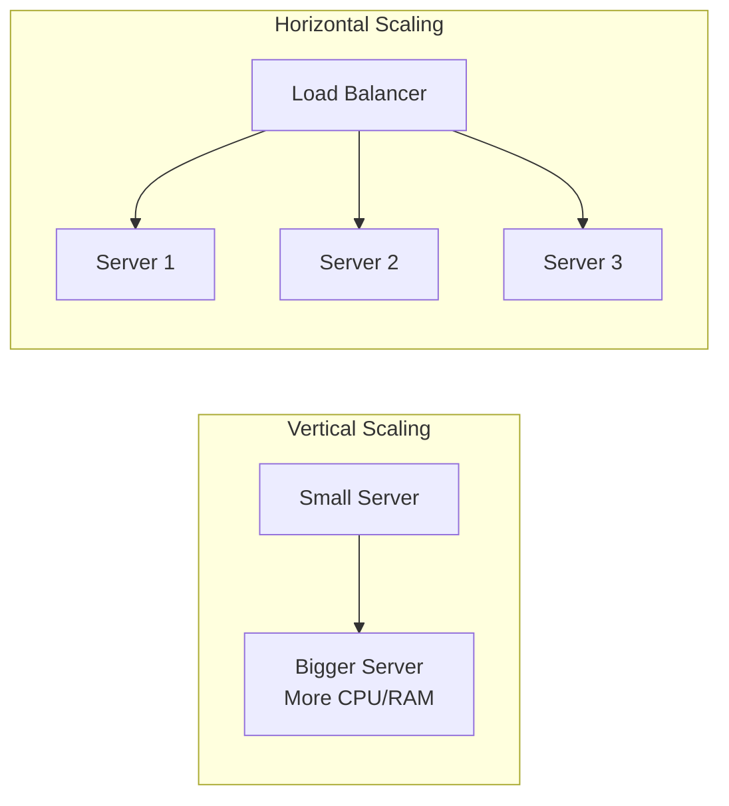

| Type | Pros | Cons |
|------|------|------|
| **Vertical** | Simple, no code changes | Hardware limit, single point of failure |
| **Horizontal** | Unlimited scale, fault tolerant | Complex, needs load balancing |

---

## 5. Intermediate Concepts

### 5.1 Load Balancing

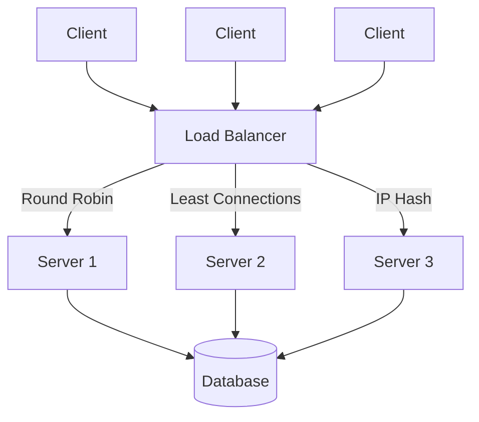

**Algorithms:**
- **Round Robin** — Requests distributed sequentially
- **Least Connections** — Route to server with fewest active connections
- **IP Hash** — Same client always goes to same server (sticky sessions)
- **Weighted Round Robin** — More powerful servers get more requests

### 5.2 Database Scaling

#### Read Replicas
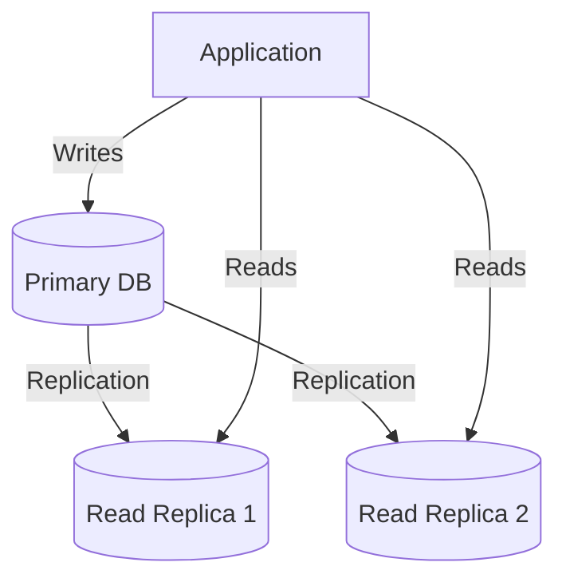

#### Database Sharding
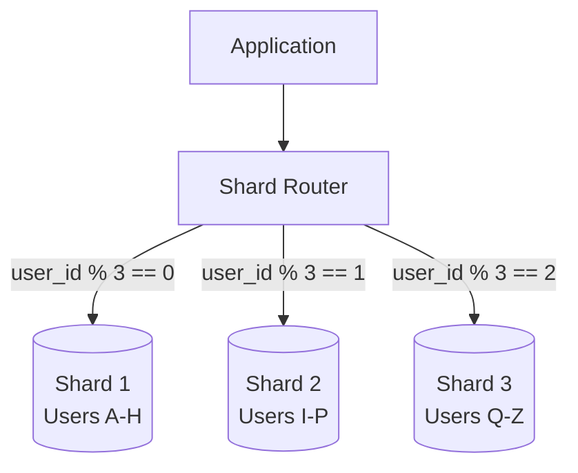

### 5.3 Caching Layer
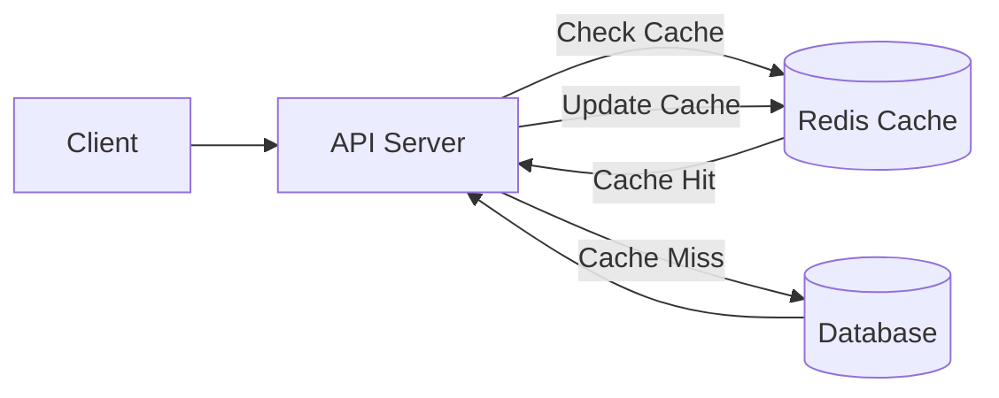

### 5.4 CDN (Content Delivery Network)
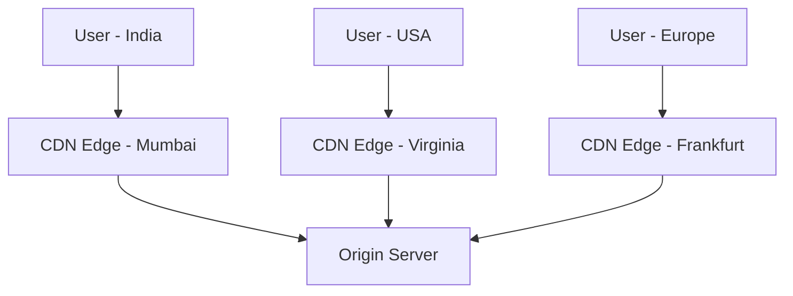

---

## 6. Advanced / Pro Concepts

### 6.1 CAP Theorem
> You can only guarantee **2 out of 3**: Consistency, Availability, Partition Tolerance

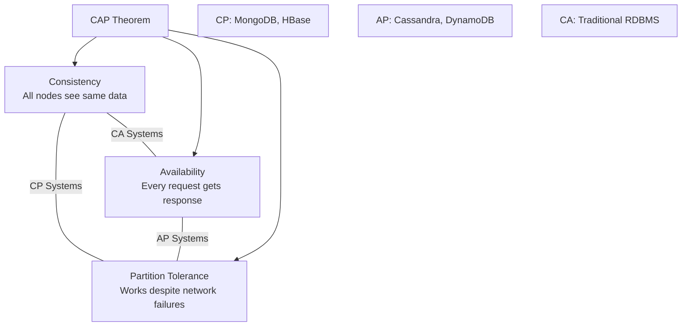

### 6.2 Consistent Hashing
Used for distributing data across nodes with minimal redistribution when nodes are added/removed.

```
Hash Ring:
    0 ─────── Node A ─────── Node B ─────── Node C ─────── 2^32
         ↑         ↑              ↑              ↑
       Key1      Key2           Key3           Key4
       → A        → A           → B            → C
```

### 6.3 Event-Driven Architecture

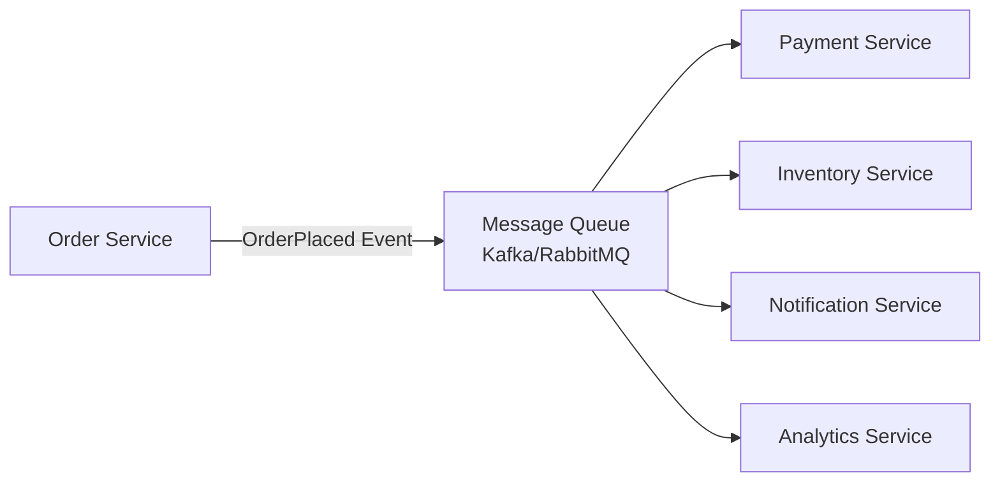

### 6.4 CQRS (Command Query Responsibility Segregation)

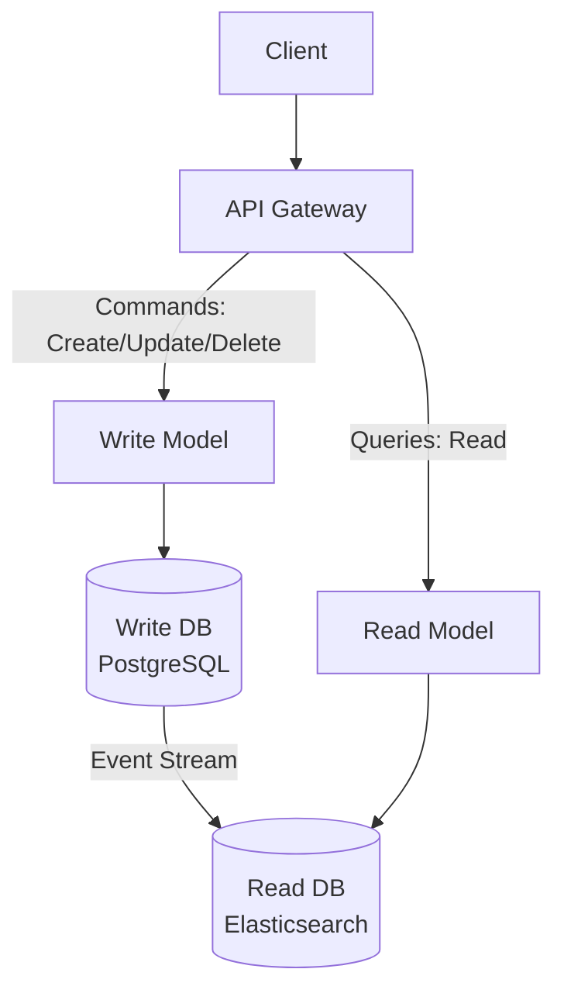

### 6.5 Saga Pattern (Distributed Transactions)

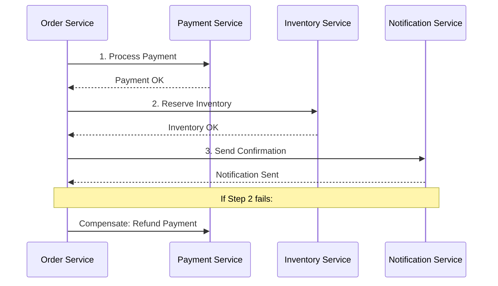

---

## 7. Scalability Deep Dive

### 7.1 Scalability Types

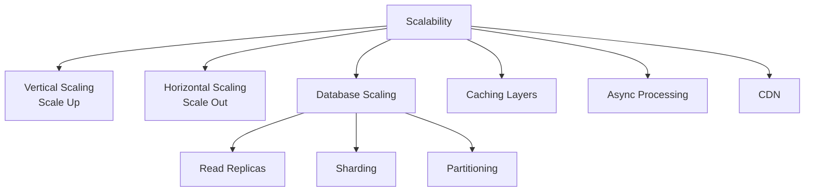

### 7.2 Scalability Checklist

| Stage | Users | Strategy |
|-------|-------|----------|
| MVP | 0-1K | Single server, monolith |
| Growth | 1K-100K | Add caching, read replicas, CDN |
| Scale | 100K-1M | Microservices, horizontal scaling, sharding |
| Massive | 1M-100M | Event-driven, CQRS, multi-region |
| Hyper | 100M+ | Custom infra, edge computing, ML-based optimization |

### 7.3 The Scale Cube

```
        ┌─────────────────────────────┐
       /│                             /│
      / │    Z-Axis: Data             / │
     /  │    Partitioning (Sharding) /  │
    ┌───│────────────────────────────┐   │
    │   │                            │   │
    │   │                            │   │
    │   └────────────────────────────│───┘
    │  /   Y-Axis: Functional       │  /
    │ /    Decomposition             │ /
    │/     (Microservices)           │/
    └────────────────────────────────┘
      X-Axis: Horizontal Duplication
      (Cloning / Load Balancing)
```

---

## 8. Microservices Deep Dive

### 8.1 What Are Microservices?

An architectural style where an application is composed of **small, independent services** that communicate over well-defined APIs.

### 8.2 Microservices Architecture

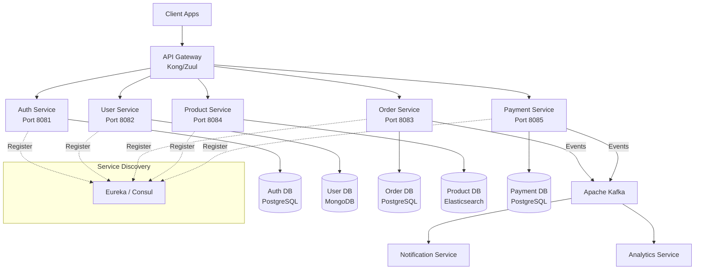

### 8.3 Microservice Design Principles

| Principle | Description |
|-----------|-------------|
| **Single Responsibility** | Each service does one thing well |
| **Decentralized Data** | Each service owns its database |
| **API First** | Design API contracts before implementation |
| **Failure Isolation** | Failure in one service doesn't cascade |
| **Independently Deployable** | Deploy without affecting other services |
| **Technology Agnostic** | Each service can use different tech stack |

### 8.4 Inter-Service Communication

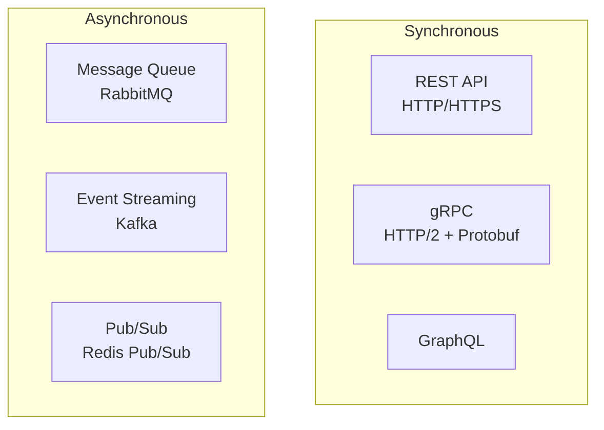

| Communication | When to Use | Latency | Coupling |
|---------------|-------------|---------|----------|
| REST | Simple CRUD, external APIs | Medium | Tight |
| gRPC | Internal service-to-service, high perf | Low | Medium |
| Message Queue | Fire-and-forget tasks | High | Loose |
| Event Streaming | Real-time data pipelines | Medium | Very Loose |

### 8.5 API Gateway Pattern

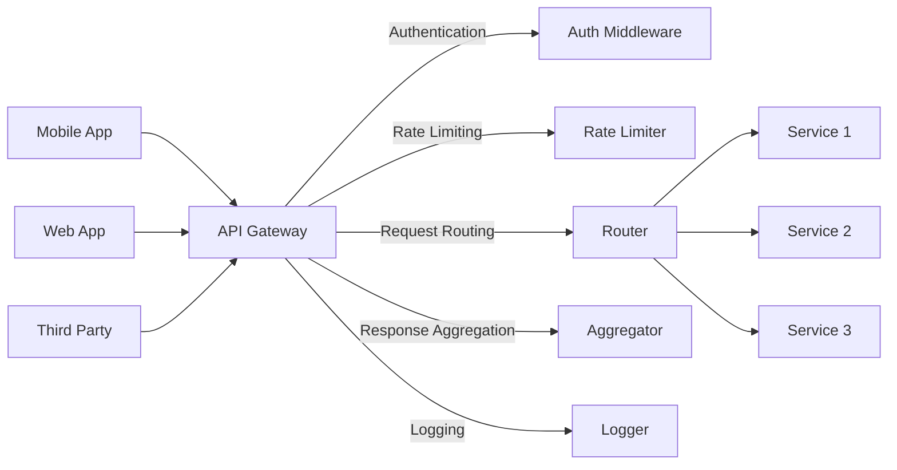

### 8.6 Service Discovery

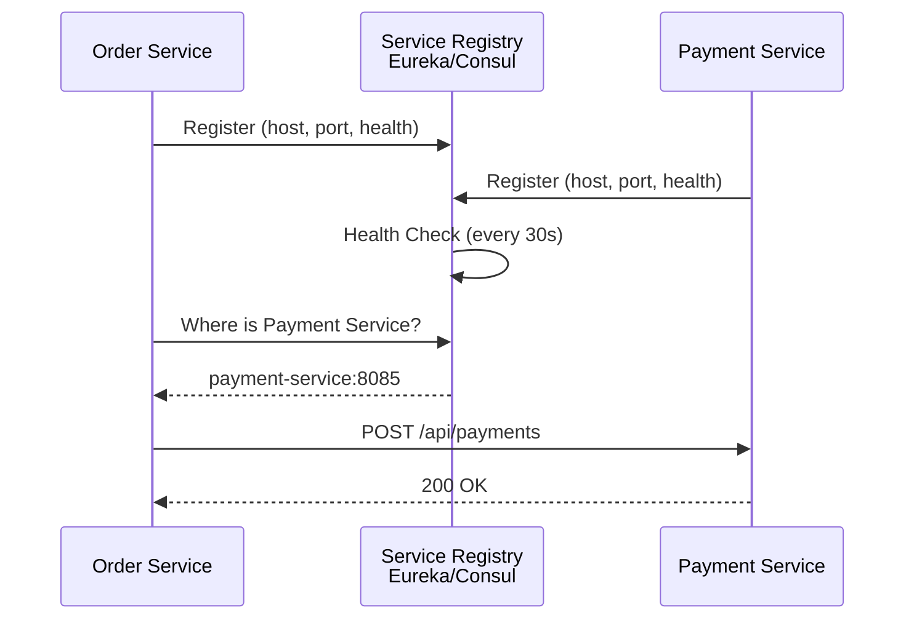

---

## 9. Architecture Diagrams

### 9.1 E-Commerce System Design (End-to-End)

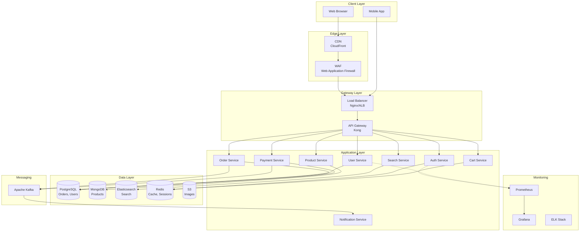

### 9.2 URL Shortener System Design

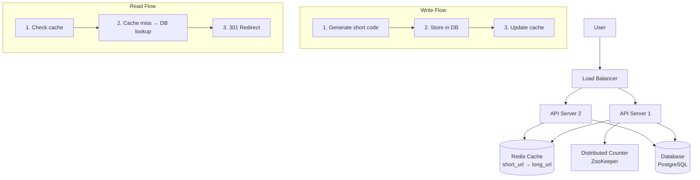

---

## 10. Production-Ready Code Examples

### 10.1 Spring Boot Microservice Setup

```java
// Application.java - Order Service
@SpringBootApplication
@EnableDiscoveryClient  // Register with Eureka
@EnableCircuitBreaker   // Resilience4j circuit breaker
public class OrderServiceApplication {
    public static void main(String[] args) {
        SpringApplication.run(OrderServiceApplication.class, args);
    }
}
```

### 10.2 API Gateway Configuration (Spring Cloud Gateway)

```yaml
# application.yml - API Gateway
spring:
  cloud:
    gateway:
      routes:
        - id: order-service
          uri: lb://ORDER-SERVICE    # Load balanced via Eureka
          predicates:
            - Path=/api/orders/**
          filters:
            - StripPrefix=1
            - name: CircuitBreaker
              args:
                name: orderServiceCB
                fallbackUri: forward:/fallback/orders
            - name: RequestRateLimiter
              args:
                redis-rate-limiter.replenishRate: 10
                redis-rate-limiter.burstCapacity: 20
                
        - id: payment-service
          uri: lb://PAYMENT-SERVICE
          predicates:
            - Path=/api/payments/**
          filters:
            - StripPrefix=1

eureka:
  client:
    serviceUrl:
      defaultZone: http://localhost:8761/eureka/
```

### 10.3 Service Discovery Registration

```yaml
# application.yml - Order Service
spring:
  application:
    name: order-service
    
server:
  port: 8083

eureka:
  client:
    serviceUrl:
      defaultZone: http://localhost:8761/eureka/
  instance:
    preferIpAddress: true
    lease-renewal-interval-in-seconds: 10
    lease-expiration-duration-in-seconds: 30
```

### 10.4 Inter-Service Communication with Feign Client

```java
// PaymentClient.java - Feign client in Order Service
@FeignClient(name = "PAYMENT-SERVICE", fallback = PaymentClientFallback.class)
public interface PaymentClient {
    
    @PostMapping("/api/payments")
    ResponseEntity<PaymentResponse> processPayment(@RequestBody PaymentRequest request);
    
    @GetMapping("/api/payments/{orderId}")
    ResponseEntity<PaymentResponse> getPaymentByOrderId(@PathVariable String orderId);
}

// PaymentClientFallback.java
@Component
public class PaymentClientFallback implements PaymentClient {
    
    @Override
    public ResponseEntity<PaymentResponse> processPayment(PaymentRequest request) {
        return ResponseEntity.status(HttpStatus.SERVICE_UNAVAILABLE)
            .body(new PaymentResponse("FAILED", "Payment service unavailable"));
    }
    
    @Override
    public ResponseEntity<PaymentResponse> getPaymentByOrderId(String orderId) {
        return ResponseEntity.status(HttpStatus.SERVICE_UNAVAILABLE)
            .body(new PaymentResponse("UNKNOWN", "Payment service unavailable"));
    }
}
```

### 10.5 Circuit Breaker with Resilience4j

```java
@Service
public class OrderService {
    
    private final PaymentClient paymentClient;
    
    @CircuitBreaker(name = "paymentService", fallbackMethod = "paymentFallback")
    @Retry(name = "paymentService", fallbackMethod = "paymentFallback")
    @TimeLimiter(name = "paymentService")
    public CompletableFuture<PaymentResponse> processPayment(OrderRequest order) {
        return CompletableFuture.supplyAsync(() -> {
            PaymentRequest paymentRequest = PaymentRequest.builder()
                .orderId(order.getId())
                .amount(order.getTotalAmount())
                .currency("INR")
                .build();
            return paymentClient.processPayment(paymentRequest).getBody();
        });
    }
    
    public CompletableFuture<PaymentResponse> paymentFallback(OrderRequest order, Throwable t) {
        log.error("Payment service failed for order: {}, error: {}", order.getId(), t.getMessage());
        return CompletableFuture.completedFuture(
            new PaymentResponse("PENDING", "Payment queued for retry")
        );
    }
}
```

```yaml
# Resilience4j Configuration
resilience4j:
  circuitbreaker:
    instances:
      paymentService:
        registerHealthIndicator: true
        slidingWindowSize: 10
        minimumNumberOfCalls: 5
        failureRateThreshold: 50
        waitDurationInOpenState: 10000    # 10 seconds
        permittedNumberOfCallsInHalfOpenState: 3
        slidingWindowType: COUNT_BASED
        
  retry:
    instances:
      paymentService:
        maxAttempts: 3
        waitDuration: 1000                 # 1 second
        
  timelimiter:
    instances:
      paymentService:
        timeoutDuration: 3s
```

### 10.6 Horizontal Scaling with Docker Compose

```yaml
# docker-compose.yml
version: '3.8'

services:
  # Service Discovery
  eureka-server:
    build: ./eureka-server
    ports:
      - "8761:8761"
    healthcheck:
      test: ["CMD", "curl", "-f", "http://localhost:8761/actuator/health"]
      interval: 10s
      retries: 5

  # API Gateway
  api-gateway:
    build: ./api-gateway
    ports:
      - "8080:8080"
    depends_on:
      eureka-server:
        condition: service_healthy
    environment:
      - EUREKA_URI=http://eureka-server:8761/eureka/

  # Order Service - Scaled to 3 instances
  order-service:
    build: ./order-service
    deploy:
      replicas: 3
    depends_on:
      eureka-server:
        condition: service_healthy
      postgres:
        condition: service_healthy
    environment:
      - EUREKA_URI=http://eureka-server:8761/eureka/
      - DB_URL=jdbc:postgresql://postgres:5432/orders
      - REDIS_HOST=redis

  # Payment Service - Scaled to 2 instances
  payment-service:
    build: ./payment-service
    deploy:
      replicas: 2
    depends_on:
      eureka-server:
        condition: service_healthy
    environment:
      - EUREKA_URI=http://eureka-server:8761/eureka/

  # Infrastructure
  postgres:
    image: postgres:15
    environment:
      POSTGRES_DB: orders
      POSTGRES_USER: admin
      POSTGRES_PASSWORD: secret
    volumes:
      - pgdata:/var/lib/postgresql/data
    healthcheck:
      test: ["CMD-SHELL", "pg_isready -U admin"]
      interval: 5s
      retries: 5

  redis:
    image: redis:7-alpine
    ports:
      - "6379:6379"

  kafka:
    image: confluentinc/cp-kafka:7.5.0
    ports:
      - "9092:9092"
    environment:
      KAFKA_BROKER_ID: 1
      KAFKA_ZOOKEEPER_CONNECT: zookeeper:2181
      KAFKA_ADVERTISED_LISTENERS: PLAINTEXT://kafka:9092

  zookeeper:
    image: confluentinc/cp-zookeeper:7.5.0
    environment:
      ZOOKEEPER_CLIENT_PORT: 2181

volumes:
  pgdata:
```

### 10.7 Load Balancer Configuration (Nginx)

```nginx
# nginx.conf
upstream order_service {
    least_conn;                    # Least connections algorithm
    server order-service-1:8083;
    server order-service-2:8083;
    server order-service-3:8083;
    
    keepalive 32;                  # Connection pooling
}

upstream payment_service {
    server payment-service-1:8085 weight=3;  # Weighted
    server payment-service-2:8085 weight=1;
}

server {
    listen 80;
    server_name api.myapp.com;

    # Rate Limiting
    limit_req_zone $binary_remote_addr zone=api:10m rate=10r/s;

    location /api/orders {
        limit_req zone=api burst=20 nodelay;
        proxy_pass http://order_service;
        proxy_set_header Host $host;
        proxy_set_header X-Real-IP $remote_addr;
        proxy_set_header X-Request-ID $request_id;
        
        # Timeouts
        proxy_connect_timeout 5s;
        proxy_read_timeout 30s;
        proxy_send_timeout 10s;
    }

    location /api/payments {
        limit_req zone=api burst=10 nodelay;
        proxy_pass http://payment_service;
        proxy_set_header Host $host;
    }

    # Health check endpoint
    location /health {
        return 200 '{"status": "UP"}';
        add_header Content-Type application/json;
    }
}
```

---

## 11. Interview Questions & Answers

### 🟢 Beginner Level

**Q1: What is the difference between monolith and microservices?**
> **A:** A monolith is a single deployable unit containing all functionality. Microservices break the app into small, independently deployable services. Monoliths are simpler to develop but harder to scale; microservices are complex but offer independent scaling, tech diversity, and fault isolation.

**Q2: What is horizontal vs vertical scaling?**
> **A:** Vertical scaling = adding more CPU/RAM to existing server (scale up). Horizontal scaling = adding more servers (scale out). Horizontal is preferred for production because it has no hardware ceiling and provides fault tolerance.

**Q3: What is a load balancer?**
> **A:** A load balancer distributes incoming traffic across multiple servers to ensure no single server is overwhelmed. Common algorithms: Round Robin, Least Connections, IP Hash. Examples: Nginx, AWS ALB, HAProxy.

**Q4: What is a CDN?**
> **A:** Content Delivery Network — a network of geographically distributed servers that cache static content (images, CSS, JS) closer to users. Reduces latency and load on origin server. Examples: CloudFront, Cloudflare, Akamai.

---

### 🟡 Intermediate Level

**Q5: How would you design a URL shortener?**
> **A:** Components: API servers behind load balancer, Redis cache for hot URLs, PostgreSQL for persistence, counter service for unique ID generation (Base62 encoding). Write path: generate short code → store in DB → cache. Read path: check cache → fallback to DB → 301 redirect. Scale: horizontally scale API servers, shard DB by key range.

**Q6: How does service discovery work in microservices?**
> **A:** Service discovery allows services to find each other dynamically. **Client-side**: Service queries registry (Eureka) and load-balances itself. **Server-side**: Load balancer queries registry and routes. Services register on startup and send heartbeats. If heartbeat stops, registry deregisters the instance.

**Q7: What is the API Gateway pattern?**
> **A:** A single entry point for all clients that handles cross-cutting concerns: authentication, rate limiting, request routing, response aggregation, logging, SSL termination. Examples: Kong, AWS API Gateway, Spring Cloud Gateway. Prevents clients from knowing about internal service topology.

**Q8: How do you handle distributed transactions across microservices?**
> **A:** Use the **Saga Pattern** — a sequence of local transactions where each step publishes an event for the next. Two types: **Choreography** (event-driven, no coordinator) and **Orchestration** (central coordinator manages the flow). If a step fails, compensating transactions undo previous steps.

---

### 🔴 Advanced / Pro Level

**Q9: Design a notification system like WhatsApp.**
> **A:** Components: Connection Gateway (WebSocket), Message Queue (Kafka), Message Storage (Cassandra), User Presence Service (Redis), Push Notification Service (FCM/APNs). Flow: sender → gateway → Kafka → check if recipient online → if yes, push via WebSocket; if no, store and push via FCM. Scale: partition Kafka by user ID, shard Cassandra by conversation ID.

**Q10: How would you design a system that handles 1 million requests per second?**
> **A:** Multi-layer approach: CDN for static content, DNS-level load balancing (GeoDNS), L4/L7 load balancers, horizontally scaled stateless API servers, Redis caching, database sharding, async processing via Kafka, read replicas, connection pooling, HTTP/2, response compression. Monitor with Prometheus + Grafana, auto-scale with Kubernetes HPA.

**Q11: Explain the CAP theorem with real-world examples.**
> **A:** CAP states you can only guarantee 2 of 3: Consistency, Availability, Partition Tolerance. In distributed systems, partitions are unavoidable, so you choose between CP (strong consistency, may reject requests during partitions — MongoDB, HBase) and AP (always available, may serve stale data — Cassandra, DynamoDB). Traditional RDBMS is CA but only within a single node.

**Q12: What is CQRS and when would you use it?**
> **A:** Command Query Responsibility Segregation separates read and write models. Write model uses normalized DB optimized for consistency; read model uses denormalized DB optimized for queries. Connected via event stream. Use when: read/write patterns differ significantly, need different scaling for reads vs writes, complex domain logic. Example: e-commerce where product catalog reads >> order writes.

**Q13: How does consistent hashing work and why is it important?**
> **A:** Consistent hashing maps both servers and keys to a circular hash space. Each key is assigned to the next server clockwise on the ring. When a server is added/removed, only K/N keys are redistributed (vs all keys in modular hashing). Virtual nodes improve balance. Used in: Cassandra, DynamoDB, load balancers, distributed caches.

**Q14: Design Twitter's home timeline.**
> **A:** Two approaches: **Fan-out on write** (when user tweets, push to all followers' timelines in Redis — fast reads, expensive writes) and **Fan-out on read** (build timeline on-the-fly by querying all followed users' tweets — slow reads, cheap writes). Hybrid: fan-out on write for regular users, fan-out on read for celebrities (millions of followers). Store: Redis sorted sets for timelines, Cassandra for tweets, graph DB for follow relationships.

**Q15: How do you handle data consistency in an event-driven microservices architecture?**
> **A:** Use **eventual consistency** with: (1) Outbox Pattern — write event to outbox table in same DB transaction, then publish asynchronously; (2) Event Sourcing — store state changes as events, derive current state by replaying; (3) Idempotent consumers — handle duplicate events safely; (4) Saga for distributed transactions with compensating actions. Monitor with dead letter queues and alerting.

---

## 🎯 Quick Reference Cheatsheet

```
System Design Formula:
───────────────────────
1. Clarify Requirements (functional + non-functional)
2. Back-of-envelope Estimation (QPS, storage, bandwidth)
3. High-Level Design (draw components, data flow)
4. Deep Dive (database schema, API design, algorithms)
5. Identify Bottlenecks & Scale
6. Discuss Trade-offs

Key Numbers to Remember:
────────────────────────
• QPS for read-heavy: 10,000+ → Need caching
• QPS for write-heavy: 1,000+ → Need message queue
• Data > 1TB → Need sharding
• Latency < 100ms → Need caching + CDN
• 99.99% uptime → 52 min downtime/year
• 1 char = 1 byte, 1 int = 4 bytes
• 1 million seconds ≈ 11.5 days
• 1 billion seconds ≈ 31.7 years
```

---

> **Next Topic:** [02 - Database Systems (SQL, NoSQL)](./02-database-systems.md)
