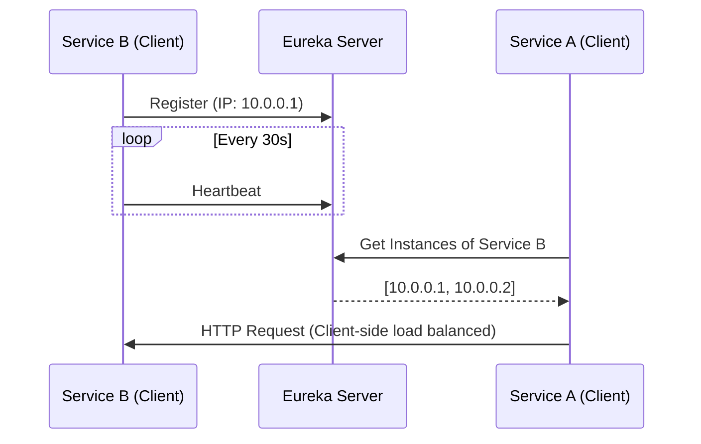

# Part 1: Microservices, Spring Cloud & Architecture

This guide covers modern Microservices architecture with Spring Boot & Spring Cloud, focusing on a 7 YOE level deep-dive.

---

### Q: How does Spring Boot fit into microservices architecture?
**Spring Boot** makes it easy to create stand-alone, production-grade microservices. It fits into the microservice architecture by providing:
1. **Embedded Servers** (Tomcat, Undertow) meaning each service runs independently.
2. **Auto-configuration** to rapidly bootstrap services without heavy XML/boilerplate.
3. **Integration with Spring Cloud** to easily add Service Discovery (Eureka), API Gateways, and Distributed Tracing.
4. **Actuator** for production-ready observability and health checks.

### Q103: What is Config Server?
A **Config Server** (like Spring Cloud Config Server) provides a centralized mechanism right out of the box to manage external properties for applications across all environments.
- **Why?** In a microservice ecosystem with 50+ services, changing a DB password shouldn't require code changes or redeploying 50 apps.
- **How it works:** It stores properties in Git, Vault, or a DB, and services fetch their properties at startup (or dynamically refresh via `@RefreshScope`).

### Q104, Q105: What is Service Discovery? What is Eureka and how it works?
**Service Discovery** is a pattern where microservices automatically locate each other on a network, rather than hardcoding IP addresses. 

**Netflix Eureka** is a Service Discovery server.
**How it works:**
1. **Registration**: When a microservice (Eureka Client) boots up, it registers its IP and port with the Eureka Server.
2. **Heartbeats**: The client sends periodic heartbeats (default 30s) to Eureka. If Eureka misses multiple heartbeats, it evicts the instance from the registry.
3. **Discovery**: When Service A wants to call Service B, it asks Eureka for Service B's active IP locations, and uses a Load Balancer (like Spring Cloud LoadBalancer) to route the request.



### Q106: What is Feign Client?
**Feign** is a declarative web service client. It makes writing web service clients easier. 
Instead of writing boilerplate `RestTemplate` or `WebClient` code to invoke other services, you declare an interface and annotate it. Feign natively integrates with Eureka for load balancing.

```java
@FeignClient(name = "user-service", fallback = UserFallback.class)
public interface UserClient {
    @GetMapping("/api/users/{id}")
    UserDto getUserById(@PathVariable("id") Long id);
}
```

### Q107, Q108: What is Circuit Breaker pattern? What is Resilience4j?
**Circuit Breaker Pattern** prevents catastrophic cascading failures across multiple systems. If a downstream service is failing, rather than having the calling service wait for timeouts and exhaust its thread pool, the circuit "trips" (opens) and fast-fails requests, returning a default/fallback response.

**Resilience4j** is a lightweight, easy-to-use fault tolerance library designed for Java 8 and functional programming. (It replaced Hystrix).
- **CLOSED**: Requests flow normally. If failure rate exceeds threshold (e.g., 50%), it opens.
- **OPEN**: Requests are fast-failed. After a `waitDurationInOpenState`, it enters HALF_OPEN.
- **HALF_OPEN**: Allows a limited number of test requests. If successful, shifts to CLOSED. If failed, back to OPEN.

```yaml
resilience4j.circuitbreaker:
  instances:
    userServiceBuilder:
      slidingWindowSize: 10
      failureRateThreshold: 50
      waitDurationInOpenState: 10000ms
```

### Q109, Q110: What is API Gateway? How Rate Limiting works?
An **API Gateway** (e.g., Spring Cloud Gateway) is the single entry point for all clients. It handles:
- **Routing**: `/api/users/**` -> User Service
- **Authentication/Authorization**: Verifying JWT tokens before routing.
- **Rate Limiting**: Preventing DDoS or limiting API usage based on tiers (e.g., 100 req/min).

**Rate Limiting in Spring Cloud Gateway** is typically done using **Redis & Token Bucket Algorithm**.
When a request comes in, the gateway checks Redis. If the bucket has tokens, it removes one and routes. If exhausted, it returns `HTTP 429 Too Many Requests`.

### Q111, Q112, Q113: Centralized Logging, Best Practices, Distributed Tracing?
**Centralized Logging** means aggregating logs from all ephemeral microservice instances into a single searchable sink (ELK Stack - Elasticsearch, Logstash, Kibana) or Splunk.
**Best Practices:**
1. **Never log sensitive data** (PII, Passwords).
2. Use **JSON format** for logs to easily index them in Elasticsearch.
3. Include a **Correlation ID (Trace ID)** in every log line.

**Distributed Tracing (Sleuth/Micrometer Tracing & Zipkin)**: In a flow where Request goes `Gateway -> OrderService -> PaymentService -> DB`, distributed tracing assigns a single `Trace ID` for the whole flow, and a unique `Span ID` per service hop, letting you visualize latency bottlenecks.

### Q114, Q115: Spring Boot Actuator & Health Checks?
`spring-boot-starter-actuator` provides enterprise-ready endpoints `/actuator/health` and `/actuator/info`.
- Production health checks must check deep dependencies (e.g., is DB up? is Redis up?), which Actuator does automatically via `HealthIndicators`.
- **Security Check:** Always secure actuator endpoints (e.g., restrict to internal subnets or require admin roles).

### Q116: How to Dockerize a Spring Boot application?
You use a `Dockerfile`. Protip (7 YOE): Use multi-stage builds or Layered Jars (Spring Boot 2.3+ feature) or Buildpacks to optimize layer caching.

```dockerfile
# Standard multi-stage build pattern
FROM maven:3.8-openjdk-17 AS build
WORKDIR /app
COPY . .
RUN mvn clean package -DskipTests

FROM eclipse-temurin:17-jre-alpine
WORKDIR /app
COPY --from=build /app/target/app.jar app.jar
ENTRYPOINT ["java", "-jar", "app.jar"]
```

### Q117: Kubernetes Readiness vs Liveness Probes?
These tell K8s how to manage your pod's lifecycle:
- **Liveness Probe**: "Is the app dead or stuck in a deadlock?" If it fails, K8s **restarts** the pod.
- **Readiness Probe**: "Is the app ready to accept traffic?" (e.g., warming up caches, initializing DB pool). If it fails, K8s **removes it from the Service load balancer**, but DOES NOT restart it.

In Spring Boot, Actuator provides `/actuator/health/liveness` and `/actuator/health/readiness`.

### Q118, Q119: Blue-Green Deployment & Zero Downtime?
**Zero Downtime Deployment**: Pushing new code without any user seeing a `502 Bad Gateway` or dropped request.
**Blue-Green Deployment**: Running two identical production environments (Blue and Green). Blue is live. You deploy new V2 code to Green, test it privately. When ready, switch the load balancer router from Blue to Green instantly. If it fails, immediately switch back.

### Q120, Q121: Graceful Shutdown & Handling High Traffic?
**Graceful Shutdown**: When an application stops, it shouldn't randomly sever active HTTP connections or kill active threads writing to DB.
In Spring Boot 2.3+, set `server.shutdown=graceful`. The server stops accepting *new* traffic but finishes processing *existing* requests before shutting down.

**Handling High Traffic**:
1. **Stateless Services**: Ensure you can horizontally scale instances safely.
2. **Caching**: Utilize Redis thoroughly to protect the DB from read-heavy traffic.
3. **Async Processing**: Use Kafka to decouple bursts of write-traffic. Instead of processing an order synchronously, put it on a queue and return `202 Accepted`.
4. **Database Tuning**: Read Replicas, Connection Pooling (HikariCP tuning), Query Optimization.
