# 🗄️ Database Systems — SQL & NoSQL

> **Beginner → Pro Guide** | What • Why • Where • Interview Questions • Production Code

---

## 📌 Table of Contents
1. [What are Database Systems?](#1-what-are-database-systems)
2. [Why Databases Matter](#2-why-databases-matter)
3. [Where Different DBs are Used](#3-where-different-dbs-are-used)
4. [SQL Databases — Deep Dive](#4-sql-databases--deep-dive)
5. [NoSQL Databases — Deep Dive](#5-nosql-databases--deep-dive)
6. [SQL vs NoSQL Comparison](#6-sql-vs-nosql-comparison)
7. [Database Internals](#7-database-internals)
8. [Advanced Concepts](#8-advanced-concepts)
9. [Architecture Diagrams](#9-architecture-diagrams)
10. [Production-Ready Code](#10-production-ready-code)
11. [Interview Questions & Answers](#11-interview-questions--answers)

---

## 1. What are Database Systems?

A **Database System** is organized software for storing, managing, and retrieving data efficiently. It includes the storage engine, query processor, transaction manager, and access control.

### Two Major Categories

| Category | Model | Examples |
|----------|-------|----------|
| **SQL (Relational)** | Tables with rows & columns, relationships via foreign keys | PostgreSQL, MySQL, Oracle, SQL Server |
| **NoSQL (Non-Relational)** | Flexible schemas — document, key-value, columnar, graph | MongoDB, Redis, Cassandra, Neo4j |

---

## 2. Why Databases Matter

- **Data Integrity** — ACID properties ensure data consistency
- **Performance** — Indexed queries over millions of records in milliseconds
- **Scalability** — Handle growing data from GBs to PBs
- **Concurrency** — Multiple users can read/write simultaneously
- **Security** — Role-based access, encryption at rest and in transit

---

## 3. Where Different DBs are Used

| Use Case | Best DB Type | Examples |
|----------|-------------|----------|
| Banking/Finance (strong consistency) | SQL | PostgreSQL, Oracle |
| E-Commerce (product catalog) | Document NoSQL | MongoDB |
| Session/Cache Storage | Key-Value NoSQL | Redis, Memcached |
| Social Networks (relationships) | Graph NoSQL | Neo4j, Amazon Neptune |
| IoT/Time Series Data | Columnar NoSQL | Cassandra, InfluxDB |
| Full-Text Search | Search Engine | Elasticsearch |
| Analytics/Warehousing | Columnar SQL | BigQuery, Redshift, Snowflake |

---

## 4. SQL Databases — Deep Dive

### 4.1 ACID Properties


| Property | Description | Example |
|----------|-------------|---------|
| **Atomicity** | Transaction is indivisible — all succeed or all rollback | Bank transfer: debit AND credit both happen or neither |
| **Consistency** | DB moves from one valid state to another | Balance can't go negative if constraint exists |
| **Isolation** | Concurrent transactions don't see each other's intermediate state | Two transfers on same account don't conflict |
| **Durability** | Once committed, data is permanently saved | Even if server crashes after COMMIT |

### 4.2 Normalization


**Example — 1NF Violation & Fix:**

❌ **Before (violates 1NF):**
| OrderID | Products |
|---------|----------|
| 1 | Laptop, Mouse, Keyboard |

✅ **After (1NF):**
| OrderID | Product |
|---------|---------|
| 1 | Laptop |
| 1 | Mouse |
| 1 | Keyboard |

### 4.3 Indexing


| Index Type | Use Case | Example |
|------------|----------|---------|
| **B-Tree** (default) | Range queries, equality | `WHERE age > 25` |
| **Hash** | Exact match only | `WHERE id = 42` |
| **GIN** | Full-text search, arrays, JSONB | `WHERE tags @> '{java}'` |
| **GiST** | Geometric, range types | `WHERE location <-> point(x,y)` |
| **Composite** | Multi-column queries | `WHERE city = 'Delhi' AND age > 25` |
| **Partial** | Subset of rows | `WHERE status = 'ACTIVE'` (only index active) |

### 4.4 Isolation Levels

| Level | Dirty Read | Non-Repeatable Read | Phantom Read | Performance |
|-------|-----------|--------------------|--------------| ------------|
| READ UNCOMMITTED | ✅ Yes | ✅ Yes | ✅ Yes | Fastest |
| READ COMMITTED | ❌ No | ✅ Yes | ✅ Yes | Fast |
| REPEATABLE READ | ❌ No | ❌ No | ✅ Yes | Medium |
| SERIALIZABLE | ❌ No | ❌ No | ❌ No | Slowest |

### 4.5 Joins Visualized

```
INNER JOIN:        LEFT JOIN:         RIGHT JOIN:        FULL OUTER JOIN:
  ┌───┐              ┌───┐              ┌───┐              ┌───┐
 ┌┤ A │┐            ┌┤ A │┐            ┌┤ A │┐            ┌┤ A │┐
 │└───┘│            █└───┘│            │└───┘█            █└───┘█
 │ ███ │            █ ███ │            │ ███ █            █ ███ █
 │┌───┐│            █┌───┐│            │┌───┐█            █┌───┐█
 └┤ B │┘            │┤ B │┘            └┤ B │█            █┤ B │█
  └───┘              └───┘              └───┘              └───┘
Only matching      All A +            All B +            All A + All B
                   matching B         matching A
```

---

## 5. NoSQL Databases — Deep Dive

### 5.1 NoSQL Categories


### 5.2 Document Store (MongoDB)

```json
// MongoDB Document - Flexible Schema
{
  "_id": ObjectId("64a7b2c3d4e5f6a7b8c9d0e1"),
  "name": "Surya Kant",
  "email": "surya@example.com",
  "addresses": [
    {
      "type": "home",
      "city": "Delhi",
      "pincode": "110001"
    },
    {
      "type": "office",
      "city": "Bangalore",
      "pincode": "560001"
    }
  ],
  "orders": [
    { "orderId": "ORD001", "total": 2999.00, "status": "delivered" }
  ]
}
```

### 5.3 Key-Value Store (Redis)

```
┌─────────────────────────────────────────────┐
│           Redis Data Structures             │
├──────────────┬──────────────────────────────┤
│ String       │ SET user:1 "John"            │
│ Hash         │ HSET user:1 name "John"      │
│ List         │ LPUSH queue "task1"           │
│ Set          │ SADD tags "java" "spring"     │
│ Sorted Set   │ ZADD leaderboard 100 "user1" │
│ Stream       │ XADD events * key value      │
│ HyperLogLog  │ PFADD visitors "user1"       │
└──────────────┴──────────────────────────────┘
```

### 5.4 Column-Family Store (Cassandra)

```
Row Key: user_123
├── Column Family: profile
│   ├── name: "Surya"
│   ├── email: "surya@example.com"
│   └── city: "Delhi"
├── Column Family: orders
│   ├── order_001: {total: 2999, status: "delivered"}
│   ├── order_002: {total: 1499, status: "shipped"}
│   └── order_003: {total: 599, status: "pending"}
```

### 5.5 Graph Database (Neo4j)


### 5.6 BASE Properties (NoSQL)

| Property | Description |
|----------|-------------|
| **Basically Available** | System guarantees availability (may serve stale data) |
| **Soft State** | State may change over time without input (due to replication) |
| **Eventually Consistent** | System will become consistent given enough time |

---

## 6. SQL vs NoSQL Comparison

| Feature | SQL | NoSQL |
|---------|-----|-------|
| **Schema** | Fixed, predefined | Dynamic, flexible |
| **Scaling** | Vertical (primarily) | Horizontal (primarily) |
| **Consistency** | Strong (ACID) | Eventual (BASE) |
| **Relationships** | Excellent (JOINs) | Limited (denormalized) |
| **Query Language** | SQL (standardized) | Varies per DB |
| **Transactions** | Multi-row, multi-table | Limited (document-level) |
| **Best For** | Complex queries, strong consistency | High throughput, flexible data |
| **Examples** | PostgreSQL, MySQL | MongoDB, Cassandra |

### When to Use What?


---

## 7. Database Internals

### 7.1 Storage Engines


### 7.2 Query Execution Pipeline


### 7.3 WAL (Write-Ahead Logging)


### 7.4 MVCC (Multi-Version Concurrency Control)

```
Transaction Timeline:
─────────────────────────────────────────────
T1 (READ):  BEGIN ─── SELECT ──────────────── COMMIT
                         │
                    Sees version at T1 start
                         │
T2 (WRITE): ──── BEGIN ── UPDATE ── COMMIT ──
                           │
                    Creates new version
                           │
T3 (READ):  ───────────── BEGIN ── SELECT ── COMMIT
                                     │
                                Sees T2's committed version
```

---

## 8. Advanced Concepts

### 8.1 Database Sharding Strategies

```mermaid
graph TD
    Sharding[Sharding Strategies] --> Range[Range-Based<br/>user A-M → Shard 1]
    Sharding --> Hash[Hash-Based<br/>hash user_id % N]
    Sharding --> Geo[Geography-Based<br/>India → Shard 1]
    Sharding --> Directory[Directory-Based<br/>Lookup table]
```



| Strategy | Pros | Cons |
|----------|------|------|
| **Range** | Simple, range queries easy | Hot spots if uneven distribution |
| **Hash** | Even distribution | Range queries across shards |
| **Geography** | Data locality, compliance | Uneven load across regions |
| **Directory** | Flexible | Lookup table is bottleneck |

### 8.2 Replication Models


### 8.3 Connection Pooling


### 8.4 Database Migration Strategy


---

## 9. Architecture Diagrams

### 9.1 Multi-Database Architecture (Polyglot Persistence)


### 9.2 Database High Availability Setup


---

## 10. Production-Ready Code

### 10.1 HikariCP Connection Pool (Spring Boot)

```yaml
# application.yml
spring:
  datasource:
    url: jdbc:postgresql://localhost:5432/mydb
    username: ${DB_USERNAME}
    password: ${DB_PASSWORD}
    hikari:
      minimum-idle: 5
      maximum-pool-size: 20
      idle-timeout: 300000        # 5 minutes
      max-lifetime: 1200000       # 20 minutes
      connection-timeout: 20000   # 20 seconds
      leak-detection-threshold: 60000  # 1 minute
      pool-name: MyAppPool
```

### 10.2 JPA Entity with Optimal Design

```java
@Entity
@Table(name = "orders", indexes = {
    @Index(name = "idx_order_user", columnList = "user_id"),
    @Index(name = "idx_order_status", columnList = "status"),
    @Index(name = "idx_order_created", columnList = "created_at")
})
@EntityListeners(AuditingEntityListener.class)
public class Order {
    
    @Id
    @GeneratedValue(strategy = GenerationType.IDENTITY)
    private Long id;
    
    @Column(name = "order_number", unique = true, nullable = false, length = 20)
    private String orderNumber;
    
    @ManyToOne(fetch = FetchType.LAZY)  // LAZY to avoid N+1
    @JoinColumn(name = "user_id", nullable = false)
    private User user;
    
    @OneToMany(mappedBy = "order", cascade = CascadeType.ALL, orphanRemoval = true)
    @BatchSize(size = 20)  // Batch loading to avoid N+1
    private List<OrderItem> items = new ArrayList<>();
    
    @Enumerated(EnumType.STRING)
    @Column(nullable = false, length = 20)
    private OrderStatus status;
    
    @Column(name = "total_amount", precision = 10, scale = 2)
    private BigDecimal totalAmount;
    
    @Version  // Optimistic locking
    private Long version;
    
    @CreatedDate
    @Column(name = "created_at", updatable = false)
    private LocalDateTime createdAt;
    
    @LastModifiedDate
    @Column(name = "updated_at")
    private LocalDateTime updatedAt;
}
```

### 10.3 Repository with Custom Queries

```java
public interface OrderRepository extends JpaRepository<Order, Long> {
    
    // Derived query
    List<Order> findByUserIdAndStatus(Long userId, OrderStatus status);
    
    // JPQL with JOIN FETCH to avoid N+1
    @Query("SELECT o FROM Order o JOIN FETCH o.items WHERE o.id = :id")
    Optional<Order> findByIdWithItems(@Param("id") Long id);
    
    // Native query for complex analytics
    @Query(value = """
        SELECT DATE(created_at) as order_date, 
               COUNT(*) as order_count,
               SUM(total_amount) as revenue
        FROM orders 
        WHERE created_at >= :startDate 
        GROUP BY DATE(created_at) 
        ORDER BY order_date
        """, nativeQuery = true)
    List<Object[]> getDailyOrderStats(@Param("startDate") LocalDateTime startDate);
    
    // Pagination
    Page<Order> findByStatus(OrderStatus status, Pageable pageable);
    
    // Streaming for large datasets
    @QueryHints(@QueryHint(name = HINT_FETCH_SIZE, value = "50"))
    @Query("SELECT o FROM Order o WHERE o.status = :status")
    Stream<Order> streamByStatus(@Param("status") OrderStatus status);
}
```

### 10.4 MongoDB with Spring Data

```java
@Document(collection = "products")
@CompoundIndex(name = "category_price_idx", def = "{'category': 1, 'price': -1}")
public class Product {
    
    @Id
    private String id;
    
    @Indexed(unique = true)
    private String sku;
    
    @TextIndexed(weight = 10)
    private String name;
    
    @TextIndexed(weight = 5)
    private String description;
    
    private String category;
    private BigDecimal price;
    
    private List<ProductVariant> variants;
    private Map<String, String> attributes;
    
    @CreatedDate
    private Instant createdAt;
}

// Repository
public interface ProductRepository extends MongoRepository<Product, String> {
    
    // Text search
    @Query("{ $text: { $search: ?0 } }")
    List<Product> searchProducts(String keyword);
    
    // Aggregation pipeline
    @Aggregation(pipeline = {
        "{ $match: { category: ?0 } }",
        "{ $group: { _id: null, avgPrice: { $avg: '$price' }, count: { $sum: 1 } } }"
    })
    AggregationResults<CategoryStats> getCategoryStats(String category);
}
```

### 10.5 Redis Cache Integration

```java
@Configuration
@EnableCaching
public class RedisConfig {
    
    @Bean
    public RedisCacheManager cacheManager(RedisConnectionFactory factory) {
        RedisCacheConfiguration config = RedisCacheConfiguration.defaultCacheConfig()
            .entryTtl(Duration.ofMinutes(30))
            .serializeKeysWith(SerializationPair.fromSerializer(new StringRedisSerializer()))
            .serializeValuesWith(SerializationPair.fromSerializer(new GenericJackson2JsonRedisSerializer()))
            .disableCachingNullValues();
            
        return RedisCacheManager.builder(factory)
            .cacheDefaults(config)
            .withCacheConfiguration("products", 
                config.entryTtl(Duration.ofHours(1)))
            .withCacheConfiguration("sessions",
                config.entryTtl(Duration.ofMinutes(15)))
            .build();
    }
}

@Service
public class ProductService {
    
    @Cacheable(value = "products", key = "#id")
    public Product getProduct(String id) {
        return productRepository.findById(id)
            .orElseThrow(() -> new NotFoundException("Product not found: " + id));
    }
    
    @CachePut(value = "products", key = "#product.id")
    public Product updateProduct(Product product) {
        return productRepository.save(product);
    }
    
    @CacheEvict(value = "products", key = "#id")
    public void deleteProduct(String id) {
        productRepository.deleteById(id);
    }
    
    @CacheEvict(value = "products", allEntries = true)
    @Scheduled(fixedRate = 3600000)  // Clear all product cache every hour
    public void evictAllProducts() {
        log.info("Product cache cleared");
    }
}
```

### 10.6 Flyway Database Migration

```sql
-- V1__create_users_table.sql
CREATE TABLE users (
    id BIGSERIAL PRIMARY KEY,
    email VARCHAR(255) NOT NULL UNIQUE,
    password_hash VARCHAR(255) NOT NULL,
    full_name VARCHAR(100) NOT NULL,
    status VARCHAR(20) NOT NULL DEFAULT 'ACTIVE',
    created_at TIMESTAMP NOT NULL DEFAULT NOW(),
    updated_at TIMESTAMP NOT NULL DEFAULT NOW()
);

CREATE INDEX idx_users_email ON users(email);
CREATE INDEX idx_users_status ON users(status);

-- V2__create_orders_table.sql
CREATE TABLE orders (
    id BIGSERIAL PRIMARY KEY,
    order_number VARCHAR(20) NOT NULL UNIQUE,
    user_id BIGINT NOT NULL REFERENCES users(id),
    status VARCHAR(20) NOT NULL DEFAULT 'PENDING',
    total_amount DECIMAL(10,2) NOT NULL,
    version BIGINT NOT NULL DEFAULT 0,
    created_at TIMESTAMP NOT NULL DEFAULT NOW(),
    updated_at TIMESTAMP NOT NULL DEFAULT NOW()
);

CREATE INDEX idx_orders_user ON orders(user_id);
CREATE INDEX idx_orders_status ON orders(status);
CREATE INDEX idx_orders_created ON orders(created_at);

-- V3__add_order_items_table.sql  
CREATE TABLE order_items (
    id BIGSERIAL PRIMARY KEY,
    order_id BIGINT NOT NULL REFERENCES orders(id) ON DELETE CASCADE,
    product_id VARCHAR(50) NOT NULL,
    product_name VARCHAR(200) NOT NULL,
    quantity INT NOT NULL CHECK (quantity > 0),
    unit_price DECIMAL(10,2) NOT NULL,
    total_price DECIMAL(10,2) NOT NULL
);

CREATE INDEX idx_order_items_order ON order_items(order_id);
```

---

## 11. Interview Questions & Answers

### 🟢 Beginner Level

**Q1: What is the difference between SQL and NoSQL?**
> **A:** SQL databases use structured tables with fixed schemas, support ACID transactions, and are best for complex queries with JOINs. NoSQL databases have flexible schemas, support horizontal scaling natively, and come in four types: document, key-value, column-family, and graph. SQL is best when you need strong consistency; NoSQL when you need flexibility and scale.

**Q2: What is an index? Why use it?**
> **A:** An index is a data structure (usually B-Tree) that speeds up data retrieval at the cost of extra storage and slower writes. Without an index, the DB does a full table scan (O(n)). With a B-Tree index, lookups are O(log n). Always index columns used in WHERE, JOIN, and ORDER BY clauses.

**Q3: What is normalization?**
> **A:** Normalization is organizing data to reduce redundancy and improve integrity. 1NF = atomic values. 2NF = no partial dependencies. 3NF = no transitive dependencies. Over-normalization can hurt read performance due to excessive JOINs, so denormalization is sometimes used for read-heavy workloads.

**Q4: What are different types of JOINs?**
> **A:** INNER JOIN (matching rows only), LEFT JOIN (all left + matching right), RIGHT JOIN (all right + matching left), FULL OUTER JOIN (all rows from both), CROSS JOIN (cartesian product), SELF JOIN (table joins itself).

---

### 🟡 Intermediate Level

**Q5: What is the N+1 query problem and how do you solve it?**
> **A:** When fetching a list of N entities that each have a child relationship, ORM executes 1 query for parents + N queries for children = N+1 queries. Solutions: (1) JOIN FETCH in JPQL, (2) @BatchSize annotation, (3) @EntityGraph, (4) native query with JOIN. Example: fetching 100 orders with their items would be 101 queries without optimization.

**Q6: Explain database isolation levels.**
> **A:** Four levels from least to most strict: READ UNCOMMITTED (dirty reads possible), READ COMMITTED (default in PostgreSQL, sees only committed data), REPEATABLE READ (same query returns same data within transaction), SERIALIZABLE (full isolation, transactions appear serial). Higher isolation = fewer anomalies but lower concurrency.

**Q7: What is database sharding?**
> **A:** Sharding is horizontal partitioning of data across multiple database instances. Each shard holds a subset of data based on a shard key. Strategies: hash-based (good distribution), range-based (range queries), directory-based (flexible). Challenges: cross-shard queries, rebalancing, distributed transactions.

**Q8: How does MVCC work?**
> **A:** Multi-Version Concurrency Control keeps multiple versions of each row. Readers see a snapshot from their transaction start time, writers create new versions. This allows readers to never block writers and vice versa. PostgreSQL uses tuple versioning with xmin/xmax; cleanup happens via VACUUM.

---

### 🔴 Advanced / Pro Level

**Q9: How would you design a database schema for a multi-tenant SaaS application?**
> **A:** Three approaches: (1) Shared DB, shared schema (tenant_id column in every table — simplest, least isolation), (2) Shared DB, separate schemas (PostgreSQL schemas — good balance), (3) Separate databases per tenant (strongest isolation, most expensive). Use Row-Level Security in PostgreSQL for approach 1. Add tenant_id to all indexes for query performance.

**Q10: Explain the differences between B-Tree and LSM-Tree storage engines.**
> **A:** B-Tree (InnoDB, PostgreSQL): data stored in fixed-size pages, in-place updates, good for read-heavy workloads, write amplification due to random I/O. LSM-Tree (RocksDB, Cassandra): writes go to memtable then flushed to sorted SSTables, sequential I/O, good for write-heavy workloads, read requires merging multiple levels. B-Tree wins for OLTP reads; LSM-Tree wins for write-intensive workloads.

**Q11: How do you handle database migrations in production with zero downtime?**
> **A:** Follow expand-contract pattern: (1) Add new column with default (backward compatible), (2) Deploy app that writes to both old and new columns, (3) Backfill old data, (4) Deploy app that reads from new column, (5) Remove old column. Never rename or delete columns directly. Use tools like Flyway or Liquibase. Run migrations before deploying new code. Avoid locking operations on large tables (use `CREATE INDEX CONCURRENTLY` in PostgreSQL).

**Q12: Explain Change Data Capture (CDC) and its use cases.**
> **A:** CDC captures row-level changes (INSERT, UPDATE, DELETE) from DB transaction log and streams them to external systems. Tools: Debezium (open-source, Kafka Connect). Use cases: (1) Sync data to Elasticsearch for search, (2) Build read models for CQRS, (3) Event-driven microservices, (4) Data warehouse ingestion, (5) Cache invalidation. It's reliable because it reads from the WAL, not polling.

**Q13: How do you handle hot partition/shard in a distributed database?**
> **A:** Hot partition occurs when one shard gets disproportionate traffic (e.g., celebrity user in social media). Solutions: (1) Add randomness to shard key (e.g., `user_id + random(0-9)` → distributes across 10 partitions, need fan-out for reads), (2) Use write-behind cache, (3) Rate limit per partition, (4) Virtual sharding with consistent hashing and rebalancing, (5) Time-based partitioning for time-series data.

**Q14: What is query plan analysis and how do you use EXPLAIN?**
> **A:** `EXPLAIN ANALYZE` shows the actual execution plan with timings. Key things to look for: Seq Scan (full table scan — add index), Nested Loop with high rows (consider hash join), large actual vs estimated rows (update statistics with ANALYZE), Sort on disk (increase work_mem), Index Scan (good). Example: `EXPLAIN (ANALYZE, BUFFERS, FORMAT TEXT) SELECT * FROM orders WHERE user_id = 42`.

---

## 🎯 Quick Reference

```
Database Selection Guide:
─────────────────────────
Need ACID + Complex Queries → PostgreSQL
Need JSON Flexibility → MongoDB  
Need Ultra-Fast Cache → Redis
Need Massive Write Scale → Cassandra
Need Full-Text Search → Elasticsearch
Need Graph Traversals → Neo4j
Need Analytics → ClickHouse / BigQuery

Performance Checklist:
──────────────────────
✅ Use connection pooling (HikariCP)
✅ Index WHERE, JOIN, ORDER BY columns
✅ Use EXPLAIN ANALYZE for slow queries
✅ Avoid SELECT * — select only needed columns
✅ Use pagination (LIMIT + OFFSET or cursor)
✅ Batch INSERT/UPDATE operations
✅ Use read replicas for read-heavy loads
✅ Cache frequently accessed data in Redis
✅ Monitor slow query logs
✅ Regular VACUUM and ANALYZE (PostgreSQL)
```

---

> **Next Topic:** [03 - Distributed Systems](./03-distributed-systems.md)
