# 🌐 Distributed Systems — Consistency & Replication

> **Beginner → Pro Guide** | What • Why • Where • Interview Questions • Production Code

---

## 📌 Table of Contents
1. [What are Distributed Systems?](#1-what-are-distributed-systems)
2. [Why Distributed Systems?](#2-why-distributed-systems)
3. [Where They Are Used](#3-where-they-are-used)
4. [Core Concepts — Beginner](#4-core-concepts--beginner)
5. [Consistency Models](#5-consistency-models)
6. [Replication Strategies](#6-replication-strategies)
7. [Consensus Algorithms](#7-consensus-algorithms)
8. [Advanced Concepts](#8-advanced-concepts)
9. [Architecture Diagrams](#9-architecture-diagrams)
10. [Production-Ready Code](#10-production-ready-code)
11. [Interview Questions & Answers](#11-interview-questions--answers)

---

## 1. What are Distributed Systems?

A **Distributed System** is a collection of independent computers (nodes) that appear to the user as a single coherent system. The nodes communicate over a network to coordinate their actions.


### Key Characteristics
| Property | Description |
|----------|-------------|
| **Concurrency** | Multiple nodes execute simultaneously |
| **No Global Clock** | Nodes have their own clocks, no unified time |
| **Independent Failures** | Nodes can fail independently |
| **Heterogeneity** | Different hardware, OS, languages |
| **Transparency** | Complexity hidden from users |

---

## 2. Why Distributed Systems?

| Reason | Explanation |
|--------|-------------|
| **Scalability** | Handle more load by adding nodes |
| **Fault Tolerance** | System works even if some nodes fail |
| **Low Latency** | Serve users from nearby regions |
| **Data Locality** | Keep data close to users for compliance |
| **Cost** | Commodity hardware cheaper than supercomputers |

---

## 3. Where They Are Used

| System | Distributed Component |
|--------|----------------------|
| **Google Search** | Distributed indexing across thousands of servers |
| **Netflix** | Globally distributed streaming CDN |
| **WhatsApp** | Distributed messaging across data centers |
| **Amazon DynamoDB** | Distributed key-value store |
| **Apache Kafka** | Distributed event streaming |
| **Bitcoin** | Distributed ledger (blockchain) |

---

## 4. Core Concepts — Beginner

### 4.1 The Eight Fallacies of Distributed Computing

```
1. The network is reliable           ← Packets get lost
2. Latency is zero                   ← Network calls are slow
3. Bandwidth is infinite             ← Network is a bottleneck
4. The network is secure             ← Security threats are real
5. Topology doesn't change           ← Nodes come and go
6. There is one administrator        ← Multiple teams manage parts
7. Transport cost is zero            ← Serialization has overhead
8. The network is homogeneous        ← Different protocols/hardware
```

### 4.2 CAP Theorem


> **Key Insight:** In a distributed system, network partitions WILL happen. So you must choose between **Consistency** (CP) and **Availability** (AP).

### 4.3 PACELC Theorem (Extension of CAP)

```
If there is a Partition (P):
    Choose between Availability (A) and Consistency (C)
Else (E) when system is running normally:
    Choose between Latency (L) and Consistency (C)

Examples:
    DynamoDB:   PA/EL  (Available during partition, Low latency normally)
    MongoDB:    PC/EC  (Consistent always)
    Cassandra:  PA/EL  (Available and fast)
    PostgreSQL: PC/EC  (Consistent always)
```

---

## 5. Consistency Models

### 5.1 Consistency Spectrum


| Model | Description | Example |
|-------|-------------|---------|
| **Strong / Linearizability** | All readers see the same value immediately after write | ZooKeeper, Spanner |
| **Sequential** | All nodes see operations in the same order | Traditional RDBMS |
| **Causal** | Causally related operations are seen in order | MongoDB (causal sessions) |
| **Eventual** | All replicas converge eventually | DynamoDB, Cassandra |

### 5.2 Strong Consistency


### 5.3 Eventual Consistency


### 5.4 Conflict Resolution in Eventual Consistency


**Vector Clocks Example:**
```
Node A: {A:1, B:0}  →  Write X=1
Node B: {A:0, B:1}  →  Write X=2
              ↓
Conflict Detected! Neither is ancestor of the other
              ↓
Application resolves: merge or pick winner
```

---

## 6. Replication Strategies

### 6.1 Single-Leader Replication


| Aspect | Detail |
|--------|--------|
| **Pros** | Simple, no write conflicts, strong consistency possible |
| **Cons** | Leader is bottleneck, write unavailability if leader fails |
| **Used By** | PostgreSQL, MySQL, MongoDB |

### 6.2 Multi-Leader Replication


| Aspect | Detail |
|--------|--------|
| **Pros** | Low latency writes in all regions, no single point of failure |
| **Cons** | Write conflicts, complex conflict resolution |
| **Used By** | CouchDB, Google Docs (OT-based), Cassandra (ring) |

### 6.3 Leaderless Replication

```mermaid
graph TD
    Client[Client] -->|Write W=2| N1[Node 1 ✅]
    Client -->|Write W=2| N2[Node 2 ✅]
    Client -->|Write W=2| N3[Node 3 ❌ Down]
    
    Client2[Client] -->|Read R=2| N1
    Client2 -->|Read R=2| N2
    
    Note1[Quorum: W + R > N<br/>2 + 2 > 3 ✅<br/>Guaranteed to read latest]
```



**Quorum Formula: W + R > N**
- N = total replicas, W = write quorum, R = read quorum
- W=2, R=2, N=3 → guaranteed to read latest write
- W=1, R=3, N=3 → fast writes, slow reads
- W=3, R=1, N=3 → slow writes, fast reads

### 6.4 Replication Comparison

| Feature | Single-Leader | Multi-Leader | Leaderless |
|---------|--------------|-------------|-----------|
| **Write Latency** | Higher (single point) | Low (local DC) | Low (any node) |
| **Consistency** | Strong possible | Eventual | Eventual (tunable) |
| **Write Conflicts** | None | Yes | Yes |
| **Availability** | Lower (leader fails) | Higher | Highest |
| **Complexity** | Low | High | Medium |
| **Examples** | PostgreSQL | CouchDB | Cassandra, DynamoDB |

---

## 7. Consensus Algorithms

### 7.1 What is Consensus?

Getting all nodes in a distributed system to agree on a single value, even when some nodes fail.

### 7.2 Raft Algorithm

```mermaid
sequenceDiagram
    participant F1 as Follower 1
    participant L as Leader
    participant F2 as Follower 2
    
    Note over F1,F2: Election Phase
    F1->>F1: Timeout → Become Candidate
    F1->>L: RequestVote
    F1->>F2: RequestVote
    L-->>F1: Vote Granted
    F2-->>F1: Vote Granted
    Note over F1: Becomes Leader (majority votes)
    
    Note over F1,F2: Log Replication Phase
    F1->>L: AppendEntries (heartbeat + log)
    F1->>F2: AppendEntries (heartbeat + log)
    L-->>F1: Success
    F2-->>F1: Success
    Note over F1: Entry committed (majority ack)
```



**Raft States:**
```mermaid
statediagram-v2
    graph LR
        Follower -->|Timeout, no heartbeat| Candidate
        Candidate -->|Receives majority votes| Leader
        Candidate -->|Higher term discovered| Follower
        Leader -->|Higher term discovered| Follower
        Candidate -->|Election timeout| Candidate
```

### 7.3 Paxos (Simplified)

```
Phase 1: Prepare
─────────────────
Proposer → Acceptors: "I have proposal #N"
Acceptors → Proposer: "OK, I promise not to accept < N"

Phase 2: Accept  
─────────────────
Proposer → Acceptors: "Accept value V for proposal #N"
Acceptors → Proposer: "Accepted"

Phase 3: Learn
─────────────────
If majority accepted → Value is chosen
Proposer → Learners: "Value V is decided"
```

### 7.4 ZAB (ZooKeeper Atomic Broadcast)

Used by Apache ZooKeeper for leader election and configuration management.


---

## 8. Advanced Concepts

### 8.1 Distributed Clocks


**Lamport Timestamps:**
```
Event A on Node 1: LC=1
Event B on Node 1: LC=2
Event C on Node 2: LC=1
Node 1 sends msg to Node 2 at LC=2
Node 2 receives: LC = max(1, 2) + 1 = 3
```

**Google TrueTime (Spanner):**
```
TrueTime API returns: [earliest, latest]
Interval accounts for clock uncertainty
Spanner waits for uncertainty interval to pass
→ Guarantees global ordering without coordination
```

### 8.2 Distributed Transactions


**2PC vs 3PC vs Saga:**

| Feature | 2PC | 3PC | Saga |
|---------|-----|-----|------|
| **Blocking** | Yes (if coordinator crashes) | No | No |
| **Performance** | Low | Medium | High |
| **Consistency** | Strong | Strong | Eventual |
| **Complexity** | Medium | High | Medium |
| **Use Case** | Traditional DB | Rarely used | Microservices |

### 8.3 Gossip Protocol

```mermaid
graph TD
    subgraph Round 1
        A1[Node A<br/>Knows: data1] -->|Gossip| B1[Node B]
    end
    
    subgraph Round 2
        A2[Node A] -->|Gossip| C2[Node C]
        B2[Node B<br/>Knows: data1] -->|Gossip| D2[Node D]
    end
    
    subgraph Round 3
        C3[Node C<br/>Knows: data1] -->|Gossip| E3[Node E]
        D3[Node D<br/>Knows: data1] -->|Gossip| F3[Node F]
    end
    
    Note1[Exponential spread:<br/>1 → 2 → 4 → 8 → all nodes<br/>O log N rounds]
```



Used for: Membership detection, failure detection, metadata propagation (Cassandra, Consul).

### 8.4 Split Brain Problem

```mermaid
graph TD
    subgraph Before Partition
        L[Leader] <--> F1[Follower 1]
        L <--> F2[Follower 2]
        L <--> F3[Follower 3]
        L <--> F4[Follower 4]
    end
    
    subgraph After Network Partition
        subgraph Partition A
            LA[Old Leader]
            FA1[Follower 1]
        end
        subgraph Partition B
            FA2[Follower 2]
            FA3[Follower 3]
            FA4[Follower 4]
        end
    end
    
    Note1[Partition B has majority 3/5<br/>→ Elects new leader<br/>Partition A 2/5 → Cannot form quorum<br/>→ Old leader steps down]
```



**Solutions:**
- **Quorum-based:** Need majority (N/2 + 1) to proceed
- **Fencing tokens:** Monotonically increasing tokens — old leader's token rejected
- **STONITH:** Shoot The Other Node In The Head — force shutdown

---

## 9. Architecture Diagrams

### 9.1 Distributed Database Architecture (Cassandra-like)

```mermaid
graph TD
    Client --> Coordinator[Coordinator Node]
    
    subgraph Ring Topology
        N1[Node 1<br/>Token: 0-100]
        N2[Node 2<br/>Token: 101-200]
        N3[Node 3<br/>Token: 201-300]
        N4[Node 4<br/>Token: 301-400]
        N5[Node 5<br/>Token: 401-500]
    end
    
    Coordinator --> N1
    Coordinator --> N2
    Coordinator --> N3
    
    N1 <-->|Gossip| N2
    N2 <-->|Gossip| N3
    N3 <-->|Gossip| N4
    N4 <-->|Gossip| N5
    N5 <-->|Gossip| N1
    
    Note1[Replication Factor = 3<br/>Key hashes to token 150<br/>→ Stored on N2, N3, N4]
```



### 9.2 ZooKeeper Ensemble


---

## 10. Production-Ready Code

### 10.1 Distributed Lock with Redis (Redisson)

```java
@Service
public class DistributedLockService {
    
    private final RedissonClient redisson;
    
    public <T> T executeWithLock(String lockName, long waitTime, 
                                  long leaseTime, Supplier<T> action) {
        RLock lock = redisson.getLock(lockName);
        try {
            boolean acquired = lock.tryLock(waitTime, leaseTime, TimeUnit.SECONDS);
            if (!acquired) {
                throw new LockAcquisitionException("Failed to acquire lock: " + lockName);
            }
            return action.get();
        } catch (InterruptedException e) {
            Thread.currentThread().interrupt();
            throw new LockAcquisitionException("Lock interrupted: " + lockName);
        } finally {
            if (lock.isHeldByCurrentThread()) {
                lock.unlock();
            }
        }
    }
}

// Usage - Preventing double order processing
@Service
public class OrderService {
    
    @Autowired
    private DistributedLockService lockService;
    
    public Order processOrder(String orderId) {
        return lockService.executeWithLock(
            "order-lock:" + orderId,    // Lock key
            5,                           // Wait up to 5 seconds
            30,                          // Auto-release after 30 seconds
            () -> {
                // Critical section — only one instance processes this order
                Order order = orderRepository.findById(orderId)
                    .orElseThrow();
                if (order.getStatus() != OrderStatus.PENDING) {
                    return order;  // Already processed (idempotent)
                }
                order.setStatus(OrderStatus.PROCESSING);
                return orderRepository.save(order);
            }
        );
    }
}
```

### 10.2 Leader Election with ZooKeeper (Curator)

```java
@Service
public class LeaderElectionService implements Closeable {
    
    private final LeaderSelector leaderSelector;
    private final String instanceId;
    
    public LeaderElectionService(CuratorFramework curator) {
        this.instanceId = UUID.randomUUID().toString();
        this.leaderSelector = new LeaderSelector(curator, "/leader/order-processor",
            new LeaderSelectorListenerAdapter() {
                @Override
                public void takeLeadership(CuratorFramework client) throws Exception {
                    log.info("Instance {} became leader!", instanceId);
                    try {
                        // This instance is now the leader
                        // Process work that should only run on one instance
                        while (!Thread.currentThread().isInterrupted()) {
                            processLeaderTasks();
                            Thread.sleep(1000);
                        }
                    } catch (InterruptedException e) {
                        log.info("Leadership relinquished by {}", instanceId);
                        Thread.currentThread().interrupt();
                    }
                }
            });
        
        leaderSelector.autoRequeue();  // Re-enter election if leadership lost
        leaderSelector.start();
    }
    
    private void processLeaderTasks() {
        // Tasks that should run on only ONE instance:
        // - Scheduled jobs
        // - Database cleanup
        // - Report generation
        log.debug("Leader {} processing tasks...", instanceId);
    }
    
    @Override
    public void close() {
        leaderSelector.close();
    }
}
```

### 10.3 Quorum Read/Write Pattern

```java
@Service
public class QuorumStore {
    
    private final List<StorageNode> nodes;
    private final int replicationFactor;    // N
    private final int writeQuorum;          // W
    private final int readQuorum;           // R
    
    public QuorumStore(List<StorageNode> nodes) {
        this.nodes = nodes;
        this.replicationFactor = 3;   // N=3
        this.writeQuorum = 2;          // W=2
        this.readQuorum = 2;           // R=2 (W+R > N)
    }
    
    public boolean write(String key, String value, long timestamp) {
        List<StorageNode> targetNodes = getNodesForKey(key, replicationFactor);
        AtomicInteger successCount = new AtomicInteger(0);
        CountDownLatch latch = new CountDownLatch(writeQuorum);
        
        for (StorageNode node : targetNodes) {
            CompletableFuture.runAsync(() -> {
                try {
                    node.put(key, value, timestamp);
                    if (successCount.incrementAndGet() <= writeQuorum) {
                        latch.countDown();
                    }
                } catch (Exception e) {
                    log.warn("Write failed to node {}: {}", node.getId(), e.getMessage());
                }
            });
        }
        
        try {
            return latch.await(5, TimeUnit.SECONDS);  // Wait for W acks
        } catch (InterruptedException e) {
            Thread.currentThread().interrupt();
            return false;
        }
    }
    
    public String read(String key) {
        List<StorageNode> targetNodes = getNodesForKey(key, replicationFactor);
        List<CompletableFuture<VersionedValue>> futures = targetNodes.stream()
            .map(node -> CompletableFuture.supplyAsync(() -> node.get(key)))
            .toList();
        
        // Wait for R responses and return the one with highest timestamp
        List<VersionedValue> responses = futures.stream()
            .map(f -> {
                try { return f.get(3, TimeUnit.SECONDS); }
                catch (Exception e) { return null; }
            })
            .filter(Objects::nonNull)
            .toList();
        
        if (responses.size() < readQuorum) {
            throw new InsufficientReplicasException("Only got " + responses.size() + " replies");
        }
        
        // Return value with highest timestamp (latest write wins)
        return responses.stream()
            .max(Comparator.comparingLong(VersionedValue::getTimestamp))
            .map(VersionedValue::getValue)
            .orElse(null);
    }
    
    private List<StorageNode> getNodesForKey(String key, int count) {
        // Consistent hashing to determine which nodes own this key
        int hash = Math.abs(key.hashCode());
        int startIdx = hash % nodes.size();
        List<StorageNode> result = new ArrayList<>();
        for (int i = 0; i < count; i++) {
            result.add(nodes.get((startIdx + i) % nodes.size()));
        }
        return result;
    }
}
```

### 10.4 Event Sourcing Pattern

```java
// Event Store
@Entity
@Table(name = "event_store", indexes = {
    @Index(name = "idx_aggregate", columnList = "aggregate_id, version")
})
public class StoredEvent {
    @Id @GeneratedValue(strategy = GenerationType.IDENTITY)
    private Long id;
    
    @Column(name = "aggregate_id", nullable = false)
    private String aggregateId;
    
    @Column(nullable = false)
    private String eventType;
    
    @Column(columnDefinition = "TEXT", nullable = false)
    private String payload;  // JSON
    
    @Column(nullable = false)
    private Integer version;
    
    @Column(name = "created_at", nullable = false)
    private Instant createdAt;
}

// Aggregate reconstruction
@Service
public class OrderAggregateService {
    
    @Autowired
    private EventStoreRepository eventStore;
    
    public OrderAggregate loadAggregate(String orderId) {
        List<StoredEvent> events = eventStore
            .findByAggregateIdOrderByVersionAsc(orderId);
        
        OrderAggregate aggregate = new OrderAggregate();
        for (StoredEvent event : events) {
            aggregate.apply(deserialize(event));  // Replay events
        }
        return aggregate;
    }
    
    @Transactional
    public void appendEvent(String aggregateId, DomainEvent event, int expectedVersion) {
        // Optimistic concurrency check
        int currentVersion = eventStore.getMaxVersion(aggregateId);
        if (currentVersion != expectedVersion) {
            throw new ConcurrentModificationException("Aggregate modified concurrently");
        }
        
        StoredEvent stored = new StoredEvent();
        stored.setAggregateId(aggregateId);
        stored.setEventType(event.getClass().getSimpleName());
        stored.setPayload(serialize(event));
        stored.setVersion(expectedVersion + 1);
        stored.setCreatedAt(Instant.now());
        
        eventStore.save(stored);
        
        // Publish to message broker for other services
        kafkaTemplate.send("domain-events", aggregateId, serialize(event));
    }
}
```

---

## 11. Interview Questions & Answers

### 🟢 Beginner Level

**Q1: What is a distributed system?**
> **A:** A distributed system is a collection of independent computers that coordinate over a network to achieve a common goal and appear as a single system to users. Examples: Google Search, Netflix, distributed databases. Key challenges: network failures, clock synchronization, partial failures.

**Q2: What is the CAP theorem?**
> **A:** States that a distributed system can only guarantee 2 of 3 properties: Consistency (all nodes see same data), Availability (every request gets a response), Partition Tolerance (system works despite network failures). Since partitions are inevitable, you choose between CP (strong consistency, reject requests during partition) and AP (always available, may serve stale data).

**Q3: What is replication? Why is it needed?**
> **A:** Replication is copying data across multiple nodes. Needed for: (1) Fault tolerance — if one node dies, others have the data, (2) Read scalability — distribute reads across replicas, (3) Low latency — serve from geographically closer replica.

---

### 🟡 Intermediate Level

**Q4: Explain the difference between strong and eventual consistency.**
> **A:** Strong consistency: after a write, all subsequent reads return the updated value. Requires synchronous replication or consensus. Eventual consistency: after a write, replicas may return stale data temporarily, but will converge. Strong is simpler to reason about but slower; eventual is faster but requires handling stale reads. Use strong for banking; eventual for social media feeds.

**Q5: What is a quorum and how does it ensure consistency?**
> **A:** A quorum is the minimum number of nodes that must agree for an operation. With N replicas, W write quorum, R read quorum: if W + R > N, at least one node in the read set has the latest write. Example: N=3, W=2, R=2 → guaranteed overlap. Tunable: W=1,R=3 → fast writes; W=3,R=1 → fast reads.

**Q6: Explain leader election in distributed systems.**
> **A:** Process where nodes choose one leader for coordination. Algorithms: Raft (leader heartbeats, follower timeout → election), Paxos (proposer-acceptor), ZAB (ZooKeeper). Leader gets majority votes. If leader fails, others detect via missing heartbeats. Fencing tokens prevent stale leaders. Used for: single-writer databases, job scheduling, configuration management.

**Q7: What is the split-brain problem?**
> **A:** When a network partition causes two groups of nodes to each believe they are the active cluster, potentially electing two leaders. Both may accept writes, causing data divergence. Solutions: quorum-based leader election (need majority), fencing tokens, STONITH, odd number of nodes, witness node.

---

### 🔴 Advanced / Pro Level

**Q8: Compare Raft vs Paxos consensus algorithms.**
> **A:** Both solve consensus but differ in approach. Raft: designed for understandability, strong leader, sequential log replication, clear election protocol. Paxos: older, more flexible, allows multiple proposers, harder to implement correctly. Raft is used in etcd, CockroachDB. Multi-Paxos is used in Google Chubby, Spanner. Raft is generally preferred for new systems due to its clarity.

**Q9: How does Google Spanner achieve global strong consistency?**
> **A:** Spanner uses TrueTime API (GPS + atomic clocks) to provide globally meaningful timestamps with bounded uncertainty. For writes, it waits out the uncertainty interval before committing (commit-wait). This ensures that if Transaction A commits before Transaction B starts, A's timestamp < B's timestamp globally. Combined with Paxos for replication, this gives linearizable reads across the globe.

**Q10: Design a globally distributed key-value store with tunable consistency.**
> **A:** Architecture: Ring topology with consistent hashing (like Cassandra). Each key replicated to N nodes. Client chooses consistency per request: ONE (fastest, AP), QUORUM (balanced), ALL (strongest, CP). Anti-entropy with Merkle trees to detect and repair inconsistencies. Read repair: when read finds stale replicas, trigger async update. Hinted handoff: if target node is down, neighbor holds write and forwards when it recovers. Tunable W/R quorums. Conflict resolution via vector clocks + LWW.

**Q11: Explain the Outbox Pattern for reliable event publishing.**
> **A:** Problem: writing to DB and publishing event to Kafka isn't atomic — one can fail. Solution: Write domain data AND event to an "outbox" table in the same DB transaction. A separate process (CDC via Debezium or polling) reads the outbox and publishes to Kafka. Mark as published after successful send. This guarantees at-least-once delivery. Consumers must be idempotent.

**Q12: How do CRDTs work and when would you use them?**
> **A:** Conflict-free Replicated Data Types are data structures that can be merged automatically without conflicts. Types: G-Counter (grow-only counter), PN-Counter (add/subtract), G-Set (grow-only set), OR-Set (observed-remove set), LWW-Register. Each node modifies independently; merge function is commutative and associative. Used in: collaborative editing, distributed caches, shopping carts. Example: Redis CRDT module for multi-region active-active.

---

## 🎯 Quick Reference

```
Consistency Decision Tree:
──────────────────────────
Financial transaction? → Strong Consistency (CP)
User session data?     → Strong Consistency (CP)
Social media feed?     → Eventual Consistency (AP)
Shopping cart?         → Eventual + CRDT (AP)
Search index?          → Eventual Consistency (AP)
Config management?     → Strong Consistency (CP)

Key Formulas:
─────────────
Quorum: W + R > N
Availability: 1 - (failure_rate ^ replication_factor)
Consistency window: replication_lag × request_rate
```

---

> **Next Topic:** [04 - Caching](./04-caching.md)
