# ⚡ Caching — Redis & Memcached

> **Beginner → Pro Guide** | What • Why • Where • Interview Questions • Production Code

---

## 📌 Table of Contents
1. [What is Caching?](#1-what-is-caching)
2. [Why Caching?](#2-why-caching)
3. [Where Caching is Applied](#3-where-caching-is-applied)
4. [Caching Fundamentals](#4-caching-fundamentals)
5. [Redis Deep Dive](#5-redis-deep-dive)
6. [Memcached Deep Dive](#6-memcached-deep-dive)
7. [Redis vs Memcached](#7-redis-vs-memcached)
8. [Advanced Caching Patterns](#8-advanced-caching-patterns)
9. [Architecture Diagrams](#9-architecture-diagrams)
10. [Production-Ready Code](#10-production-ready-code)
11. [Interview Questions & Answers](#11-interview-questions--answers)

---

## 1. What is Caching?

**Caching** is storing frequently accessed data in a fast-access layer (typically in-memory) to reduce latency and load on the primary data store.


### Speed Comparison

| Storage Layer | Latency | Operations/sec |
|--------------|---------|----------------|
| L1 CPU Cache | ~1 ns | Billions |
| L2 CPU Cache | ~5 ns | Billions |
| RAM | ~100 ns | Millions |
| **Redis/Memcached** | **~0.5-1 ms** | **100K-1M** |
| SSD | ~100 μs | 100K |
| HDD | ~10 ms | 100-200 |
| **Database Query** | **5-100 ms** | **1K-10K** |
| Network (same region) | ~0.5 ms | — |
| Network (cross region) | ~50-150 ms | — |

---

## 2. Why Caching?

| Benefit | Explanation |
|---------|-------------|
| **⚡ Reduced Latency** | Sub-millisecond response vs 10-100ms DB query |
| **📉 Reduced DB Load** | 80-90% of reads served from cache |
| **💰 Cost Savings** | Fewer DB connections, smaller DB instances |
| **📈 Higher Throughput** | Handle more concurrent requests |
| **🛡️ Resilience** | Serve stale data if DB is temporarily down |

---

## 3. Where Caching is Applied


---

## 4. Caching Fundamentals

### 4.1 Caching Strategies


#### Cache-Aside (Most Common)

```mermaid
sequenceDiagram
    participant App
    participant Cache
    participant DB
    
    App->>Cache: 1. GET user:123
    Cache-->>App: NULL (Cache Miss)
    App->>DB: 2. SELECT * FROM users WHERE id=123
    DB-->>App: User data
    App->>Cache: 3. SET user:123 (TTL: 30min)
    App-->>App: Return to client
    
    Note over App,DB: Next Request
    App->>Cache: 1. GET user:123
    Cache-->>App: User data (Cache Hit!) ⚡
```


#### Write-Through


#### Write-Behind (Write-Back)


### 4.2 Cache Eviction Policies

| Policy | Description | Use Case |
|--------|-------------|----------|
| **LRU** (Least Recently Used) | Remove least recently accessed | General purpose (default) |
| **LFU** (Least Frequently Used) | Remove least frequently accessed | Hot data stays cached |
| **FIFO** | Remove oldest entry | Simple, predictable |
| **TTL** (Time To Live) | Remove after time expires | Session data, tokens |
| **Random** | Remove random entry | When all entries equally likely |

```mermaid
graph LR
    subgraph LRU Cache Size 3
        A[Access: A B C] --> B[Access: A B C D]
        B --> C[Evict A → B C D]
        C --> D[Access: B C D B]
        D --> E[Access: C D B E]
        E --> F[Evict C → D B E]
    end
```



### 4.3 Cache Invalidation Strategies

| Strategy | When to Use | Pros | Cons |
|----------|------------|------|------|
| **TTL-based** | Data can be slightly stale | Simple, automatic | Stale data during TTL |
| **Event-based** | Data changes are tracked | Always fresh | Complex, tight coupling |
| **Version-based** | API responses | No stale data | Extra DB query for version |
| **Manual** | Admin actions | Full control | Error-prone |

---

## 5. Redis Deep Dive

### 5.1 Redis Architecture


### 5.2 Redis Data Structures with Use Cases

```
┌───────────────────────────────────────────────────────┐
│ Data Structure │ Commands               │ Use Case    │
├────────────────┼─────────────────────────┼─────────────┤
│ String         │ SET, GET, INCR, DECR    │ Cache,      │
│                │ SETNX, MGET             │ Counters    │
├────────────────┼─────────────────────────┼─────────────┤
│ Hash           │ HSET, HGET, HGETALL     │ User        │
│                │ HINCRBY                  │ Profiles    │
├────────────────┼─────────────────────────┼─────────────┤
│ List           │ LPUSH, RPUSH, LPOP      │ Message     │
│                │ LRANGE, BRPOP            │ Queues      │
├────────────────┼─────────────────────────┼─────────────┤
│ Set            │ SADD, SMEMBERS          │ Tags,       │
│                │ SINTER, SUNION           │ Unique items│
├────────────────┼─────────────────────────┼─────────────┤
│ Sorted Set     │ ZADD, ZRANGE, ZRANK     │ Leaderboard │
│                │ ZRANGEBYSCORE            │ Rankings    │
├────────────────┼─────────────────────────┼─────────────┤
│ Stream         │ XADD, XREAD, XRANGE     │ Event log   │
│                │ XGROUP                   │ Activity    │
├────────────────┼─────────────────────────┼─────────────┤
│ HyperLogLog    │ PFADD, PFCOUNT          │ Unique      │
│                │ PFMERGE                  │ visitors    │
├────────────────┼─────────────────────────┼─────────────┤
│ Bitmap         │ SETBIT, GETBIT          │ Feature     │
│                │ BITCOUNT                 │ flags       │
└────────────────┴─────────────────────────┴─────────────┘
```

### 5.3 Redis Cluster Architecture


### 5.4 Redis Sentinel (High Availability)


### 5.5 Redis Persistence

| Mode | Description | Pros | Cons |
|------|-------------|------|------|
| **RDB** (Snapshot) | Point-in-time snapshot at intervals | Fast recovery, compact | Data loss between snapshots |
| **AOF** (Append-Only) | Logs every write operation | Minimal data loss | Larger file, slower recovery |
| **RDB + AOF** | Both combined | Best durability | More disk usage |

---

## 6. Memcached Deep Dive

### 6.1 Memcached Architecture


### 6.2 Memcached Slab Allocation

```
Memory: 64MB
├── Slab Class 1: chunk_size=96B   → stores items ≤ 96B
├── Slab Class 2: chunk_size=120B  → stores items ≤ 120B
├── Slab Class 3: chunk_size=152B  → stores items ≤ 152B
├── ...
└── Slab Class N: chunk_size=1MB   → stores items ≤ 1MB

Item (100 bytes) → Slab Class 2 (120B chunk) → 20B wasted (internal fragmentation)
```

---

## 7. Redis vs Memcached

| Feature | Redis | Memcached |
|---------|-------|-----------|
| **Data Structures** | Strings, Hashes, Lists, Sets, Sorted Sets, Streams | Strings only |
| **Persistence** | RDB + AOF | None (in-memory only) |
| **Replication** | Built-in master-replica | None |
| **Clustering** | Redis Cluster (16384 slots) | Client-side sharding |
| **Pub/Sub** | ✅ Yes | ❌ No |
| **Lua Scripting** | ✅ Yes | ❌ No |
| **Transactions** | MULTI/EXEC | CAS (Compare-And-Swap) |
| **Max Value Size** | 512 MB | 1 MB |
| **Threads** | Single-threaded (6.0+ I/O threads) | Multi-threaded |
| **Memory Efficiency** | Lower (overhead for data structures) | Higher (slab allocator) |
| **Best For** | Feature-rich caching, sessions, queues, pub/sub | Simple key-value caching at scale |

### Decision Guide


---

## 8. Advanced Caching Patterns

### 8.1 Cache Stampede (Thundering Herd)

```mermaid
sequenceDiagram
    participant C1 as Client 1
    participant C2 as Client 2
    participant C3 as Client 3
    participant Cache
    participant DB
    
    Note over Cache: Key expires (TTL)
    C1->>Cache: GET popular_key → MISS
    C2->>Cache: GET popular_key → MISS
    C3->>Cache: GET popular_key → MISS
    
    C1->>DB: Expensive Query
    C2->>DB: Expensive Query (duplicate!)
    C3->>DB: Expensive Query (duplicate!)
    
    Note over DB: DB overwhelmed!
```



**Solutions:**

```java
// Solution 1: Distributed Lock (Mutex)
public String getWithMutex(String key) {
    String value = redis.get(key);
    if (value != null) return value;
    
    String lockKey = "lock:" + key;
    if (redis.setnx(lockKey, "1", 10, TimeUnit.SECONDS)) {
        try {
            value = db.queryExpensive(key);
            redis.set(key, value, 30, TimeUnit.MINUTES);
            return value;
        } finally {
            redis.del(lockKey);
        }
    } else {
        Thread.sleep(100);
        return getWithMutex(key);  // Retry
    }
}

// Solution 2: Probabilistic Early Expiration
public String getWithEarlyExpiration(String key) {
    CachedItem item = redis.get(key);
    if (item == null) return refreshCache(key);
    
    double ttlRemaining = item.getExpiry() - System.currentTimeMillis();
    double delta = item.getComputeTime() * Math.log(Math.random());
    
    if (ttlRemaining + delta <= 0) {
        // Refresh early (probabilistically)
        return refreshCache(key);
    }
    return item.getValue();
}
```

### 8.2 Cache Penetration

When queries for non-existent keys always bypass cache and hit DB.

```java
// Solution 1: Cache null values
public User getUser(String userId) {
    String cached = redis.get("user:" + userId);
    if ("NULL_MARKER".equals(cached)) return null;
    if (cached != null) return deserialize(cached);
    
    User user = userRepository.findById(userId).orElse(null);
    if (user == null) {
        redis.set("user:" + userId, "NULL_MARKER", 5, TimeUnit.MINUTES);
        return null;
    }
    redis.set("user:" + userId, serialize(user), 30, TimeUnit.MINUTES);
    return user;
}

// Solution 2: Bloom Filter
@Service
public class BloomFilterCacheGuard {
    private final BloomFilter<String> existingKeys;
    
    @PostConstruct
    public void init() {
        existingKeys = BloomFilter.create(
            Funnels.stringFunnel(StandardCharsets.UTF_8),
            1_000_000,   // Expected elements
            0.01          // 1% false positive rate
        );
        // Load all existing IDs into bloom filter
        userRepository.findAllIds().forEach(existingKeys::put);
    }
    
    public User getUser(String userId) {
        if (!existingKeys.mightContain(userId)) {
            return null;  // Definitely doesn't exist → skip DB
        }
        // Might exist → check cache then DB
        return lookupWithCache(userId);
    }
}
```

### 8.3 Multi-Level Caching


```java
@Service
public class MultiLevelCacheService {
    
    private final Cache<String, Product> localCache;  // Caffeine
    private final RedisTemplate<String, Product> redisTemplate;
    private final ProductRepository productRepository;
    
    public MultiLevelCacheService() {
        this.localCache = Caffeine.newBuilder()
            .maximumSize(10_000)
            .expireAfterWrite(5, TimeUnit.MINUTES)
            .recordStats()
            .build();
    }
    
    public Product getProduct(String id) {
        // L1: Local cache
        Product product = localCache.getIfPresent(id);
        if (product != null) {
            log.debug("L1 cache hit: {}", id);
            return product;
        }
        
        // L2: Redis
        product = redisTemplate.opsForValue().get("product:" + id);
        if (product != null) {
            log.debug("L2 cache hit: {}", id);
            localCache.put(id, product);
            return product;
        }
        
        // L3: Database
        log.debug("Cache miss, querying DB: {}", id);
        product = productRepository.findById(id)
            .orElseThrow(() -> new NotFoundException("Product: " + id));
        
        // Populate both caches
        redisTemplate.opsForValue().set("product:" + id, product, 
            Duration.ofMinutes(30));
        localCache.put(id, product);
        
        return product;
    }
}
```

---

## 9. Architecture Diagrams

### 9.1 Production Redis Architecture


### 9.2 Caching in Microservices


---

## 10. Production-Ready Code

### 10.1 Spring Boot Redis Configuration

```java
@Configuration
@EnableCaching
public class RedisCacheConfig {
    
    @Bean
    public LettuceConnectionFactory redisConnectionFactory() {
        // Sentinel config for HA
        RedisSentinelConfiguration sentinelConfig = new RedisSentinelConfiguration()
            .master("mymaster")
            .sentinel("sentinel-1", 26379)
            .sentinel("sentinel-2", 26379)
            .sentinel("sentinel-3", 26379);
        sentinelConfig.setPassword(RedisPassword.of("${REDIS_PASSWORD}"));
        
        LettuceClientConfiguration clientConfig = LettuceClientConfiguration.builder()
            .commandTimeout(Duration.ofSeconds(2))
            .readFrom(ReadFrom.REPLICA_PREFERRED)  // Read from replicas
            .build();
        
        return new LettuceConnectionFactory(sentinelConfig, clientConfig);
    }
    
    @Bean
    public RedisCacheManager cacheManager(RedisConnectionFactory factory) {
        ObjectMapper mapper = new ObjectMapper()
            .registerModule(new JavaTimeModule())
            .activateDefaultTyping(
                mapper.getPolymorphicTypeValidator(),
                ObjectMapper.DefaultTyping.NON_FINAL);
        
        GenericJackson2JsonRedisSerializer serializer = 
            new GenericJackson2JsonRedisSerializer(mapper);
        
        RedisCacheConfiguration defaultConfig = RedisCacheConfiguration.defaultCacheConfig()
            .entryTtl(Duration.ofMinutes(30))
            .serializeValuesWith(SerializationPair.fromSerializer(serializer))
            .disableCachingNullValues()
            .prefixCacheNameWith("myapp:");
        
        Map<String, RedisCacheConfiguration> cacheConfigs = Map.of(
            "users",      defaultConfig.entryTtl(Duration.ofHours(1)),
            "products",   defaultConfig.entryTtl(Duration.ofHours(2)),
            "sessions",   defaultConfig.entryTtl(Duration.ofMinutes(30)),
            "config",     defaultConfig.entryTtl(Duration.ofHours(24))
        );
        
        return RedisCacheManager.builder(factory)
            .cacheDefaults(defaultConfig)
            .withInitialCacheConfigurations(cacheConfigs)
            .transactionAware()
            .build();
    }
}
```

### 10.2 Rate Limiting with Redis

```java
@Service
public class RateLimiter {
    
    private final StringRedisTemplate redis;
    
    // Sliding Window Rate Limiter
    public boolean isAllowed(String clientId, int maxRequests, int windowSeconds) {
        String key = "rate:" + clientId;
        long now = System.currentTimeMillis();
        long windowStart = now - (windowSeconds * 1000L);
        
        // Use Redis sorted set with timestamp as score
        String member = now + ":" + UUID.randomUUID();
        
        // Lua script for atomic operation
        String luaScript = """
            redis.call('ZREMRANGEBYSCORE', KEYS[1], 0, ARGV[1])
            local count = redis.call('ZCARD', KEYS[1])
            if count < tonumber(ARGV[2]) then
                redis.call('ZADD', KEYS[1], ARGV[3], ARGV[4])
                redis.call('EXPIRE', KEYS[1], ARGV[5])
                return 1
            end
            return 0
            """;
        
        Long result = redis.execute(new DefaultRedisScript<>(luaScript, Long.class),
            List.of(key),
            String.valueOf(windowStart),
            String.valueOf(maxRequests),
            String.valueOf(now),
            member,
            String.valueOf(windowSeconds));
        
        return result != null && result == 1;
    }
}
```

### 10.3 Distributed Session Management

```java
@Configuration
@EnableRedisHttpSession(maxInactiveIntervalInSeconds = 1800)  // 30 min
public class SessionConfig {
    
    @Bean
    public CookieSerializer cookieSerializer() {
        DefaultCookieSerializer serializer = new DefaultCookieSerializer();
        serializer.setCookieName("SESSIONID");
        serializer.setUseSecureCookie(true);
        serializer.setSameSite("Strict");
        serializer.setCookieMaxAge(1800);
        return serializer;
    }
}

// Usage in Controller
@RestController
public class CartController {
    
    @PostMapping("/cart/add")
    public ResponseEntity<?> addToCart(HttpSession session, 
                                        @RequestBody CartItem item) {
        // Session automatically stored in Redis
        List<CartItem> cart = (List<CartItem>) session.getAttribute("cart");
        if (cart == null) cart = new ArrayList<>();
        cart.add(item);
        session.setAttribute("cart", cart);
        return ResponseEntity.ok(cart);
    }
}
```

### 10.4 Redis Pub/Sub for Cache Invalidation

```java
// Publisher - when data changes
@Service
public class CacheInvalidationPublisher {
    
    @Autowired
    private StringRedisTemplate redisTemplate;
    
    public void invalidateProduct(String productId) {
        String message = "INVALIDATE:product:" + productId;
        redisTemplate.convertAndSend("cache-invalidation", message);
        log.info("Published cache invalidation for product: {}", productId);
    }
}

// Subscriber - on all app instances
@Component
public class CacheInvalidationSubscriber implements MessageListener {
    
    @Autowired
    private CacheManager cacheManager;
    
    @Override
    public void onMessage(Message message, byte[] pattern) {
        String payload = new String(message.getBody());
        if (payload.startsWith("INVALIDATE:")) {
            String cacheKey = payload.substring("INVALIDATE:".length());
            String[] parts = cacheKey.split(":", 2);
            
            Cache cache = cacheManager.getCache(parts[0]);
            if (cache != null) {
                cache.evict(parts[1]);
                log.info("Evicted local cache: {} -> {}", parts[0], parts[1]);
            }
        }
    }
}
```

---

## 11. Interview Questions & Answers

### 🟢 Beginner Level

**Q1: What is caching and why do we use it?**
> **A:** Caching stores frequently accessed data in fast memory (like Redis) to reduce latency and database load. Without caching, every request hits the database (~10-100ms). With caching, most reads are served from memory (~1ms). Common use: session storage, API responses, database query results.

**Q2: What is a cache hit vs cache miss?**
> **A:** Cache hit: requested data found in cache → returned immediately. Cache miss: data not in cache → fetch from DB, store in cache, return. Hit ratio = hits / (hits + misses). A good cache should have >90% hit ratio.

**Q3: What is TTL (Time To Live)?**
> **A:** TTL is the expiration time set on a cache entry. After TTL expires, the entry is automatically removed. Example: session TTL = 30 minutes, product cache TTL = 1 hour. Prevents stale data from being served indefinitely. Balance: too short = more cache misses; too long = stale data.

---

### 🟡 Intermediate Level

**Q4: Explain the Cache-Aside pattern.**
> **A:** Application manages the cache explicitly: (1) Check cache first, (2) On miss, query DB, (3) Store result in cache with TTL, (4) On data update, invalidate/update cache. Most common pattern. Pros: cache only what's needed, works if cache goes down. Cons: cache miss is slow (3 round trips), potential stale data.

**Q5: What is the Cache Stampede problem and how to solve it?**
> **A:** When a popular cache key expires, many concurrent requests all miss the cache and hammer the database simultaneously. Solutions: (1) Mutex/distributed lock — only one request rebuilds cache, (2) Probabilistic early expiration — randomly refresh before TTL, (3) Never expire + background refresh, (4) Request coalescing — batch concurrent requests.

**Q6: What is cache penetration and how to prevent it?**
> **A:** Queries for keys that don't exist in DB always bypass cache and hit DB. Attackers can exploit this. Solutions: (1) Cache null/empty values with short TTL, (2) Bloom filter — probabilistic data structure that tells if key definitely doesn't exist, (3) Input validation / rate limiting.

**Q7: Redis vs Memcached — when to use which?**
> **A:** Redis: when you need data structures (sorted sets for leaderboards, lists for queues), persistence, pub/sub, replication, Lua scripting. Memcached: when you only need simple key-value caching with multi-threaded performance and memory efficiency. Most modern applications choose Redis for its versatility.

---

### 🔴 Advanced / Pro Level

**Q8: How does Redis Cluster work?**
> **A:** Redis Cluster distributes data across multiple masters using 16384 hash slots. Each key is assigned to a slot via CRC16(key) % 16384. Each master owns a range of slots with one or more replicas. Client libraries handle redirection (MOVED/ASK). If a master fails, its replica is promoted. Gossip protocol for node discovery and health. Limitation: multi-key operations only work if all keys are on the same slot (use hash tags `{user}:profile`).

**Q9: Design a distributed caching system for an e-commerce platform.**
> **A:** Multi-level caching: L1 = Caffeine (local, per-instance, 5-min TTL, 10K entries), L2 = Redis Cluster (shared, 30-min TTL). Cache strategies: products → cache-aside with long TTL, prices → write-through (always fresh), sessions → Redis with 30-min TTL, inventory → short TTL (1 min) or real-time. Invalidation: Kafka events for product updates → all instances evict L1 + L2. Cache warming: pre-populate on deployment. Monitoring: hit ratio, latency P99, memory usage, eviction rate via Prometheus.

**Q10: How do you handle cache consistency in a microservices architecture?**
> **A:** (1) Event-driven invalidation: service publishes "entity.updated" event → consumers evict cache, (2) CDC (Change Data Capture): Debezium captures DB changes → publishes to Kafka → cache invalidation, (3) Short TTL for tolerance of slight staleness, (4) Cache-aside with version check: cache stores version number, compare with DB version on read, (5) Two-phase cache update: invalidate before and after DB write to handle race conditions.

---

## 🎯 Quick Reference

```
Caching Decision Guide:
───────────────────────
Read-heavy, rarely changes? → Cache-aside + long TTL
Write-heavy, needs consistency? → Write-through
Write-heavy, can tolerate lag? → Write-behind
Never should be stale? → Event-driven invalidation
Large working set? → Multi-level caching

Redis Key Naming Convention:
────────────────────────────
{entity}:{id}              → user:123
{entity}:{id}:{field}      → user:123:profile
{service}:{entity}:{id}    → auth:session:abc123
{env}:{entity}:{id}        → prod:user:123
```

---

> **Next Topic:** [05 - Security](./05-security.md)
