# 🔐 Security — OAuth2, JWT & Encryption

> **Beginner → Pro Guide** | What • Why • Where • Interview Questions • Production Code

---

## 📌 Table of Contents
1. [What is Application Security?](#1-what-is-application-security)
2. [Why Security Matters](#2-why-security-matters)
3. [Where Security is Applied](#3-where-security-is-applied)
4. [Authentication vs Authorization](#4-authentication-vs-authorization)
5. [JWT Deep Dive](#5-jwt-deep-dive)
6. [OAuth2 Deep Dive](#6-oauth2-deep-dive)
7. [Encryption Deep Dive](#7-encryption-deep-dive)
8. [Advanced Security Concepts](#8-advanced-security-concepts)
9. [Architecture Diagrams](#9-architecture-diagrams)
10. [Production-Ready Code](#10-production-ready-code)
11. [Interview Questions & Answers](#11-interview-questions--answers)

---

## 1. What is Application Security?

Application security encompasses all measures taken to protect software from unauthorized access, data breaches, and attacks throughout its lifecycle.


---

## 2. Why Security Matters

| Risk | Impact | Prevention |
|------|--------|------------|
| **Data Breach** | Customer data leaked, fines (GDPR: up to €20M) | Encryption, access control |
| **SQL Injection** | DB compromised, data stolen | Parameterized queries |
| **XSS** | Session hijacking, data theft | Input sanitization, CSP |
| **CSRF** | Unauthorized actions on behalf of user | CSRF tokens, SameSite cookies |
| **Broken Auth** | Account takeover | JWT, OAuth2, MFA |

---

## 3. Where Security is Applied


---

## 4. Authentication vs Authorization

| Aspect | Authentication (AuthN) | Authorization (AuthZ) |
|--------|----------------------|---------------------|
| **Question** | Who are you? | What can you access? |
| **Mechanism** | Username/password, OAuth, SSO | Roles, Permissions, Policies |
| **When** | Before authorization | After authentication |
| **Response** | 401 Unauthorized | 403 Forbidden |
| **Example** | Login with credentials | Admin can delete, User can read |

```mermaid
sequenceDiagram
    participant User
    participant App
    participant AuthServer
    participant Resource
    
    User->>App: Login (username + password)
    App->>AuthServer: Verify credentials
    AuthServer-->>App: ✅ Authenticated + JWT Token
    App-->>User: JWT Token
    
    User->>App: GET /admin/users (+ JWT)
    App->>App: Verify JWT → Valid
    App->>App: Check Role → ADMIN?
    alt Has ADMIN role
        App->>Resource: Fetch users
        Resource-->>App: User list
        App-->>User: 200 OK + Users
    else No ADMIN role
        App-->>User: 403 Forbidden
    end
```



---

## 5. JWT Deep Dive

### 5.1 What is JWT?

**JSON Web Token** — a compact, self-contained token for securely transmitting information between parties as a JSON object. It's digitally signed so it can be verified.

### 5.2 JWT Structure

```
eyJhbGciOiJIUzI1NiJ9.eyJzdWIiOiJ1c2VyMTIzIiwicm9sZSI6IkFETUlOIn0.SflKxw...

    HEADER              .          PAYLOAD           .    SIGNATURE
```


### 5.3 JWT Claim Types

| Claim | Key | Description |
|-------|-----|-------------|
| **Subject** | `sub` | User identifier |
| **Issuer** | `iss` | Who issued the token |
| **Audience** | `aud` | Intended recipient |
| **Expiration** | `exp` | Token expiry (Unix timestamp) |
| **Issued At** | `iat` | When token was created |
| **Not Before** | `nbf` | Token not valid before this time |
| **JWT ID** | `jti` | Unique token identifier |
| **Custom** | `role`, `permissions` | Application-specific claims |

### 5.4 Access Token + Refresh Token Flow


### 5.5 JWT vs Session-Based Auth

| Feature | JWT (Token-Based) | Session (Server-Side) |
|---------|-------------------|----------------------|
| **Storage** | Client (localStorage/cookie) | Server (Redis/DB) |
| **Stateless** | ✅ Yes | ❌ No |
| **Scalable** | ✅ Easy (no server state) | ⚠️ Needs shared session store |
| **Revocation** | ❌ Hard (token blacklist needed) | ✅ Easy (delete session) |
| **Size** | Larger (carries claims) | Small (just session ID) |
| **Cross-Domain** | ✅ Easy | ❌ Complex (CORS) |
| **Mobile Friendly** | ✅ Yes | ⚠️ Cookie management tricky |

---

## 6. OAuth2 Deep Dive

### 6.1 What is OAuth2?

**OAuth 2.0** is an authorization framework that enables third-party applications to obtain limited access to a user's resources without exposing their credentials.

### 6.2 OAuth2 Roles


### 6.3 OAuth2 Grant Types


### 6.4 Authorization Code Flow (Most Common)


### 6.5 OAuth2 + OpenID Connect (OIDC)

```
OAuth2 = Authorization (what can you access?)
OIDC   = Authentication (who are you?) — built on top of OAuth2

OIDC adds:
  • ID Token (JWT with user identity)
  • UserInfo endpoint
  • Standard scopes: openid, profile, email
  • Discovery document (.well-known/openid-configuration)
```

---

## 7. Encryption Deep Dive

### 7.1 Types of Encryption


### 7.2 Symmetric vs Asymmetric

| Feature | Symmetric | Asymmetric |
|---------|-----------|------------|
| **Keys** | 1 shared key | Public + Private key pair |
| **Speed** | Fast | Slow (100-1000x slower) |
| **Key Size** | 128/256 bits | 2048/4096 bits |
| **Use Case** | Data encryption (AES) | Key exchange, signatures |
| **Example** | Encrypting database fields | TLS handshake, JWT signing |
| **Challenge** | Secure key distribution | Slower performance |

### 7.3 TLS Handshake


### 7.4 Password Hashing Best Practices

```
❌ BAD:  MD5("password123")              → Rainbow table attack
❌ BAD:  SHA256("password123")            → No salt, fast to brute force
⚠️ OK:   SHA256("password123" + salt)    → Better, but SHA is too fast
✅ GOOD: BCrypt("password123", cost=12)   → Slow by design, built-in salt
✅ BEST: Argon2id("password123", params)  → Memory-hard, GPU resistant
```

---

## 8. Advanced Security Concepts

### 8.1 OWASP Top 10


### 8.2 RBAC vs ABAC


### 8.3 API Security Layers


### 8.4 Zero Trust Architecture

```
Traditional: "Trust but verify" (castle-and-moat)
Zero Trust:  "Never trust, always verify"

Principles:
1. Verify explicitly — authenticate every request
2. Use least privilege access
3. Assume breach — minimize blast radius
4. Encrypt everything (even internal traffic)
5. Continuous validation (not just at login)
```

---

## 9. Architecture Diagrams

### 9.1 Complete Authentication Architecture


### 9.2 Microservices Security Architecture


---

## 10. Production-Ready Code

### 10.1 JWT Implementation (Spring Security)

```java
@Component
public class JwtTokenProvider {
    
    @Value("${jwt.secret}")
    private String jwtSecret;
    
    @Value("${jwt.access-token-expiry:900000}")  // 15 minutes
    private long accessTokenExpiry;
    
    @Value("${jwt.refresh-token-expiry:604800000}")  // 7 days
    private long refreshTokenExpiry;
    
    private Key signingKey;
    
    @PostConstruct
    public void init() {
        this.signingKey = Keys.hmacShaKeyFor(
            Decoders.BASE64.decode(jwtSecret));
    }
    
    public String generateAccessToken(UserDetails user) {
        Map<String, Object> claims = new HashMap<>();
        claims.put("roles", user.getAuthorities().stream()
            .map(GrantedAuthority::getAuthority)
            .toList());
        claims.put("type", "ACCESS");
        
        return Jwts.builder()
            .setClaims(claims)
            .setSubject(user.getUsername())
            .setIssuedAt(new Date())
            .setExpiration(new Date(System.currentTimeMillis() + accessTokenExpiry))
            .setId(UUID.randomUUID().toString())  // jti for blacklisting
            .signWith(signingKey, SignatureAlgorithm.HS512)
            .compact();
    }
    
    public String generateRefreshToken(UserDetails user) {
        return Jwts.builder()
            .setSubject(user.getUsername())
            .claim("type", "REFRESH")
            .setIssuedAt(new Date())
            .setExpiration(new Date(System.currentTimeMillis() + refreshTokenExpiry))
            .setId(UUID.randomUUID().toString())
            .signWith(signingKey, SignatureAlgorithm.HS512)
            .compact();
    }
    
    public Claims validateToken(String token) {
        try {
            Claims claims = Jwts.parserBuilder()
                .setSigningKey(signingKey)
                .build()
                .parseClaimsJws(token)
                .getBody();
                
            // Check if token is blacklisted
            String jti = claims.getId();
            if (tokenBlacklistService.isBlacklisted(jti)) {
                throw new TokenBlacklistedException("Token has been revoked");
            }
            
            return claims;
        } catch (ExpiredJwtException e) {
            throw new TokenExpiredException("Token expired");
        } catch (JwtException e) {
            throw new InvalidTokenException("Invalid token");
        }
    }
}
```

### 10.2 Spring Security Configuration

```java
@Configuration
@EnableWebSecurity
@EnableMethodSecurity
public class SecurityConfig {
    
    @Bean
    public SecurityFilterChain filterChain(HttpSecurity http) throws Exception {
        return http
            .csrf(csrf -> csrf.disable())  // Disabled for API (use JWT instead)
            .cors(cors -> cors.configurationSource(corsConfigSource()))
            .sessionManagement(session -> 
                session.sessionCreationPolicy(SessionCreationPolicy.STATELESS))
            .authorizeHttpRequests(auth -> auth
                .requestMatchers("/api/auth/**").permitAll()
                .requestMatchers("/api/public/**").permitAll()
                .requestMatchers("/actuator/health").permitAll()
                .requestMatchers("/api/admin/**").hasRole("ADMIN")
                .requestMatchers(HttpMethod.DELETE).hasRole("ADMIN")
                .anyRequest().authenticated()
            )
            .addFilterBefore(jwtAuthFilter, UsernamePasswordAuthenticationFilter.class)
            .exceptionHandling(ex -> ex
                .authenticationEntryPoint((req, res, authEx) -> {
                    res.setStatus(HttpStatus.UNAUTHORIZED.value());
                    res.setContentType("application/json");
                    res.getWriter().write("{\"error\": \"Unauthorized\"}");
                })
                .accessDeniedHandler((req, res, accessEx) -> {
                    res.setStatus(HttpStatus.FORBIDDEN.value());
                    res.setContentType("application/json");
                    res.getWriter().write("{\"error\": \"Access Denied\"}");
                })
            )
            .build();
    }
    
    @Bean
    public PasswordEncoder passwordEncoder() {
        return new BCryptPasswordEncoder(12);  // Cost factor 12
    }
    
    @Bean
    CorsConfigurationSource corsConfigSource() {
        CorsConfiguration config = new CorsConfiguration();
        config.setAllowedOrigins(List.of("https://myapp.com"));
        config.setAllowedMethods(List.of("GET", "POST", "PUT", "DELETE"));
        config.setAllowedHeaders(List.of("Authorization", "Content-Type"));
        config.setAllowCredentials(true);
        config.setMaxAge(3600L);
        
        UrlBasedCorsConfigurationSource source = new UrlBasedCorsConfigurationSource();
        source.registerCorsConfiguration("/api/**", config);
        return source;
    }
}
```

### 10.3 OAuth2 with Google Login

```java
// application.yml
// spring:
//   security:
//     oauth2:
//       client:
//         registration:
//           google:
//             client-id: ${GOOGLE_CLIENT_ID}
//             client-secret: ${GOOGLE_CLIENT_SECRET}
//             scope: openid, profile, email

@Service
public class OAuth2UserService extends DefaultOAuth2UserService {
    
    @Override
    public OAuth2User loadUser(OAuth2UserRequest request) throws OAuth2AuthenticationException {
        OAuth2User oauth2User = super.loadUser(request);
        
        String provider = request.getClientRegistration().getRegistrationId();
        String email = oauth2User.getAttribute("email");
        String name = oauth2User.getAttribute("name");
        String picture = oauth2User.getAttribute("picture");
        
        // Find or create user
        User user = userRepository.findByEmail(email)
            .orElseGet(() -> {
                User newUser = new User();
                newUser.setEmail(email);
                newUser.setName(name);
                newUser.setProvider(provider);
                newUser.setProfilePic(picture);
                newUser.setRole(Role.USER);
                return userRepository.save(newUser);
            });
        
        return new CustomOAuth2User(user, oauth2User.getAttributes());
    }
}
```

### 10.4 Encryption Utilities

```java
@Component
public class EncryptionService {
    
    private static final String ALGORITHM = "AES/GCM/NoPadding";
    private static final int GCM_IV_LENGTH = 12;
    private static final int GCM_TAG_LENGTH = 128;
    
    @Value("${encryption.key}")
    private String base64Key;
    
    // AES-256-GCM Encryption
    public String encrypt(String plaintext) {
        try {
            SecretKey key = new SecretKeySpec(Base64.getDecoder().decode(base64Key), "AES");
            byte[] iv = new byte[GCM_IV_LENGTH];
            new SecureRandom().nextBytes(iv);
            
            Cipher cipher = Cipher.getInstance(ALGORITHM);
            GCMParameterSpec spec = new GCMParameterSpec(GCM_TAG_LENGTH, iv);
            cipher.init(Cipher.ENCRYPT_MODE, key, spec);
            
            byte[] ciphertext = cipher.doFinal(plaintext.getBytes(StandardCharsets.UTF_8));
            
            // Prepend IV to ciphertext
            byte[] result = new byte[iv.length + ciphertext.length];
            System.arraycopy(iv, 0, result, 0, iv.length);
            System.arraycopy(ciphertext, 0, result, iv.length, ciphertext.length);
            
            return Base64.getEncoder().encodeToString(result);
        } catch (Exception e) {
            throw new EncryptionException("Encryption failed", e);
        }
    }
    
    public String decrypt(String encrypted) {
        try {
            byte[] decoded = Base64.getDecoder().decode(encrypted);
            SecretKey key = new SecretKeySpec(Base64.getDecoder().decode(base64Key), "AES");
            
            byte[] iv = Arrays.copyOfRange(decoded, 0, GCM_IV_LENGTH);
            byte[] ciphertext = Arrays.copyOfRange(decoded, GCM_IV_LENGTH, decoded.length);
            
            Cipher cipher = Cipher.getInstance(ALGORITHM);
            GCMParameterSpec spec = new GCMParameterSpec(GCM_TAG_LENGTH, iv);
            cipher.init(Cipher.DECRYPT_MODE, key, spec);
            
            return new String(cipher.doFinal(ciphertext), StandardCharsets.UTF_8);
        } catch (Exception e) {
            throw new EncryptionException("Decryption failed", e);
        }
    }
}
```

---

## 11. Interview Questions & Answers

### 🟢 Beginner Level

**Q1: What is the difference between authentication and authorization?**
> **A:** Authentication verifies identity (who are you? → login). Authorization checks permissions (what can you do? → role/access check). Authentication returns 401 if failed; authorization returns 403. Authentication must happen before authorization.

**Q2: What is JWT and how does it work?**
> **A:** JSON Web Token is a self-contained, digitally signed token. Structure: Header (algorithm) + Payload (claims like user ID, role, expiry) + Signature (HMAC or RSA). Server creates JWT after login; client sends it in `Authorization: Bearer <token>` header. Server validates signature and expiry. Stateless — no server-side storage needed.

**Q3: What is the difference between symmetric and asymmetric encryption?**
> **A:** Symmetric uses one shared key for both encrypt/decrypt (AES-256 — fast, used for data). Asymmetric uses key pair: public key encrypts, private key decrypts (RSA — slow, used for key exchange and signatures). TLS uses both: asymmetric for handshake, then symmetric for data transfer.

---

### 🟡 Intermediate Level

**Q4: Explain the OAuth2 Authorization Code flow.**
> **A:** (1) User clicks "Login with Google", (2) App redirects to Google's /authorize with client_id and redirect_uri, (3) User grants permission, (4) Google redirects back with authorization code, (5) App exchanges code + client_secret for access token (server-to-server), (6) App uses access token to call Google APIs. The code exchange happens server-side so the client_secret is never exposed.

**Q5: How do you securely store passwords?**
> **A:** Never store plaintext! Use adaptive hashing: BCrypt (cost=12+) or Argon2id (memory-hard, GPU-resistant). These are deliberately slow to prevent brute force. Each password gets a unique random salt (built into BCrypt). Never use MD5 or SHA for passwords — they're too fast. Add rate limiting and account lockout for login attempts.

**Q6: What is CORS and why is it needed?**
> **A:** Cross-Origin Resource Sharing — browser mechanism that restricts web pages from making requests to different origins. Prevents malicious sites from calling your API using the user's cookies. Server specifies allowed origins, methods, and headers in response headers. Without CORS, a malicious site could make authenticated requests to your banking API.

**Q7: How do you handle JWT token revocation?**
> **A:** JWT is stateless, so revocation is challenging. Solutions: (1) Short-lived access tokens (15 min) + refresh tokens in Redis, (2) Token blacklist in Redis (store JTI of revoked tokens until expiry), (3) Token versioning — store user's token version in DB, reject older versions, (4) Logout: blacklist current token + delete refresh token.

---

### 🔴 Advanced / Pro Level

**Q8: Design a secure authentication system for a microservices architecture.**
> **A:** Central Auth Service issues JWT. API Gateway validates JWT on every request (no auth logic in individual services). Short access tokens (15 min) + refresh tokens (7 days) in Redis. Inter-service communication uses mTLS (mutual TLS). Secrets stored in HashiCorp Vault. Use OIDC for SSO. Rate limit login endpoints. Implement MFA for sensitive operations. Audit log all auth events. Use RBAC with a policy engine (OPA). Rotate signing keys regularly.

**Q9: Explain how TLS 1.3 handshake works and why it's faster than TLS 1.2.**
> **A:** TLS 1.3 reduces handshake from 2 round trips to 1 (1-RTT). Client sends ClientHello + key share in first message. Server responds with everything needed. 0-RTT resumption possible for repeat connections (sends data with first message, though vulnerable to replay). Removed insecure algorithms (RSA key exchange, CBC mode, RC4, SHA-1). Only supports AEAD ciphers (AES-GCM, ChaCha20-Poly1305).

**Q10: How do you implement field-level encryption in a database?**
> **A:** Encrypt sensitive fields (SSN, card numbers) at application level before storing: (1) Generate data encryption key (DEK) per record, (2) Encrypt field with DEK (AES-256-GCM), (3) Encrypt DEK with master key (KEK) from Vault/KMS (envelope encryption), (4) Store encrypted field + encrypted DEK + IV. Allows key rotation without re-encrypting all data (just re-wrap DEKs). Use separate KEKs for different sensitivity levels.

---

## 🎯 Quick Reference

```
Security Checklist:
───────────────────
✅ Use HTTPS everywhere (TLS 1.3)
✅ Hash passwords with BCrypt/Argon2id
✅ Use short-lived JWTs (15 min access, 7 day refresh)
✅ Validate all input (parameterized queries)
✅ Implement CORS properly
✅ Rate limit authentication endpoints
✅ Store secrets in Vault/KMS (never in code)
✅ Enable CSRF protection for cookie-based auth
✅ Use Content-Security-Policy headers
✅ Log all security events
✅ Keep dependencies updated (Dependabot)
✅ Use mTLS for service-to-service communication
```

---

> **Next Topic:** [06 - DevOps](./06-devops.md)
