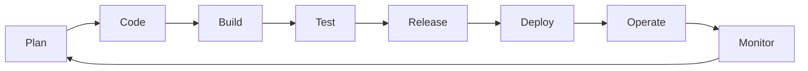
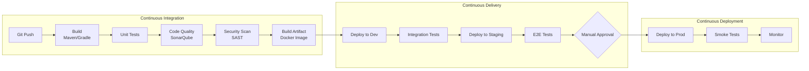
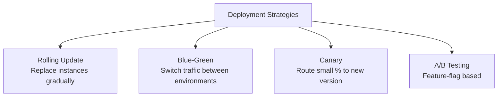
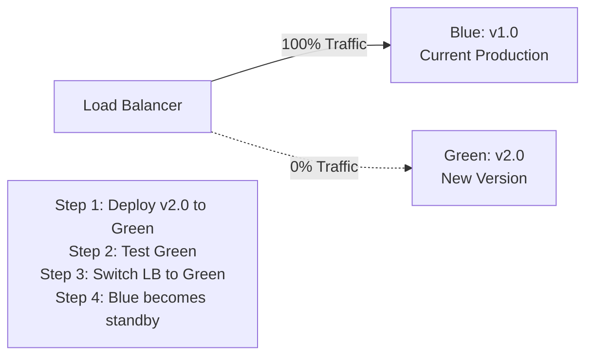
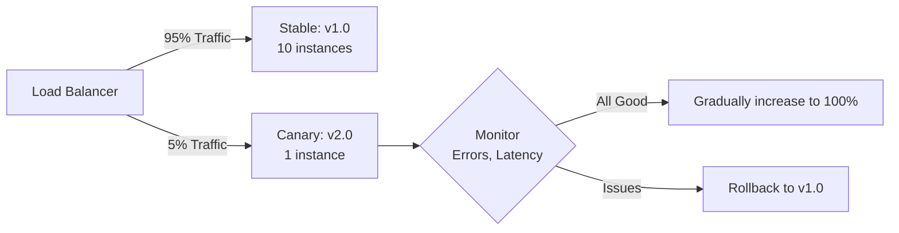
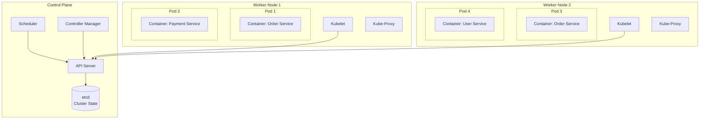
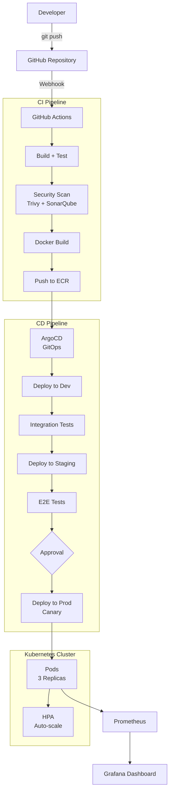

# 🚀 DevOps — CI/CD, Docker & Kubernetes

> **Beginner → Pro Guide** | What • Why • Where • Interview Questions • Production Code

---

## 📌 Table of Contents
1. [What is DevOps?](#1-what-is-devops)
2. [Why DevOps?](#2-why-devops)
3. [Where DevOps is Applied](#3-where-devops-is-applied)
4. [CI/CD Deep Dive](#4-cicd-deep-dive)
5. [Docker Deep Dive](#5-docker-deep-dive)
6. [Kubernetes Deep Dive](#6-kubernetes-deep-dive)
7. [Infrastructure as Code](#7-infrastructure-as-code)
8. [Architecture Diagrams](#9-architecture-diagrams)
9. [Production-Ready Code](#10-production-ready-code)
10. [Interview Questions & Answers](#11-interview-questions--answers)

---

## 1. What is DevOps?

**DevOps** is a set of practices that combines software **Development** and IT **Operations** to shorten the development lifecycle while delivering features, fixes, and updates frequently in close alignment with business objectives.



### DevOps Pillars
| Pillar | Tools |
|--------|-------|
| **Source Control** | Git, GitHub, GitLab |
| **CI/CD** | Jenkins, GitHub Actions, GitLab CI |
| **Containerization** | Docker, Podman |
| **Orchestration** | Kubernetes, Docker Swarm |
| **IaC** | Terraform, Ansible, Pulumi |
| **Monitoring** | Prometheus, Grafana, ELK |
| **Cloud** | AWS, GCP, Azure |

---

## 2. Why DevOps?

| Before DevOps | After DevOps |
|---------------|-------------|
| Manual deployments (hours) | Automated deployments (minutes) |
| Release every 3-6 months | Release daily/weekly |
| "It works on my machine" | Containerized consistency |
| Finger-pointing between teams | Shared responsibility |
| Manual scaling | Auto-scaling |
| Post-mortem after outages | Proactive monitoring & alerting |

---

## 3. Where DevOps is Applied

Every modern tech company: Netflix (multiple deploys/day), Amazon (deploy every 11.7 seconds), Google, Facebook, startups and enterprises alike.

---

## 4. CI/CD Deep Dive

### 4.1 CI/CD Pipeline



### 4.2 Deployment Strategies



#### Blue-Green Deployment


#### Canary Deployment


---

## 5. Docker Deep Dive

### 5.1 Docker Architecture

```mermaid
graph TD
    subgraph Docker Host
        Daemon[Docker Daemon]
        
        subgraph Container 1
            App1[Java App]
            JRE1[JRE 17]
            Libs1[Dependencies]
        end
        
        subgraph Container 2
            App2[Node App]
            Node[Node 18]
            Libs2[Dependencies]
        end
        
        subgraph Container 3
            DB[PostgreSQL]
            Data[(Volume)]
        end
    end
    
    Daemon --> Container 1
    Daemon --> Container 2
    Daemon --> Container 3
    
    Registry[Docker Registry<br/>DockerHub / ECR] <-->|push/pull| Daemon
```

### 5.2 Docker vs VM

| Feature | Docker Container | Virtual Machine |
|---------|-----------------|-----------------|
| **Boot Time** | Seconds | Minutes |
| **Size** | MBs | GBs |
| **Performance** | Near native | ~5-10% overhead |
| **Isolation** | Process level | Hardware level |
| **OS** | Shares host kernel | Full OS per VM |
| **Density** | 100s per host | 10s per host |

### 5.3 Dockerfile Best Practices

```dockerfile
# Multi-stage build for Java Spring Boot
# Stage 1: Build
FROM eclipse-temurin:17-jdk-alpine AS builder
WORKDIR /app

# Cache dependencies
COPY pom.xml .
COPY mvnw .
COPY .mvn .mvn
RUN ./mvnw dependency:go-offline -B

# Build application
COPY src ./src
RUN ./mvnw package -DskipTests -B

# Stage 2: Runtime (minimal image)
FROM eclipse-temurin:17-jre-alpine
WORKDIR /app

# Security: run as non-root
RUN addgroup -S appgroup && adduser -S appuser -G appgroup

# Copy only the JAR
COPY --from=builder /app/target/*.jar app.jar

# Health check
HEALTHCHECK --interval=30s --timeout=3s --retries=3 \
    CMD wget -q --spider http://localhost:8080/actuator/health || exit 1

# Environment
ENV JAVA_OPTS="-Xmx512m -Xms256m -XX:+UseG1GC"

USER appuser
EXPOSE 8080

ENTRYPOINT ["sh", "-c", "java $JAVA_OPTS -jar app.jar"]
```

### 5.4 Docker Compose for Local Development

```yaml
version: '3.8'

services:
  app:
    build:
      context: .
      dockerfile: Dockerfile
    ports:
      - "8080:8080"
    environment:
      - SPRING_PROFILES_ACTIVE=dev
      - DB_URL=jdbc:postgresql://db:5432/myapp
      - REDIS_HOST=redis
    depends_on:
      db:
        condition: service_healthy
      redis:
        condition: service_started
    networks:
      - backend

  db:
    image: postgres:15-alpine
    environment:
      POSTGRES_DB: myapp
      POSTGRES_USER: admin
      POSTGRES_PASSWORD: secret
    volumes:
      - pgdata:/var/lib/postgresql/data
      - ./init.sql:/docker-entrypoint-initdb.d/init.sql
    ports:
      - "5432:5432"
    healthcheck:
      test: ["CMD-SHELL", "pg_isready -U admin"]
      interval: 5s
      retries: 5
    networks:
      - backend

  redis:
    image: redis:7-alpine
    ports:
      - "6379:6379"
    command: redis-server --maxmemory 100mb --maxmemory-policy allkeys-lru
    networks:
      - backend

volumes:
  pgdata:

networks:
  backend:
    driver: bridge
```

---

## 6. Kubernetes Deep Dive

### 6.1 Kubernetes Architecture



### 6.2 Kubernetes Objects

| Object | Purpose |
|--------|---------|
| **Pod** | Smallest unit — one or more containers |
| **Deployment** | Manages replicas of pods, rolling updates |
| **Service** | Stable network endpoint for pods |
| **Ingress** | HTTP routing, SSL termination |
| **ConfigMap** | Non-sensitive configuration |
| **Secret** | Sensitive data (base64 encoded) |
| **HPA** | Horizontal Pod Autoscaler |
| **PV/PVC** | Persistent storage |
| **Namespace** | Logical isolation |

### 6.3 Kubernetes Manifests

```yaml
# deployment.yaml
apiVersion: apps/v1
kind: Deployment
metadata:
  name: order-service
  namespace: production
  labels:
    app: order-service
    version: v2.1.0
spec:
  replicas: 3
  strategy:
    type: RollingUpdate
    rollingUpdate:
      maxSurge: 1          # Max 1 extra pod during update
      maxUnavailable: 0     # Always maintain desired count
  selector:
    matchLabels:
      app: order-service
  template:
    metadata:
      labels:
        app: order-service
    spec:
      containers:
        - name: order-service
          image: myregistry/order-service:v2.1.0
          ports:
            - containerPort: 8080
          resources:
            requests:
              cpu: "250m"
              memory: "512Mi"
            limits:
              cpu: "500m"
              memory: "1Gi"
          livenessProbe:
            httpGet:
              path: /actuator/health/liveness
              port: 8080
            initialDelaySeconds: 30
            periodSeconds: 10
          readinessProbe:
            httpGet:
              path: /actuator/health/readiness
              port: 8080
            initialDelaySeconds: 15
            periodSeconds: 5
          env:
            - name: SPRING_PROFILES_ACTIVE
              value: "prod"
            - name: DB_PASSWORD
              valueFrom:
                secretKeyRef:
                  name: db-credentials
                  key: password
          volumeMounts:
            - name: config
              mountPath: /config
      volumes:
        - name: config
          configMap:
            name: order-service-config
---
# service.yaml
apiVersion: v1
kind: Service
metadata:
  name: order-service
  namespace: production
spec:
  type: ClusterIP
  selector:
    app: order-service
  ports:
    - port: 80
      targetPort: 8080
---
# hpa.yaml
apiVersion: autoscaling/v2
kind: HorizontalPodAutoscaler
metadata:
  name: order-service-hpa
  namespace: production
spec:
  scaleTargetRef:
    apiVersion: apps/v1
    kind: Deployment
    name: order-service
  minReplicas: 3
  maxReplicas: 10
  metrics:
    - type: Resource
      resource:
        name: cpu
        target:
          type: Utilization
          averageUtilization: 70
    - type: Resource
      resource:
        name: memory
        target:
          type: Utilization
          averageUtilization: 80
---
# ingress.yaml
apiVersion: networking.k8s.io/v1
kind: Ingress
metadata:
  name: api-ingress
  annotations:
    kubernetes.io/ingress.class: nginx
    cert-manager.io/cluster-issuer: letsencrypt-prod
    nginx.ingress.kubernetes.io/rate-limit: "100"
spec:
  tls:
    - hosts:
        - api.myapp.com
      secretName: api-tls
  rules:
    - host: api.myapp.com
      http:
        paths:
          - path: /api/orders
            pathType: Prefix
            backend:
              service:
                name: order-service
                port:
                  number: 80
```

---

## 7. Infrastructure as Code

### Terraform Example (AWS)

```hcl
# main.tf - EKS Cluster
provider "aws" {
  region = "ap-south-1"
}

module "eks" {
  source          = "terraform-aws-modules/eks/aws"
  cluster_name    = "myapp-cluster"
  cluster_version = "1.28"
  
  vpc_id     = module.vpc.vpc_id
  subnet_ids = module.vpc.private_subnets
  
  eks_managed_node_groups = {
    general = {
      desired_size = 3
      min_size     = 2
      max_size     = 5
      instance_types = ["t3.medium"]
    }
  }
}
```

---

## 8. Architecture Diagrams

### Complete CI/CD Pipeline with Kubernetes



---

## 9. Production-Ready Code

### GitHub Actions CI/CD

```yaml
# .github/workflows/ci-cd.yml
name: CI/CD Pipeline

on:
  push:
    branches: [main, develop]
  pull_request:
    branches: [main]

env:
  REGISTRY: ghcr.io
  IMAGE_NAME: ${{ github.repository }}

jobs:
  test:
    runs-on: ubuntu-latest
    steps:
      - uses: actions/checkout@v4
      - uses: actions/setup-java@v4
        with:
          java-version: '17'
          distribution: 'temurin'
          cache: maven
      
      - name: Run Tests
        run: mvn verify -B
      
      - name: SonarQube Analysis
        run: mvn sonar:sonar -Dsonar.host.url=${{ secrets.SONAR_URL }}

  build-and-push:
    needs: test
    runs-on: ubuntu-latest
    if: github.ref == 'refs/heads/main'
    outputs:
      image-tag: ${{ steps.meta.outputs.version }}
    steps:
      - uses: actions/checkout@v4
      
      - name: Build Docker Image
        run: docker build -t ${{ env.REGISTRY }}/${{ env.IMAGE_NAME }}:${{ github.sha }} .
      
      - name: Login to Registry
        run: echo "${{ secrets.GITHUB_TOKEN }}" | docker login ${{ env.REGISTRY }} -u $ --password-stdin
      
      - name: Push Image
        run: docker push ${{ env.REGISTRY }}/${{ env.IMAGE_NAME }}:${{ github.sha }}

  deploy:
    needs: build-and-push
    runs-on: ubuntu-latest
    steps:
      - name: Update Kubernetes Manifest
        run: |
          cd k8s/overlays/production
          kustomize edit set image order-service=${{ env.REGISTRY }}/${{ env.IMAGE_NAME }}:${{ github.sha }}
          git commit -am "Deploy ${{ github.sha }}"
          git push   # ArgoCD detects this change and deploys
```

---

## 10. Interview Questions & Answers

### 🟢 Beginner Level

**Q1: What is CI/CD?**
> **A:** CI (Continuous Integration): automatically build, test, and validate code on every commit. CD (Continuous Delivery/Deployment): automatically deploy validated code to environments. CI catches bugs early; CD reduces deployment risk. Together they enable frequent, reliable releases.

**Q2: What is Docker and why use it?**
> **A:** Docker packages applications with all dependencies into containers — lightweight, portable, consistent environments. Solves "works on my machine" problem. Containers share the host OS kernel (unlike VMs that need full OS). Benefits: consistency across environments, fast startup, resource efficient, easy scaling.

**Q3: What is Kubernetes?**
> **A:** Container orchestration platform that automates deployment, scaling, and management of containerized applications. Key features: auto-scaling (HPA), self-healing (restart failed pods), rolling updates, service discovery, load balancing, secrets management. It's the standard for running microservices in production.

---

### 🟡 Intermediate Level

**Q4: Explain the difference between Docker image and container.**
> **A:** Image is a read-only template with application code and dependencies (like a class). Container is a running instance of an image (like an object). You can create multiple containers from one image. Images are built from Dockerfiles and stored in registries.

**Q5: What are Kubernetes probes and why are they important?**
> **A:** Liveness probe: checks if container is alive (restart if fails). Readiness probe: checks if container can accept traffic (remove from service if fails). Startup probe: gives slow-starting containers time to initialize. Without probes, K8s can route traffic to unhealthy pods or keep crashed pods running.

**Q6: What is GitOps?**
> **A:** Operational framework where Git is the single source of truth for infrastructure and application state. Tools like ArgoCD watch Git repos and automatically sync desired state to Kubernetes. Benefits: audit trail (git history), easy rollback (git revert), pull-based deployment (more secure).

---

### 🔴 Advanced / Pro Level

**Q7: How do you implement zero-downtime deployments in Kubernetes?**
> **A:** (1) Rolling update strategy with maxSurge=1, maxUnavailable=0, (2) Readiness probes ensure new pods are ready before old ones terminate, (3) PreStop hook with sleep to allow in-flight requests to complete, (4) PodDisruptionBudget to prevent too many pods being unavailable, (5) Graceful shutdown handling in application. For critical updates: use canary deployment with Istio/Flagger — route 5% traffic to new version, monitor errors, gradually increase.

**Q8: Design a CI/CD pipeline for a microservices architecture.**
> **A:** Monorepo or multi-repo with per-service pipelines. CI: lint → unit tests → build → security scan (Trivy, SonarQube) → Docker build → push to registry → integration tests. CD: GitOps with ArgoCD per environment. Environments: dev (auto-deploy), staging (auto-deploy + E2E tests), prod (canary with manual promotion). Rollback: ArgoCD rollback or git revert. Feature flags for gradual rollout. Monitoring: Prometheus alerts on error rate spike → auto-rollback.

---

## 🎯 Quick Reference

```
Docker Commands:
────────────────
docker build -t myapp:v1 .
docker run -d -p 8080:8080 myapp:v1
docker compose up -d
docker logs -f container_id

Kubectl Commands:
─────────────────
kubectl get pods -n production
kubectl describe pod <pod-name>
kubectl logs <pod-name> -f
kubectl apply -f deployment.yaml
kubectl rollout status deployment/order-service
kubectl rollout undo deployment/order-service
kubectl scale deployment/order-service --replicas=5
kubectl top pods
```

---

> **Next Topic:** [07 - Performance Optimization](./07-performance-optimization.md)
