# 📊 Performance Optimization — Profiling & Load Balancing

> **Beginner → Pro Guide** | What • Why • Where • Interview Questions • Production Code

---

## 📌 Table of Contents
1. [What is Performance Optimization?](#1-what-is-performance-optimization)
2. [Why It Matters](#2-why-it-matters)
3. [Where to Optimize](#3-where-to-optimize)
4. [Profiling Deep Dive](#4-profiling-deep-dive)
5. [Load Balancing Deep Dive](#5-load-balancing-deep-dive)
6. [JVM Performance Tuning](#6-jvm-performance-tuning)
7. [Database Performance](#7-database-performance)
8. [API Performance](#8-api-performance)
9. [Architecture Diagrams](#9-architecture-diagrams)
10. [Production-Ready Code](#10-production-ready-code)
11. [Interview Questions & Answers](#11-interview-questions--answers)

---

## 1. What is Performance Optimization?

The process of making a system **faster, more efficient, and capable of handling more load** by identifying bottlenecks and applying targeted improvements.

### Key Metrics

| Metric | Description | Target |
|--------|-------------|--------|
| **Latency (P50/P95/P99)** | Response time percentiles | P99 < 200ms |
| **Throughput (QPS/RPS)** | Requests per second | Based on requirements |
| **Error Rate** | % of failed requests | < 0.1% |
| **CPU Utilization** | Processing power used | 60-70% (leave headroom) |
| **Memory Usage** | RAM consumption | < 80% |
| **Connection Pool** | Active DB connections | < 80% of max |

---

## 2. Why It Matters

```
Response Time Impact on Business:
─────────────────────────────────
100ms delay → 1% sales drop (Amazon)
500ms delay → 20% traffic drop (Google)
1s delay → 7% conversion drop
3s delay → 53% mobile users abandon
```

---

## 3. Where to Optimize


---

## 4. Profiling Deep Dive

### 4.1 Types of Profiling


### 4.2 Java Profiling Tools

| Tool | Type | Use Case |
|------|------|----------|
| **JVisualVM** | All-in-one | Development profiling |
| **JFR (Java Flight Recorder)** | Low-overhead | Production profiling |
| **Async Profiler** | CPU + Allocation | Flame graphs |
| **JMeter** | Load testing | Throughput & latency |
| **Gatling** | Load testing | Performance scripts |
| **Micrometer** | Metrics | Application metrics |

### 4.3 Flame Graph Reading

```
┌───────────────────────────────────────────────────────┐
│                    main()                              │ 100% time
├──────────────────────┬────────────────────────────────┤
│  processOrders()     │      sendNotifications()       │ 60% / 40%
├──────────┬───────────┤                                │
│ validateOrder │ saveToDb │                             │
│    10%       │   50%    │ ← Database is the bottleneck│
└──────────┴───────────┴────────────────────────────────┘
```

---

## 5. Load Balancing Deep Dive

### 5.1 Load Balancing Layers


| Layer | Protocol | Speed | Intelligence |
|-------|----------|-------|-------------|
| **L3 (DNS)** | DNS | Fastest | Geo-based only |
| **L4 (Transport)** | TCP/UDP | Very fast | IP/Port based |
| **L7 (Application)** | HTTP/HTTPS | Fast | URL, headers, cookies |

### 5.2 Load Balancing Algorithms


### 5.3 Health Checks

```mermaid
sequenceDiagram
    participant LB as Load Balancer
    participant S1 as Server 1 ✅
    participant S2 as Server 2 ✅
    participant S3 as Server 3 ❌
    
    loop Every 10 seconds
        LB->>S1: GET /health
        S1-->>LB: 200 OK
        LB->>S2: GET /health
        S2-->>LB: 200 OK
        LB->>S3: GET /health
        S3-->>LB: Timeout
        Note over LB,S3: Mark S3 unhealthy<br/>Stop routing traffic
    end
```



---

## 6. JVM Performance Tuning

### 6.1 JVM Memory Layout

```
┌─────────────────────────────────────┐
│              JVM Memory             │
├──────────────────┬──────────────────┤
│    Heap Memory   │  Non-Heap Memory │
├──────────────────┤──────────────────┤
│ ┌──────────────┐ │ Metaspace        │
│ │  Young Gen   │ │ (Class metadata) │
│ │ ┌──────────┐ │ │                  │
│ │ │   Eden   │ │ │ Thread Stacks    │
│ │ ├──────────┤ │ │ (1MB per thread) │
│ │ │ S0 │ S1  │ │ │                  │
│ │ └──────────┘ │ │ Direct Buffers   │
│ ├──────────────┤ │ (NIO)            │
│ │   Old Gen    │ │                  │
│ │ (Tenured)    │ │ Code Cache       │
│ └──────────────┘ │ (JIT compiled)   │
└──────────────────┴──────────────────┘
```

### 6.2 Garbage Collector Selection

| GC | Best For | Pause Time | Throughput |
|----|----------|------------|------------|
| **G1GC** | General purpose, 4-16GB heap | Medium (~200ms) | Good |
| **ZGC** | Large heaps, low latency | Very low (<10ms) | Good |
| **Shenandoah** | Low latency, any size | Very low (<10ms) | Good |
| **Parallel GC** | Batch processing, throughput | High (seconds) | Best |

### 6.3 JVM Tuning Flags

```bash
# Production JVM Settings
java \
  -Xms2g -Xmx2g \                    # Fixed heap size (avoid resizing)
  -XX:+UseG1GC \                      # G1 garbage collector
  -XX:MaxGCPauseMillis=200 \          # Target pause time
  -XX:+UseStringDeduplication \       # Save memory on duplicate strings
  -XX:+HeapDumpOnOutOfMemoryError \   # Dump heap on OOM
  -XX:HeapDumpPath=/tmp/heapdump.hprof \
  -Xlog:gc*:file=/var/log/gc.log \    # GC logging
  -XX:+ExitOnOutOfMemoryError \       # Exit on OOM (let K8s restart)
  -jar app.jar
```

---

## 7. Database Performance

### 7.1 Query Optimization Checklist

```
✅ Use EXPLAIN ANALYZE on slow queries
✅ Add indexes on WHERE, JOIN, ORDER BY columns
✅ Avoid SELECT * — select only needed columns
✅ Use pagination (LIMIT/OFFSET or cursor-based)
✅ Batch INSERT/UPDATE operations
✅ Use connection pooling (HikariCP)
✅ Avoid N+1 queries (use JOIN FETCH)
✅ Use read replicas for read-heavy loads
✅ Partition large tables
✅ Monitor slow query log
```

### 7.2 Connection Pool Sizing

```
Optimal pool size formula (based on PostgreSQL docs):
────────────────────────────────────────────────────
pool_size = (core_count * 2) + effective_spindle_count

Example: 4 cores, SSD (1 spindle)
pool_size = (4 * 2) + 1 = 9

Common mistake: Too many connections!
Each connection = ~10MB RAM on PostgreSQL
100 connections × 10MB = 1GB just for connections
```

---

## 8. API Performance

### 8.1 Async Processing Pattern


### 8.2 Response Compression

```java
// Spring Boot - Enable compression
// application.yml
// server:
//   compression:
//     enabled: true
//     mime-types: application/json,text/html,text/xml
//     min-response-size: 1024

@Configuration
public class WebConfig implements WebMvcConfigurer {
    
    // Enable ETags for conditional requests
    @Bean
    public Filter shallowEtagHeaderFilter() {
        return new ShallowEtagHeaderFilter();
    }
}
```

---

## 9. Architecture Diagrams

### Full Performance Architecture


---

## 10. Production-Ready Code

### 10.1 Thread Pool Configuration

```java
@Configuration
@EnableAsync
public class AsyncConfig {
    
    @Bean("taskExecutor")
    public Executor taskExecutor() {
        ThreadPoolTaskExecutor executor = new ThreadPoolTaskExecutor();
        executor.setCorePoolSize(10);
        executor.setMaxPoolSize(50);
        executor.setQueueCapacity(100);
        executor.setKeepAliveSeconds(60);
        executor.setThreadNamePrefix("async-");
        executor.setRejectedExecutionHandler(new ThreadPoolExecutor.CallerRunsPolicy());
        executor.setWaitForTasksToCompleteOnShutdown(true);
        executor.setAwaitTerminationSeconds(30);
        executor.initialize();
        return executor;
    }
}

// Usage
@Service
public class NotificationService {
    
    @Async("taskExecutor")
    public CompletableFuture<Void> sendEmailAsync(String email, String subject, String body) {
        // This runs on a separate thread
        emailClient.send(email, subject, body);
        return CompletableFuture.completedFuture(null);
    }
}
```

### 10.2 Micrometer Metrics

```java
@Component
public class OrderMetrics {
    
    private final Counter orderCounter;
    private final Timer orderProcessingTimer;
    private final AtomicInteger activeOrders;
    
    public OrderMetrics(MeterRegistry registry) {
        this.orderCounter = Counter.builder("orders.created.total")
            .description("Total orders created")
            .tag("service", "order-service")
            .register(registry);
            
        this.orderProcessingTimer = Timer.builder("orders.processing.duration")
            .description("Order processing time")
            .publishPercentiles(0.5, 0.95, 0.99)
            .register(registry);
            
        this.activeOrders = registry.gauge("orders.active.count", new AtomicInteger(0));
    }
    
    public void recordOrderCreated() {
        orderCounter.increment();
    }
    
    public <T> T timeOrderProcessing(Supplier<T> action) {
        return orderProcessingTimer.record(action);
    }
}
```

### 10.3 Pagination Best Practices

```java
// Cursor-based pagination (better for large datasets)
@Repository
public interface OrderRepository extends JpaRepository<Order, Long> {
    
    @Query("""
        SELECT o FROM Order o 
        WHERE o.createdAt < :cursor 
        ORDER BY o.createdAt DESC
        """)
    List<Order> findOrdersBefore(
        @Param("cursor") LocalDateTime cursor, 
        Pageable pageable);
}

@RestController
public class OrderController {
    
    @GetMapping("/api/orders")
    public CursorPageResponse<OrderDTO> getOrders(
            @RequestParam(required = false) String cursor,
            @RequestParam(defaultValue = "20") int size) {
        
        LocalDateTime cursorTime = cursor != null 
            ? LocalDateTime.parse(cursor) 
            : LocalDateTime.now();
        
        List<Order> orders = orderRepository.findOrdersBefore(
            cursorTime, PageRequest.of(0, size + 1));
        
        boolean hasMore = orders.size() > size;
        if (hasMore) orders = orders.subList(0, size);
        
        String nextCursor = hasMore 
            ? orders.getLast().getCreatedAt().toString() 
            : null;
        
        return new CursorPageResponse<>(
            orders.stream().map(this::toDTO).toList(),
            nextCursor,
            hasMore
        );
    }
}
```

---

## 11. Interview Questions & Answers

### 🟢 Beginner Level

**Q1: What is latency vs throughput?**
> **A:** Latency = time to complete one request (measured in ms, P50/P95/P99). Throughput = number of requests handled per second (QPS/RPS). They're related but different: you can have low latency but low throughput (single-threaded), or high throughput with high latency (batch processing). Goal: optimize both.

**Q2: What is a load balancer?**
> **A:** Distributes incoming traffic across multiple servers. Types: L4 (TCP/IP level, fast), L7 (HTTP level, smart routing). Algorithms: Round Robin, Least Connections, IP Hash. Benefits: no single point of failure, horizontal scaling, SSL termination. Examples: Nginx, HAProxy, AWS ALB/NLB.

**Q3: Why is SELECT * bad for performance?**
> **A:** Fetches all columns even if you need only 2-3. Extra I/O, memory, and network bandwidth. Can't use covering indexes. Breaks if schema changes. Instead: `SELECT id, name, email FROM users WHERE id = ?`.

---

### 🟡 Intermediate Level

**Q4: How do you find and fix N+1 query problem?**
> **A:** Detection: enable SQL logging, use tools like P6Spy. Symptom: 1 query for parent + N queries for children (e.g., 100 orders + 100 queries for items). Fix: (1) JOIN FETCH in JPQL: `SELECT o FROM Order o JOIN FETCH o.items`, (2) @EntityGraph, (3) @BatchSize(size=20), (4) Native query with JOIN.

**Q5: Explain connection pooling and how to size it.**
> **A:** Maintains pre-established DB connections to avoid expensive connection creation. HikariCP recommended for Java. Sizing formula: `pool_size = (cores * 2) + spindles`. Too few: requests wait for connections. Too many: DB overloaded, context switching. Monitor: active connections, wait time, timeouts.

**Q6: What is P99 latency and why does it matter?**
> **A:** The latency value below which 99% of requests fall. If P99 is 500ms, 99% of requests complete within 500ms. P50 (median) can be good while P99 is terrible (long tail). Amazon measures P99.9 because even 0.1% of requests at high latency affects thousands of customers. Focus: optimize P99, not just average.

---

### 🔴 Advanced / Pro Level

**Q7: How would you reduce API latency from 500ms to 50ms?**
> **A:** Layered approach: (1) Add Redis cache for hot data (biggest win), (2) Optimize SQL queries with EXPLAIN ANALYZE + proper indexes, (3) Use connection pooling, (4) Enable response compression (gzip), (5) Use async processing for non-critical work, (6) Reduce serialization overhead (use Protocol Buffers for internal calls), (7) CDN for static content, (8) HTTP/2 for multiplexing, (9) Batch external API calls, (10) Profile with JFR to find CPU hotspots.

**Q8: Design an auto-scaling strategy for a microservices platform.**
> **A:** Kubernetes HPA for pod scaling based on CPU/memory/custom metrics. Scale triggers: CPU > 70%, request latency P99 > 200ms, queue depth > 1000. Cluster Autoscaler for node scaling. Pre-scale for known traffic patterns (cron). Use PodDisruptionBudget for safe scaling. Database: read replicas auto-scale with traffic. Cache: Redis Cluster with automatic resharding. Queue: Kafka partition count based on throughput needs.

---

## 🎯 Quick Reference

```
Performance Optimization Priority:
───────────────────────────────────
1. Add caching (biggest ROI)
2. Optimize database queries
3. Use async where possible
4. Enable compression
5. Scale horizontally
6. Fine-tune JVM/runtime
7. CDN for static content
8. Connection pooling
```

---

> **Next Topic:** [08 - Cloud Services](./08-cloud-services.md)
