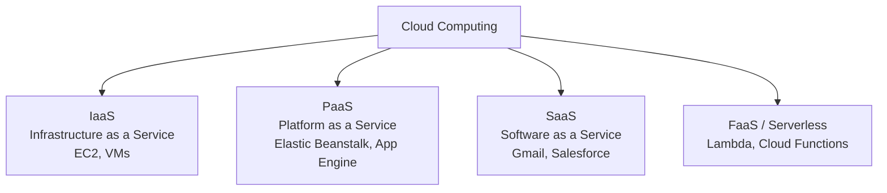
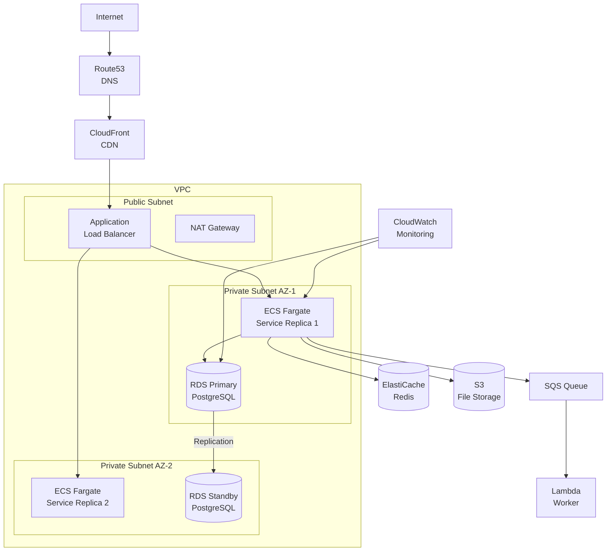
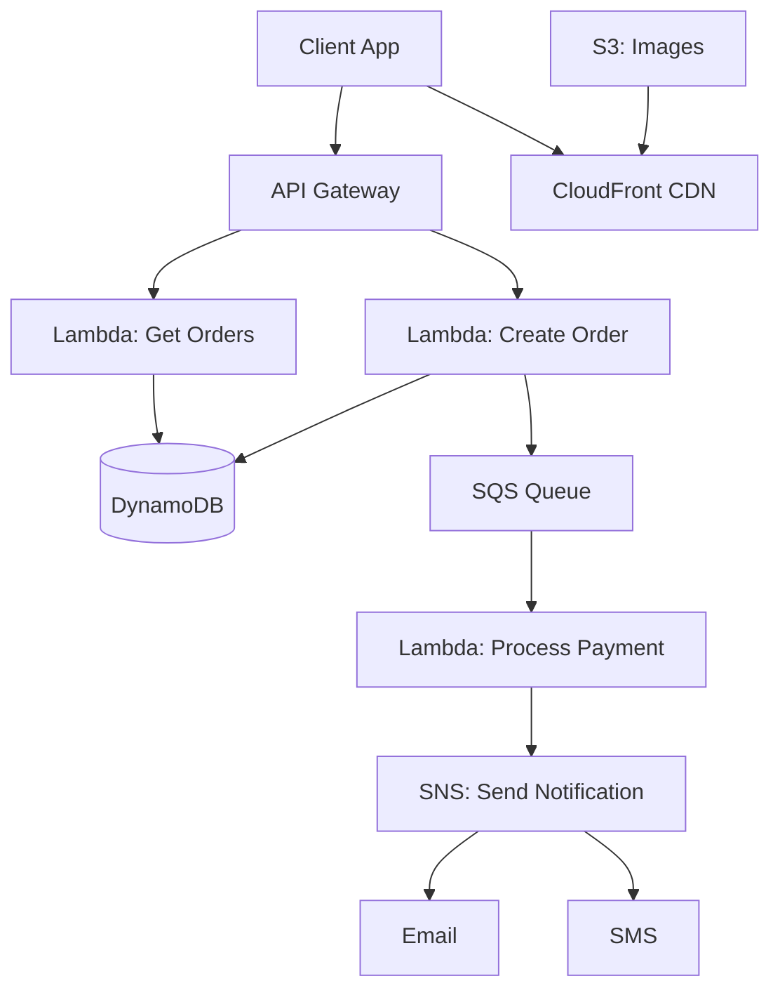

# ☁️ Cloud Services — AWS, GCP & Azure

> **Beginner → Pro Guide** | What • Why • Where • Interview Questions • Production Code

---

## 📌 Table of Contents
1. [What are Cloud Services?](#1-what-are-cloud-services)
2. [Why Cloud?](#2-why-cloud)
3. [Cloud Service Models](#3-cloud-service-models)
4. [AWS Deep Dive](#4-aws-deep-dive)
5. [GCP Deep Dive](#5-gcp-deep-dive)
6. [Azure Deep Dive](#6-azure-deep-dive)
7. [Multi-Cloud & Comparison](#7-multi-cloud--comparison)
8. [Architecture Diagrams](#8-architecture-diagrams)
9. [Production-Ready Code](#9-production-ready-code)
10. [Interview Questions & Answers](#10-interview-questions--answers)

---

## 1. What are Cloud Services?

**Cloud computing** delivers computing resources (servers, storage, databases, networking, AI) over the internet on a pay-as-you-go basis, managed by cloud providers.



---

## 2. Why Cloud?

| Benefit | Description |
|---------|-------------|
| **No Upfront Cost** | Pay only for what you use |
| **Elastic Scaling** | Scale up/down based on demand |
| **Global Reach** | Deploy to 30+ regions worldwide |
| **Managed Services** | DB, cache, queue — managed by provider |
| **High Availability** | Multi-AZ, multi-region redundancy |
| **Security** | Compliance (SOC2, HIPAA, GDPR) built-in |
| **Innovation Speed** | Use AI/ML, analytics without building infra |

---

## 3. Cloud Service Models

```
┌──────────────────────────────────────────────────────┐
│                What YOU Manage                        │
├──────────┬──────────┬──────────┬──────────┬──────────┤
│ On-Prem  │  IaaS    │  PaaS    │ Serverless│  SaaS   │
├──────────┼──────────┼──────────┼──────────┼──────────┤
│ App      │ App      │ App      │ App      │          │
│ Data     │ Data     │ Data     │          │          │
│ Runtime  │ Runtime  │          │          │          │
│ OS       │ OS       │          │          │          │
│ VM       │          │          │          │          │
│ Network  │          │          │          │          │
│ Storage  │          │          │          │          │
│ Server   │          │          │          │          │
├──────────┴──────────┴──────────┴──────────┴──────────┤
│        ◄── YOU manage ──►  ◄── CLOUD manages ──►     │
└──────────────────────────────────────────────────────┘
```

---

## 4. AWS Deep Dive

### 4.1 Core AWS Services Map

```mermaid
graph TD
    AWS[AWS Services] --> Compute[Compute]
    AWS --> Storage[Storage]
    AWS --> Database[Database]
    AWS --> Network[Networking]
    AWS --> Security[Security]
    AWS --> Integration[Integration]
    AWS --> Monitor[Monitoring]
    
    Compute --> EC2[EC2 - VMs]
    Compute --> Lambda[Lambda - Serverless]
    Compute --> ECS[ECS/EKS - Containers]
    Compute --> Fargate[Fargate - Serverless Containers]
    
    Storage --> S3[S3 - Object Storage]
    Storage --> EBS[EBS - Block Storage]
    Storage --> EFS[EFS - File Storage]
    
    Database --> RDS[RDS - PostgreSQL/MySQL]
    Database --> DynamoDB[DynamoDB - NoSQL]
    Database --> ElastiCache[ElastiCache - Redis]
    Database --> Aurora[Aurora - Managed SQL]
    
    Network --> VPC[VPC - Private Network]
    Network --> ALB[ALB/NLB - Load Balancer]
    Network --> Route53[Route53 - DNS]
    Network --> CloudFront[CloudFront - CDN]
    
    Security --> IAM[IAM - Access Control]
    Security --> KMS[KMS - Encryption Keys]
    Security --> WAF2[WAF - Firewall]
    
    Integration --> SQS[SQS - Queue]
    Integration --> SNS[SNS - Notifications]
    Integration --> EventBridge[EventBridge]
    
    Monitor --> CloudWatch[CloudWatch]
    Monitor --> XRay[X-Ray - Tracing]
```



### 4.2 AWS Well-Architected Framework

| Pillar | Description |
|--------|-------------|
| **Operational Excellence** | Run and monitor systems, improve processes |
| **Security** | Protect data, systems, and assets |
| **Reliability** | Recover from failures, meet demand |
| **Performance Efficiency** | Use resources efficiently |
| **Cost Optimization** | Avoid unnecessary costs |
| **Sustainability** | Minimize environmental impact |

---

## 5. GCP Deep Dive

### Key GCP Services

| Category | AWS Equivalent | GCP Service |
|----------|---------------|-------------|
| Compute | EC2 | Compute Engine |
| Serverless | Lambda | Cloud Functions |
| Containers | EKS | GKE (Google Kubernetes Engine) |
| Object Storage | S3 | Cloud Storage |
| SQL Database | RDS | Cloud SQL |
| NoSQL | DynamoDB | Firestore / Bigtable |
| Cache | ElastiCache | Memorystore |
| Queue | SQS | Pub/Sub |
| CDN | CloudFront | Cloud CDN |
| DNS | Route53 | Cloud DNS |
| Analytics | Redshift | BigQuery |
| ML | SageMaker | Vertex AI |

### GCP Strengths
- **BigQuery** — best-in-class analytics engine
- **GKE** — best managed Kubernetes
- **Spanner** — globally consistent distributed DB
- **TensorFlow/Vertex AI** — best ML ecosystem

---

## 6. Azure Deep Dive

### Key Azure Services

| Category | AWS Equivalent | Azure Service |
|----------|---------------|---------------|
| Compute | EC2 | Virtual Machines |
| Serverless | Lambda | Azure Functions |
| Containers | EKS | AKS (Azure Kubernetes Service) |
| Object Storage | S3 | Blob Storage |
| SQL Database | RDS | Azure SQL Database |
| NoSQL | DynamoDB | Cosmos DB |
| Cache | ElastiCache | Azure Cache for Redis |
| Queue | SQS | Service Bus |
| CDN | CloudFront | Azure CDN |
| DevOps | CodePipeline | Azure DevOps |

### Azure Strengths
- **Active Directory (Entra ID)** — enterprise identity
- **Cosmos DB** — multi-model globally distributed DB
- **Azure DevOps** — full DevOps platform
- **Enterprise Integration** — best for Microsoft shops

---

## 7. Multi-Cloud & Comparison

### Service Comparison

| Service | AWS | GCP | Azure |
|---------|-----|-----|-------|
| **Best Compute** | EC2 (most options) | GCE (live migration) | VMs (Spot pricing) |
| **Best K8s** | EKS | **GKE** ✨ | AKS |
| **Best Serverless** | **Lambda** ✨ | Cloud Functions | Azure Functions |
| **Best SQL** | Aurora | Cloud SQL | Azure SQL |
| **Best NoSQL** | DynamoDB | Firestore | **Cosmos DB** ✨ |
| **Best Analytics** | Redshift | **BigQuery** ✨ | Synapse |
| **Best ML/AI** | SageMaker | **Vertex AI** ✨ | Azure ML |
| **Best Enterprise** | Good | Good | **Best** ✨ |

---

## 8. Architecture Diagrams

### Production AWS Architecture



### Serverless Architecture (AWS)



---

## 9. Production-Ready Code

### 9.1 AWS SDK — S3 File Upload

```java
@Service
public class S3StorageService {
    
    private final S3Client s3Client;
    
    @Value("${aws.s3.bucket}")
    private String bucketName;
    
    public String uploadFile(MultipartFile file) {
        String key = "uploads/" + UUID.randomUUID() + "-" + file.getOriginalFilename();
        
        PutObjectRequest request = PutObjectRequest.builder()
            .bucket(bucketName)
            .key(key)
            .contentType(file.getContentType())
            .serverSideEncryption(ServerSideEncryption.AES256)  // Encryption at rest
            .build();
        
        s3Client.putObject(request, 
            RequestBody.fromInputStream(file.getInputStream(), file.getSize()));
        
        return String.format("https://%s.s3.amazonaws.com/%s", bucketName, key);
    }
    
    // Generate pre-signed URL for secure temporary access
    public String generatePresignedUrl(String key, Duration expiry) {
        GetObjectRequest getRequest = GetObjectRequest.builder()
            .bucket(bucketName)
            .key(key)
            .build();
        
        GetObjectPresignRequest presignRequest = GetObjectPresignRequest.builder()
            .signatureDuration(expiry)
            .getObjectRequest(getRequest)
            .build();
        
        return s3Presigner.presignGetObject(presignRequest).url().toString();
    }
}
```

### 9.2 AWS SQS with Spring

```java
@Configuration
public class SqsConfig {
    @Bean
    public SqsTemplate sqsTemplate(SqsAsyncClient sqsAsyncClient) {
        return SqsTemplate.builder()
            .sqsAsyncClient(sqsAsyncClient)
            .build();
    }
}

// Producer
@Service
public class OrderEventPublisher {
    @Autowired
    private SqsTemplate sqsTemplate;
    
    public void publishOrderCreated(Order order) {
        sqsTemplate.send("order-events-queue", 
            new OrderCreatedEvent(order.getId(), order.getTotalAmount()));
    }
}

// Consumer
@Component
public class OrderEventConsumer {
    
    @SqsListener("order-events-queue")
    public void handleOrderCreated(OrderCreatedEvent event) {
        log.info("Processing order: {}", event.getOrderId());
        paymentService.processPayment(event);
    }
}
```

### 9.3 Terraform for AWS Infrastructure

```hcl
# variables.tf
variable "environment" {
  default = "production"
}

# vpc.tf
module "vpc" {
  source  = "terraform-aws-modules/vpc/aws"
  
  name = "${var.environment}-vpc"
  cidr = "10.0.0.0/16"
  
  azs             = ["ap-south-1a", "ap-south-1b"]
  private_subnets = ["10.0.1.0/24", "10.0.2.0/24"]
  public_subnets  = ["10.0.101.0/24", "10.0.102.0/24"]
  
  enable_nat_gateway = true
  single_nat_gateway = true
}

# rds.tf
module "rds" {
  source  = "terraform-aws-modules/rds/aws"
  
  identifier = "${var.environment}-db"
  engine     = "postgres"
  engine_version = "15.4"
  instance_class = "db.r6g.large"
  
  allocated_storage = 100
  multi_az          = true    # High availability
  
  db_name  = "myapp"
  username = "admin"
  
  vpc_security_group_ids = [module.vpc.default_security_group_id]
  subnet_ids             = module.vpc.private_subnets
  
  backup_retention_period = 7
  deletion_protection     = true
}
```

---

## 10. Interview Questions & Answers

### 🟢 Beginner Level

**Q1: What is the difference between IaaS, PaaS, and SaaS?**
> **A:** IaaS (EC2): you manage OS, runtime, app — provider manages hardware/network. PaaS (Elastic Beanstalk): you manage app/data — provider manages OS, runtime, scaling. SaaS (Gmail): everything managed by provider. FaaS/Serverless (Lambda): even more abstracted — you write functions, provider handles everything.

**Q2: What is a VPC?**
> **A:** Virtual Private Cloud — your own isolated network in the cloud. You define IP ranges (CIDR), subnets (public/private), route tables, security groups (firewall rules), NAT gateways. Public subnets for load balancers, private subnets for app servers and databases.

**Q3: What is the difference between S3, EBS, and EFS?**
> **A:** S3: object storage (files, images, backups — unlimited, cheap). EBS: block storage (attached to one EC2, like a hard disk). EFS: file storage (shared across multiple EC2s, like NFS). Use S3 for static files, EBS for DB volumes, EFS for shared application data.

---

### 🟡 Intermediate Level

**Q4: How do you design a highly available architecture on AWS?**
> **A:** Multi-AZ deployment: ALB across AZs, ECS/EC2 in multiple AZs, RDS Multi-AZ (automatic failover), ElastiCache Multi-AZ. Auto-scaling groups with min 2 instances. Health checks at every layer. Route53 failover routing for multi-region. S3 cross-region replication for disaster recovery. RTO < 1 hour, RPO < 5 minutes.

**Q5: What is serverless and when to use it?**
> **A:** Run code without managing servers (AWS Lambda, Cloud Functions). Pay per execution (no idle cost). Auto-scales to zero. Best for: event-driven processing, APIs with variable traffic, data transformation, scheduled tasks. Not ideal for: long-running processes (15 min limit), stateful apps, consistent high-traffic (cost can be higher).

---

### 🔴 Advanced / Pro Level

**Q6: Design a multi-region active-active architecture on AWS.**
> **A:** Route53 latency-based routing to nearest region. Each region has: ALB + ECS/EKS (auto-scaled), DynamoDB Global Tables (multi-region writes, eventual consistency), ElastiCache Global Datastore, S3 cross-region replication. API Gateway in each region with same API. Challenges: conflict resolution for concurrent writes (DynamoDB uses LWW), data consistency, increased cost (~2x). Use for: global users, regulatory requirements, disaster recovery with near-zero RTO.

---

## 🎯 Quick Reference

```
Cloud Decision Guide:
─────────────────────
Startup / general purpose → AWS (largest ecosystem)
Kubernetes / data analytics → GCP
Enterprise / Microsoft stack → Azure
Cost sensitive → Compare reserved instances across all 3

Cost Optimization:
──────────────────
✅ Use reserved instances (save 40-60%)
✅ Use spot instances for batch jobs (save 70-90%)
✅ Right-size instances (monitor utilization)
✅ Use auto-scaling (don't over-provision)
✅ Use S3 lifecycle policies (move to Glacier)
✅ Delete unused resources (EBS volumes, IPs)
✅ Use CloudWatch cost alerts
```

---

> **Next Topic:** [09 - Monitoring and Metrics](./09-monitoring-metrics.md)
