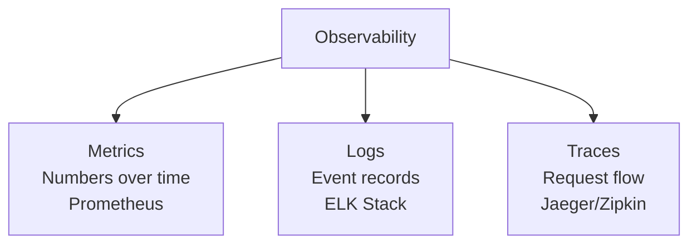
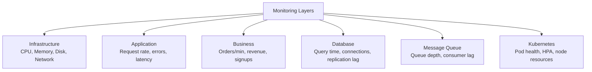
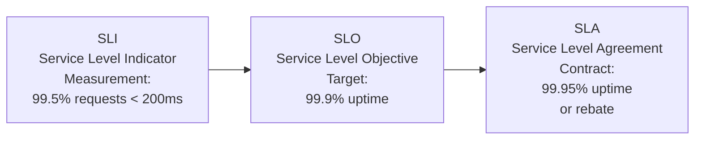
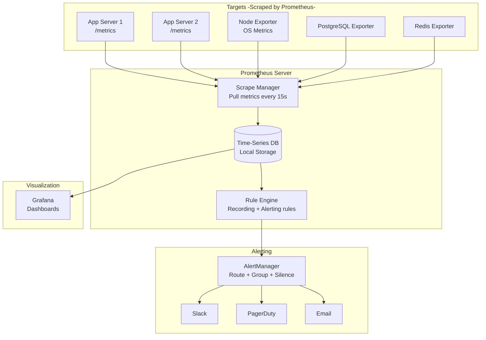
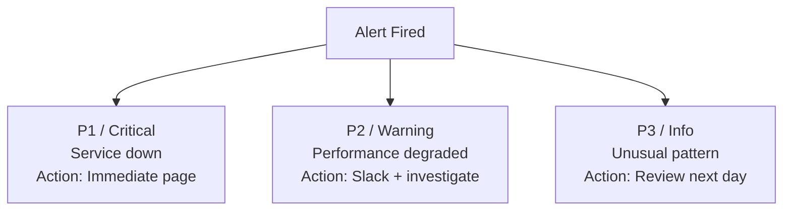
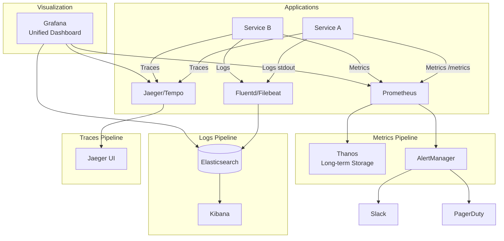

# 📈 Monitoring & Metrics — Prometheus & Grafana

> **Beginner → Pro Guide** | What • Why • Where • Interview Questions • Production Code

---

## 📌 Table of Contents
1. [What is Monitoring?](#1-what-is-monitoring)
2. [Why Monitoring Matters](#2-why-monitoring-matters)
3. [Where Monitoring is Applied](#3-where-monitoring-is-applied)
4. [Observability Pillars](#4-observability-pillars)
5. [Prometheus Deep Dive](#5-prometheus-deep-dive)
6. [Grafana Deep Dive](#6-grafana-deep-dive)
7. [Alerting Strategies](#7-alerting-strategies)
8. [Architecture Diagrams](#8-architecture-diagrams)
9. [Production-Ready Code](#9-production-ready-code)
10. [Interview Questions & Answers](#10-interview-questions--answers)

---

## 1. What is Monitoring?

**Monitoring** is the practice of collecting, analyzing, and visualizing system metrics, logs, and traces to understand system health, detect anomalies, and troubleshoot issues.



---

## 2. Why Monitoring Matters

| Without Monitoring | With Monitoring |
|-------------------|-----------------|
| Learn about outages from users | Proactive alerts before impact |
| Guessing at root cause | Data-driven debugging |
| No capacity planning | Predict scaling needs |
| No SLA tracking | Measure SLI/SLO/SLA precisely |
| Blame game during incidents | Clear timeline of events |

---

## 3. Where Monitoring is Applied



---

## 4. Observability Pillars

### 4.1 The Three Pillars

| Pillar | What | Tool | Example |
|--------|------|------|---------|
| **Metrics** | Numeric time-series data | Prometheus | `http_requests_total = 50000` |
| **Logs** | Event records with context | ELK / Loki | `ERROR OrderService: Payment failed for order-123` |
| **Traces** | Request flow across services | Jaeger / Zipkin | `Order → Payment → Inventory (350ms total)` |

### 4.2 SLI / SLO / SLA



| Term | Definition | Example |
|------|-----------|---------|
| **SLI** | Metric that measures service quality | Request latency P99, error rate, throughput |
| **SLO** | Target value for an SLI | P99 latency < 200ms, error rate < 0.1% |
| **SLA** | Contract with consequences if SLO is breached | 99.95% availability or 10% rebate |
| **Error Budget** | Allowed downtime = 100% - SLO | 99.9% SLO → 43.8 min/month error budget |

### 4.3 RED & USE Methods

```
RED Method (for microservices):
───────────────────────────────
R — Rate:     requests per second
E — Errors:   failed requests per second
D — Duration: latency distribution (P50, P95, P99)

USE Method (for infrastructure):
────────────────────────────────
U — Utilization: % of time resource is busy
S — Saturation:  queue depth / backlog
E — Errors:      error count / rate
```

---

## 5. Prometheus Deep Dive

### 5.1 Prometheus Architecture



### 5.2 Prometheus Metric Types

| Type | Description | Example |
|------|-------------|---------|
| **Counter** | Monotonically increasing value | `http_requests_total` |
| **Gauge** | Value that can go up or down | `active_connections` |
| **Histogram** | Distribution of observations (buckets) | `http_request_duration_seconds` |
| **Summary** | Similar to histogram with quantiles | `rpc_duration_seconds` |

### 5.3 PromQL (Prometheus Query Language)

```promql
# Request rate (per second) over last 5 minutes
rate(http_requests_total[5m])

# P99 latency
histogram_quantile(0.99, rate(http_request_duration_seconds_bucket[5m]))

# Error rate percentage
sum(rate(http_requests_total{status=~"5.."}[5m])) / 
sum(rate(http_requests_total[5m])) * 100

# Memory usage percentage
(node_memory_MemTotal_bytes - node_memory_MemAvailable_bytes) / 
node_memory_MemTotal_bytes * 100

# Top 5 endpoints by request count
topk(5, sum by (endpoint) (rate(http_requests_total[5m])))
```

### 5.4 Recording & Alerting Rules

```yaml
# prometheus-rules.yml
groups:
  - name: application-rules
    rules:
      # Recording rule — pre-compute expensive queries
      - record: job:http_request_rate:5m
        expr: sum(rate(http_requests_total[5m])) by (job)
      
      # Alert: High error rate
      - alert: HighErrorRate
        expr: |
          sum(rate(http_requests_total{status=~"5.."}[5m])) / 
          sum(rate(http_requests_total[5m])) > 0.05
        for: 5m
        labels:
          severity: critical
        annotations:
          summary: "High error rate ({{ $value | humanizePercentage }})"
          description: "More than 5% of requests are failing"
      
      # Alert: High latency
      - alert: HighP99Latency
        expr: |
          histogram_quantile(0.99, 
            rate(http_request_duration_seconds_bucket[5m])) > 0.5
        for: 10m
        labels:
          severity: warning
        annotations:
          summary: "P99 latency above 500ms"
      
      # Alert: Pod restarts
      - alert: PodCrashLooping
        expr: rate(kube_pod_container_status_restarts_total[15m]) > 0
        for: 5m
        labels:
          severity: critical
        annotations:
          summary: "Pod {{ $labels.pod }} is crash-looping"
```

---

## 6. Grafana Deep Dive

### 6.1 Dashboard Components

```
┌──────────────────────────────────────────────────┐
│  📊 Order Service Dashboard                      │
├──────────────┬──────────────┬────────────────────┤
│  QPS: 1,234  │  Error: 0.1% │  P99: 145ms       │
│  ████████▒▒  │  ████▒▒▒▒▒▒  │  ████████▒▒       │
├──────────────┴──────────────┴────────────────────┤
│  📈 Request Rate Over Time                       │
│  ╭────────────────────────────────────────╮       │
│  │    ╱╲    ╱╲  ╱╲                       │       │
│  │   ╱  ╲  ╱  ╲╱  ╲                     │       │
│  │  ╱    ╲╱        ╲                     │       │
│  ╰────────────────────────────────────────╯       │
├──────────────────────────────────────────────────┤
│  📉 Latency Distribution (P50, P95, P99)         │
│  ╭────────────────────────────────────────╮       │
│  │ P99: ─────────────────────── 145ms    │       │
│  │ P95: ──────────────── 89ms            │       │
│  │ P50: ──────── 45ms                    │       │
│  ╰────────────────────────────────────────╯       │
└──────────────────────────────────────────────────┘
```

### 6.2 Essential Dashboards

| Dashboard | Key Panels |
|-----------|-----------|
| **Application** | QPS, error rate, P50/P95/P99 latency, active requests |
| **Infrastructure** | CPU usage, memory, disk I/O, network |
| **Database** | Query time, connections, replication lag, cache hit ratio |
| **Kubernetes** | Pod status, HPA replicas, node resources, OOM kills |
| **Business** | Orders/min, revenue, active users, conversion rate |

---

## 7. Alerting Strategies

### 7.1 Alert Severity Levels



### 7.2 Alertmanager Routing

```yaml
# alertmanager.yml
route:
  receiver: default-slack
  group_by: [alertname, service]
  group_wait: 30s
  group_interval: 5m
  repeat_interval: 4h
  
  routes:
    - match:
        severity: critical
      receiver: pagerduty-critical
      continue: true
    
    - match:
        severity: critical
      receiver: slack-critical
    
    - match:
        severity: warning
      receiver: slack-warning

receivers:
  - name: pagerduty-critical
    pagerduty_configs:
      - service_key: '<pagerduty-key>'
  
  - name: slack-critical
    slack_configs:
      - api_url: '<slack-webhook>'
        channel: '#alerts-critical'
        title: '🔴 {{ .GroupLabels.alertname }}'
        text: '{{ range .Alerts }}{{ .Annotations.summary }}{{ end }}'
  
  - name: slack-warning
    slack_configs:
      - api_url: '<slack-webhook>'
        channel: '#alerts-warning'
```

---

## 8. Architecture Diagrams

### Full Observability Stack



---

## 9. Production-Ready Code

### 9.1 Spring Boot Actuator + Micrometer + Prometheus

```yaml
# application.yml
management:
  endpoints:
    web:
      exposure:
        include: health, info, prometheus, metrics
  metrics:
    tags:
      application: order-service
      environment: production
    distribution:
      percentiles-histogram:
        http.server.requests: true     # Enable histogram for latency
      sla:
        http.server.requests: 100ms, 200ms, 500ms, 1s
  endpoint:
    health:
      show-details: when_authorized
      probes:
        enabled: true
```

### 9.2 Custom Business Metrics

```java
@Component
public class BusinessMetrics {
    
    private final MeterRegistry registry;
    private final Counter orderCounter;
    private final DistributionSummary orderAmountSummary;
    private final Timer paymentTimer;
    
    public BusinessMetrics(MeterRegistry registry) {
        this.registry = registry;
        
        this.orderCounter = Counter.builder("business.orders.created")
            .description("Total orders created")
            .register(registry);
        
        this.orderAmountSummary = DistributionSummary.builder("business.order.amount")
            .description("Order amount distribution")
            .baseUnit("INR")
            .publishPercentiles(0.5, 0.95)
            .register(registry);
        
        this.paymentTimer = Timer.builder("business.payment.duration")
            .description("Payment processing time")
            .publishPercentiles(0.5, 0.95, 0.99)
            .register(registry);
    }
    
    public void recordOrderCreated(BigDecimal amount, String paymentMethod) {
        orderCounter.increment();
        orderAmountSummary.record(amount.doubleValue());
        
        // Tagged counter for breakdown
        registry.counter("business.orders.by_payment", 
            "method", paymentMethod).increment();
    }
    
    public <T> T timePayment(Supplier<T> paymentAction) {
        return paymentTimer.record(paymentAction);
    }
}
```

### 9.3 Structured Logging

```java
// logback-spring.xml
// Configure JSON logging for ELK

@Slf4j
@Service
public class OrderService {
    
    public Order createOrder(CreateOrderRequest request) {
        // Use MDC for request context (included in all logs)
        MDC.put("userId", request.getUserId());
        MDC.put("requestId", request.getRequestId());
        
        try {
            log.info("Creating order", 
                kv("items", request.getItems().size()),
                kv("totalAmount", request.getTotal()));
            
            Order order = processOrder(request);
            
            log.info("Order created successfully",
                kv("orderId", order.getId()),
                kv("status", order.getStatus()));
            
            return order;
        } catch (Exception e) {
            log.error("Order creation failed",
                kv("error", e.getMessage()),
                kv("errorType", e.getClass().getSimpleName()), e);
            throw e;
        } finally {
            MDC.clear();
        }
    }
}
```

### 9.4 Distributed Tracing with OpenTelemetry

```java
// Add to pom.xml: opentelemetry-spring-boot-starter

// application.yml
// otel:
//   service:
//     name: order-service
//   exporter:
//     otlp:
//       endpoint: http://jaeger:4317

@RestController
public class OrderController {
    
    @Autowired
    private Tracer tracer;
    
    @GetMapping("/api/orders/{id}")
    public Order getOrder(@PathVariable String id) {
        // Automatic span created by OpenTelemetry for HTTP requests
        // Add custom attributes to the current span
        Span currentSpan = Span.current();
        currentSpan.setAttribute("order.id", id);
        
        // Create child span for DB operation
        Span dbSpan = tracer.spanBuilder("db.findOrder")
            .setSpanKind(SpanKind.CLIENT)
            .startSpan();
        
        try (Scope scope = dbSpan.makeCurrent()) {
            Order order = orderRepository.findById(id).orElseThrow();
            dbSpan.setAttribute("db.type", "postgresql");
            return order;
        } catch (Exception e) {
            dbSpan.setStatus(StatusCode.ERROR, e.getMessage());
            dbSpan.recordException(e);
            throw e;
        } finally {
            dbSpan.end();
        }
    }
}
```

---

## 10. Interview Questions & Answers

### 🟢 Beginner Level

**Q1: What is the difference between monitoring and observability?**
> **A:** Monitoring tells you WHEN something is wrong (metrics, alerts). Observability tells you WHY something is wrong (metrics + logs + traces combined). Monitoring is about dashboards and thresholds. Observability is about being able to ask arbitrary questions about your system's state.

**Q2: What is Prometheus and how does it work?**
> **A:** Open-source time-series monitoring system. Uses pull-based model — scrapes metrics from targets' `/metrics` endpoints every 15 seconds. Stores in local TSDB. PromQL for querying. AlertManager for routing alerts. Typically paired with Grafana for visualization.

**Q3: What are the four golden signals of monitoring?**
> **A:** From Google's SRE book: (1) Latency — time to serve a request, (2) Traffic — request rate, (3) Errors — rate of failed requests, (4) Saturation — how "full" the system is (CPU, memory, queue depth). Monitor these for every service.

---

### 🟡 Intermediate Level

**Q4: Explain SLI, SLO, and SLA with examples.**
> **A:** SLI: the metric (e.g., 99.3% of requests complete in < 200ms). SLO: the target (e.g., SLI must be ≥ 99.5%). SLA: the contract (e.g., if SLO breached for > 1 hour, customer gets 10% refund). Error budget = 100% - SLO (e.g., 99.9% SLO = 0.1% error budget = 43 min/month of downtime allowed). Teams use error budget to balance reliability vs feature velocity.

**Q5: What is the difference between pull-based (Prometheus) and push-based (Datadog) monitoring?**
> **A:** Pull: Prometheus scrapes targets at intervals. Pros: knows if target is down, centralized rate control. Cons: can't monitor ephemeral targets well. Push: targets send metrics to collector. Pros: works for short-lived jobs, firewalled envs. Cons: harder to know if target is down vs just not sending. Prometheus supports Pushgateway for short-lived jobs.

---

### 🔴 Advanced / Pro Level

**Q6: How do you scale Prometheus for a large Kubernetes cluster with 1000+ services?**
> **A:** Single Prometheus can't handle it. Use: (1) Federation — multiple Prometheus instances, global scrapes key metrics, (2) Thanos — distributed system that adds global query, long-term storage (S3), deduplication. Thanos Sidecar attaches to Prometheus, uploads blocks to object storage. Thanos Query provides unified PromQL across all instances. (3) Alternative: VictoriaMetrics for higher cardinality. Reduce cardinality by limiting labels.

**Q7: Design an alerting pipeline that minimizes alert fatigue for an on-call team.**
> **A:** (1) Alert on symptoms, not causes (alert on error rate, not CPU), (2) Three levels: P1 (page — service down), P2 (Slack — degraded), P3 (ticket — investigate), (3) AlertManager grouping to batch related alerts, (4) Routing by service team, (5) Silence during deployments, (6) SLO-based alerts: only alert if error budget burn rate > threshold, (7) Require runbooks for every P1 alert, (8) Weekly alert review to tune/remove noisy alerts.

---

## 🎯 Quick Reference

```
Essential PromQL:
─────────────────
Rate:    rate(metric[5m])
P99:     histogram_quantile(0.99, rate(metric_bucket[5m]))
Errors:  sum(rate(errors[5m])) / sum(rate(total[5m]))
TopK:    topk(5, sum by (label) (rate(metric[5m])))

Monitoring Stack:
─────────────────
Metrics: Prometheus + Grafana
Logs:    ELK (Elasticsearch + Logstash + Kibana) or Loki + Grafana
Traces:  Jaeger or Tempo + Grafana
Alerts:  Prometheus AlertManager → PagerDuty / Slack
```

---

> **Next Topic:** [10 - Message Queues](./10-message-queues.md)
