# 📨 Message Queues — Kafka, RabbitMQ & JMS

> **Beginner → Pro Guide** | What • Why • Where • Interview Questions • Production Code

---

## 📌 Table of Contents
1. [What are Message Queues?](#1-what-are-message-queues)
2. [Why Message Queues?](#2-why-message-queues)
3. [Where They Are Used](#3-where-they-are-used)
4. [Core Concepts](#4-core-concepts)
5. [Kafka Deep Dive](#5-kafka-deep-dive)
6. [RabbitMQ Deep Dive](#6-rabbitmq-deep-dive)
7. [JMS Deep Dive](#7-jms-deep-dive)
8. [Kafka vs RabbitMQ vs JMS](#8-kafka-vs-rabbitmq-vs-jms)
9. [Advanced Patterns](#9-advanced-patterns)
10. [Architecture Diagrams](#10-architecture-diagrams)
11. [Production-Ready Code](#11-production-ready-code)
12. [Interview Questions & Answers](#12-interview-questions--answers)

---

## 1. What are Message Queues?

A **Message Queue** is middleware that enables asynchronous communication between services by holding messages until the consumer is ready to process them.

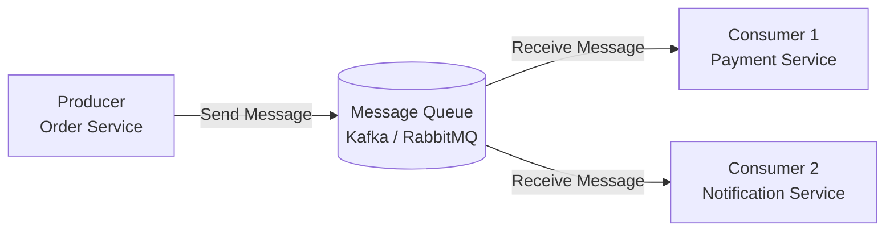

---

## 2. Why Message Queues?

| Benefit | Explanation |
|---------|-------------|
| **Decoupling** | Producer doesn't need to know about consumers |
| **Async Processing** | Non-blocking, improve response times |
| **Load Leveling** | Buffer traffic spikes |
| **Reliability** | Messages persisted, guaranteed delivery |
| **Scalability** | Add consumers to process more messages |
| **Event-Driven** | Enable event-driven architecture |

### Without vs With Message Queue

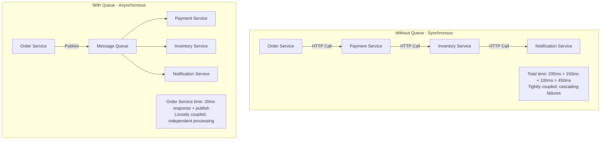

---

## 3. Where They Are Used

| Use Case | Pattern | Example |
|----------|---------|---------|
| **Order Processing** | Event-driven | Order → Payment → Inventory → Notification |
| **Email/SMS** | Fire-and-forget | Queue emails for async sending |
| **Log Aggregation** | Pipeline | Application logs → Kafka → ELK |
| **Data Streaming** | Stream processing | Real-time analytics, ETL |
| **Task Scheduling** | Work queue | Image processing, report generation |
| **Microservice Events** | Pub/Sub | Service-to-service communication |

---

## 4. Core Concepts

### 4.1 Message Delivery Guarantees

| Guarantee | Description | Implementation |
|-----------|-------------|----------------|
| **At-most-once** | Message may be lost, never duplicated | Fire-and-forget, no ACK |
| **At-least-once** | Message never lost, may be duplicated | ACK after processing, retry on failure |
| **Exactly-once** | Message processed exactly once | Kafka transactions + idempotent consumers |

### 4.2 Push vs Pull

| Model | Description | Used By |
|-------|-------------|---------|
| **Push** | Broker pushes messages to consumers | RabbitMQ, JMS |
| **Pull** | Consumers pull messages from broker | Kafka |

---

## 5. Kafka Deep Dive

### 5.1 Kafka Architecture

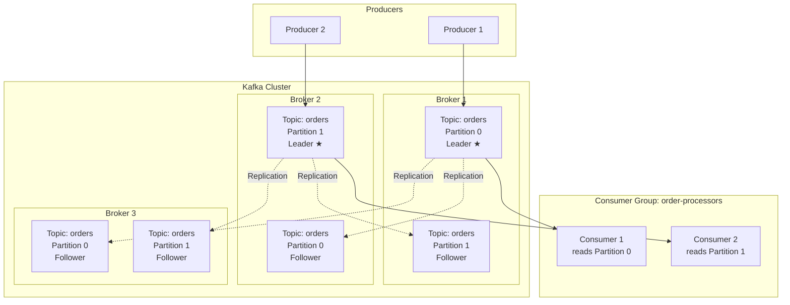

### 5.2 Kafka Key Concepts

| Concept | Description |
|---------|-------------|
| **Topic** | Category/feed of messages (like a table) |
| **Partition** | Ordered, immutable log within a topic |
| **Offset** | Position of a message within a partition |
| **Consumer Group** | Group of consumers that share partitions |
| **Broker** | Kafka server that stores data |
| **Replication Factor** | Number of copies of each partition |
| **ISR** | In-Sync Replicas — replicas that are caught up |

### 5.3 Message Ordering in Kafka

```
Topic: orders (3 partitions)

Partition 0: [msg1] [msg4] [msg7] → Consumer 1
Partition 1: [msg2] [msg5] [msg8] → Consumer 2
Partition 2: [msg3] [msg6] [msg9] → Consumer 3

✅ Order guaranteed WITHIN a partition
❌ No ordering guarantee ACROSS partitions

Strategy: Use message key (e.g., orderId) to ensure
related messages go to the same partition
```

### 5.4 Kafka Consumer Group Rebalancing

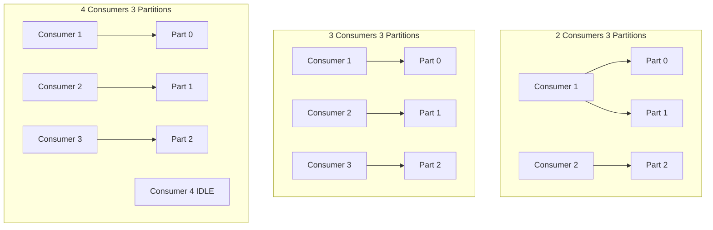

> **Rule:** Max useful consumers = number of partitions. Extra consumers sit idle.

---

## 6. RabbitMQ Deep Dive

### 6.1 RabbitMQ Architecture

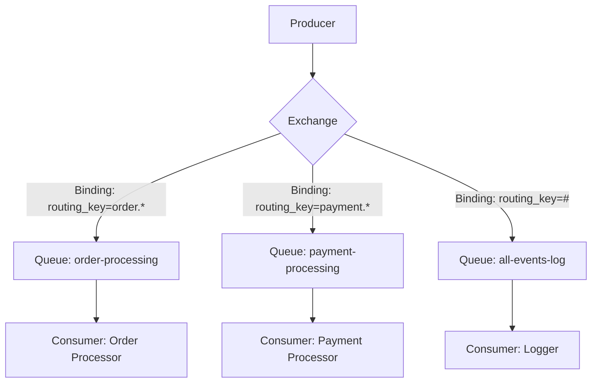

### 6.2 Exchange Types

| Exchange Type | Routing Logic | Use Case |
|---------------|--------------|----------|
| **Direct** | Exact routing key match | Task distribution |
| **Fanout** | Broadcast to all bound queues | Broadcasting events |
| **Topic** | Pattern matching (`order.*`, `#`) | Selective routing |
| **Headers** | Match on message headers | Complex routing |

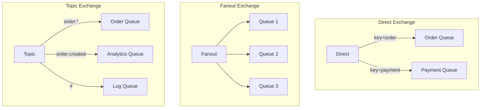

### 6.3 RabbitMQ Acknowledgment Modes

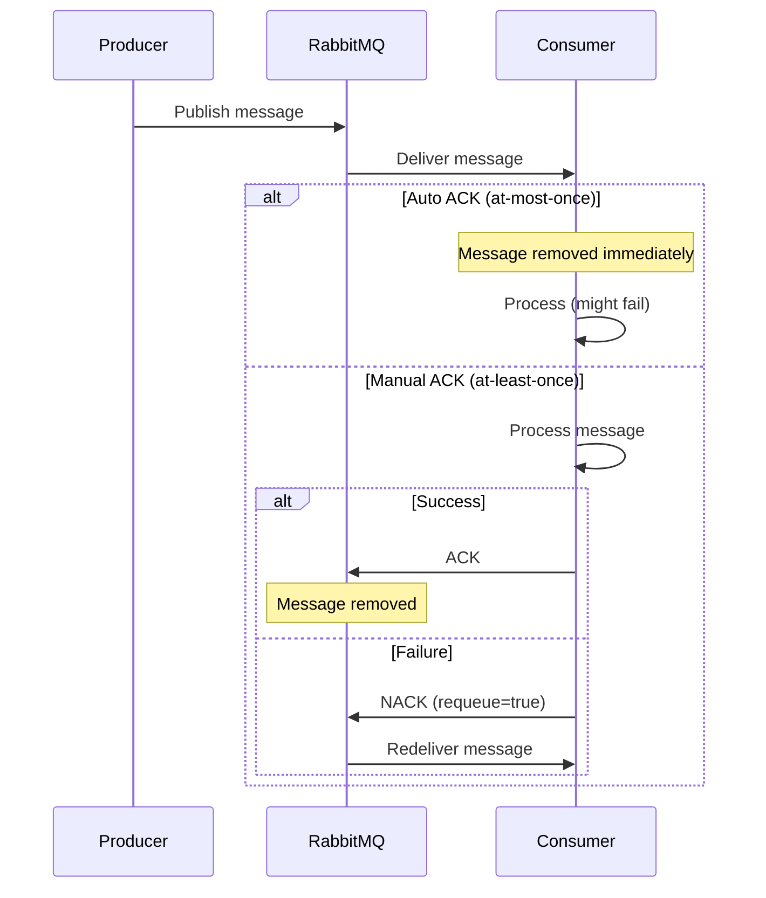

---

## 7. JMS Deep Dive

### 7.1 JMS (Java Message Service)

JMS is a **Java API specification** (not an implementation) for messaging. Implementations include ActiveMQ, IBM MQ, and others.

### 7.2 JMS Models

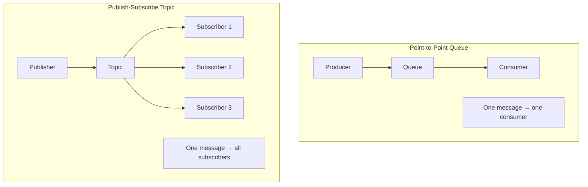

---

## 8. Kafka vs RabbitMQ vs JMS

| Feature | Kafka | RabbitMQ | JMS (ActiveMQ) |
|---------|-------|----------|----------------|
| **Model** | Distributed log | Message broker | API specification |
| **Delivery** | Pull-based | Push-based | Push-based |
| **Ordering** | Per partition | Per queue | Per queue |
| **Throughput** | Very high (millions/sec) | High (100K/sec) | Medium (10K/sec) |
| **Retention** | Configurable (days/weeks) | Until consumed | Until consumed |
| **Replay** | ✅ Yes (offset-based) | ❌ No | ❌ No |
| **Use Case** | Event streaming, log aggregation | Task queues, routing | Enterprise Java |
| **Complexity** | High | Medium | Low |

### Decision Guide

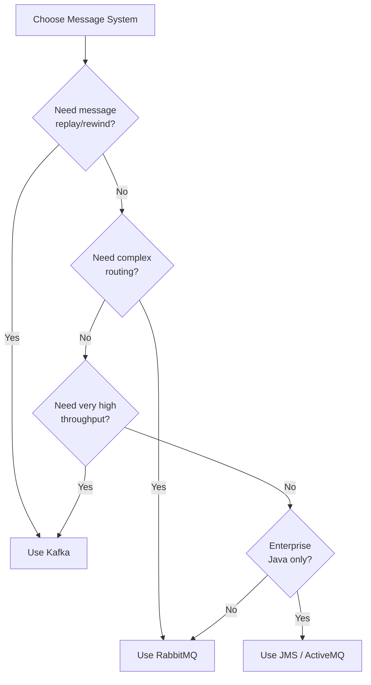

---

## 9. Advanced Patterns

### 9.1 Dead Letter Queue (DLQ)

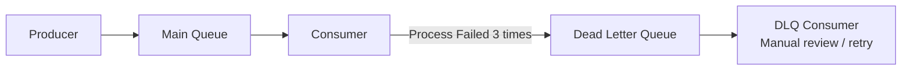

### 9.2 Outbox Pattern

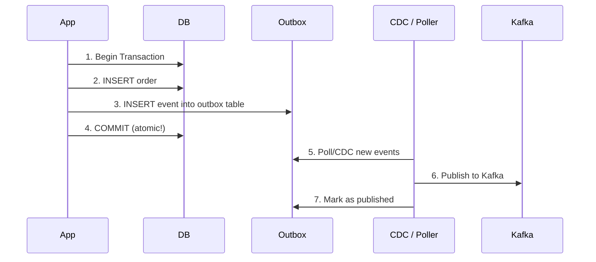

### 9.3 Competing Consumers

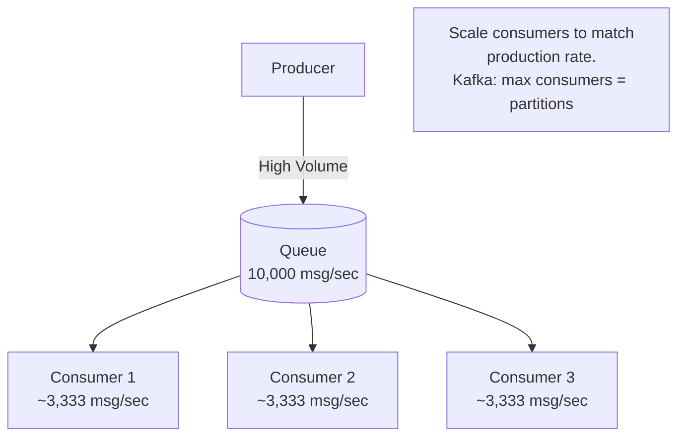

---

## 10. Architecture Diagrams

### Event-Driven Microservices with Kafka

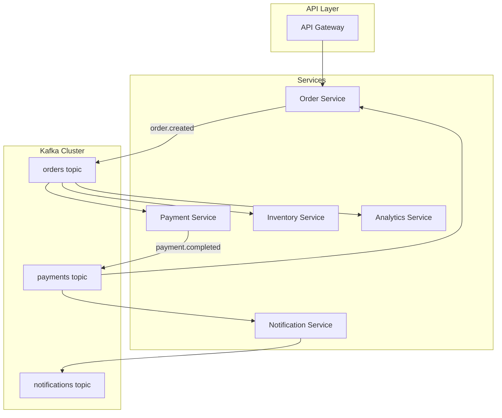

---

## 11. Production-Ready Code

### 11.1 Kafka Producer (Spring Boot)

```java
@Configuration
public class KafkaProducerConfig {
    
    @Bean
    public ProducerFactory<String, Object> producerFactory() {
        Map<String, Object> config = Map.of(
            ProducerConfig.BOOTSTRAP_SERVERS_CONFIG, "kafka-1:9092,kafka-2:9092,kafka-3:9092",
            ProducerConfig.KEY_SERIALIZER_CLASS_CONFIG, StringSerializer.class,
            ProducerConfig.VALUE_SERIALIZER_CLASS_CONFIG, JsonSerializer.class,
            ProducerConfig.ACKS_CONFIG, "all",           // Wait for all replicas
            ProducerConfig.RETRIES_CONFIG, 3,
            ProducerConfig.ENABLE_IDEMPOTENCE_CONFIG, true,  // Exactly-once
            ProducerConfig.MAX_IN_FLIGHT_REQUESTS_PER_CONNECTION, 5
        );
        return new DefaultKafkaProducerFactory<>(config);
    }
}

@Service
@Slf4j
public class OrderEventProducer {
    
    @Autowired
    private KafkaTemplate<String, Object> kafkaTemplate;
    
    public void publishOrderCreated(Order order) {
        OrderCreatedEvent event = new OrderCreatedEvent(
            order.getId(), 
            order.getUserId(), 
            order.getTotalAmount(),
            Instant.now()
        );
        
        // Use orderId as key → same order always goes to same partition
        CompletableFuture<SendResult<String, Object>> future = 
            kafkaTemplate.send("orders", order.getId(), event);
        
        future.whenComplete((result, error) -> {
            if (error != null) {
                log.error("Failed to publish order event: {}", order.getId(), error);
            } else {
                log.info("Published order event: {} to partition: {} offset: {}", 
                    order.getId(),
                    result.getRecordMetadata().partition(),
                    result.getRecordMetadata().offset());
            }
        });
    }
}
```

### 11.2 Kafka Consumer (Spring Boot)

```java
@Component
@Slf4j
public class OrderEventConsumer {
    
    @KafkaListener(
        topics = "orders", 
        groupId = "payment-service",
        concurrency = "3",    // 3 threads — match partition count
        containerFactory = "kafkaListenerContainerFactory"
    )
    @Retry(maxAttempts = 3, backoff = @Backoff(delay = 1000, multiplier = 2))
    public void handleOrderCreated(
            @Payload OrderCreatedEvent event,
            @Header(KafkaHeaders.RECEIVED_PARTITION) int partition,
            @Header(KafkaHeaders.OFFSET) long offset) {
        
        log.info("Processing order: {} from partition: {} offset: {}", 
            event.getOrderId(), partition, offset);
        
        // Idempotency check
        if (eventProcessedRepository.existsByEventId(event.getEventId())) {
            log.warn("Duplicate event, skipping: {}", event.getEventId());
            return;
        }
        
        try {
            paymentService.processPayment(event);
            eventProcessedRepository.save(new ProcessedEvent(event.getEventId()));
        } catch (Exception e) {
            log.error("Failed to process order: {}", event.getOrderId(), e);
            throw e;  // Will be retried by @Retry, then sent to DLQ
        }
    }
    
    @KafkaListener(topics = "orders.DLT", groupId = "payment-service-dlt")
    public void handleDLQ(OrderCreatedEvent event) {
        log.error("DLQ: Failed to process order after all retries: {}", event.getOrderId());
        // Alert, create incident ticket, etc.
        alertService.createIncident("Order processing failed: " + event.getOrderId());
    }
}
```

### 11.3 RabbitMQ Configuration (Spring Boot)

```java
@Configuration
public class RabbitMQConfig {
    
    @Bean
    public TopicExchange orderExchange() {
        return new TopicExchange("order-exchange", true, false);
    }
    
    @Bean
    public Queue orderQueue() {
        return QueueBuilder.durable("order-processing-queue")
            .withArgument("x-dead-letter-exchange", "dlx-exchange")
            .withArgument("x-dead-letter-routing-key", "dlq.order")
            .withArgument("x-max-retries", 3)
            .build();
    }
    
    @Bean
    public Binding orderBinding() {
        return BindingBuilder.bind(orderQueue())
            .to(orderExchange())
            .with("order.created");
    }
}

// Producer
@Service
public class RabbitOrderProducer {
    
    @Autowired
    private RabbitTemplate rabbitTemplate;
    
    public void publishOrderCreated(Order order) {
        rabbitTemplate.convertAndSend(
            "order-exchange", 
            "order.created", 
            new OrderCreatedEvent(order));
    }
}

// Consumer
@Component
@RabbitListener(queues = "order-processing-queue")
public class RabbitOrderConsumer {
    
    @RabbitHandler
    public void handleOrder(OrderCreatedEvent event) {
        log.info("Processing order from RabbitMQ: {}", event.getOrderId());
        paymentService.processPayment(event);
    }
}
```

---

## 12. Interview Questions & Answers

### 🟢 Beginner Level

**Q1: What is a message queue and why use it?**
> **A:** Middleware for async communication between services. Benefits: decoupling (services don't need to know about each other), async processing (faster responses), load leveling (buffer traffic spikes), reliability (messages persisted until processed). Example: order service publishes "order created" event, payment and notification services consume independently.

**Q2: What is the difference between a message queue and an event stream?**
> **A:** Queue (RabbitMQ): message consumed by one consumer, deleted after ACK. Stream (Kafka): message persisted in a log, can be consumed by multiple consumer groups, supports replay. Use queue for tasks (send email). Use stream for events (event sourcing, analytics).

**Q3: What is a consumer group in Kafka?**
> **A:** A group of consumers that share the workload of consuming a topic. Each partition is assigned to exactly one consumer in a group. Multiple groups can consume the same topic independently (each gets all messages). Max useful consumers per group = number of partitions.

---

### 🟡 Intermediate Level

**Q4: How does Kafka guarantee message ordering?**
> **A:** Ordering is guaranteed within a partition only. To ensure related messages are ordered: use a message key (e.g., orderId) — Kafka hashes the key to determine the partition. All messages with the same key go to the same partition → ordered. Across partitions, no ordering guarantee. Don't use more partitions than needed if ordering is critical.

**Q5: What is a Dead Letter Queue and when to use it?**
> **A:** A DLQ holds messages that failed processing after max retries. Without DLQ: failed messages block the queue or are lost. With DLQ: failed messages are moved aside for investigation. Implementation: set max-retries on the queue, configure DLQ, set up alerting on DLQ depth. Review DLQ messages periodically — fix bugs, replay if needed.

**Q6: Explain the Outbox Pattern.**
> **A:** Problem: writing to DB + publishing to Kafka is not atomic. Solution: (1) Write business data + event to outbox table in same DB transaction, (2) Separate process (CDC with Debezium or polling) reads outbox → publishes to Kafka, (3) Mark as published. Guarantees at-least-once delivery. Consumers must be idempotent.

---

### 🔴 Advanced / Pro Level

**Q7: How would you design a Kafka cluster for processing 1 million events per second?**
> **A:** Hardware: 10+ brokers with NVMe SSDs, 64GB RAM, 10Gbps network. Topics: partition count based on throughput (each partition handles ~10K msg/s write → 100 partitions). Replication factor: 3 for durability. Producer: batch.size=64KB, linger.ms=5, compression=lz4, acks=all with idempotence. Consumers: concurrency matches partitions, manual offset commit, processing with thread pools. Monitoring: consumer lag (Burrow), broker metrics, under-replicated partitions. Cross-DC: MirrorMaker2 for replication.

**Q8: Compare exactly-once semantics in Kafka vs RabbitMQ.**
> **A:** Kafka: supports exactly-once via idempotent producers (enable.idempotence=true) + transactions (read-process-write atomically). Consumer side: transactional.id ensures committed offsets and output writes are atomic. RabbitMQ: doesn't natively support exactly-once. Achieve it with: publisher confirms + consumer manual ACK + idempotent processing (store processed message IDs in DB). Kafka's approach is more reliable but complex.

---

## 🎯 Quick Reference

```
Message Queue Selection:
────────────────────────
Event streaming / replay → Kafka
Task queues / routing   → RabbitMQ
Enterprise Java only    → JMS (ActiveMQ)
Cloud-native queue      → AWS SQS / GCP Pub/Sub

Kafka Config Essentials:
────────────────────────
acks=all                    # Durability
enable.idempotence=true     # No duplicates
replication.factor=3        # Fault tolerance
min.insync.replicas=2       # Write safety
```

---

> **Next Topic:** [11 - Fault Tolerance & Circuit Breaker](./11-fault-tolerance.md)
