# 🛡️ Fault Tolerance & Circuit Breaker

> **Beginner → Pro Guide** | What • Why • Where • Interview Questions • Production Code

---

## 📌 Table of Contents
1. [What is Fault Tolerance?](#1-what-is-fault-tolerance)
2. [Why Fault Tolerance?](#2-why-fault-tolerance)
3. [Where It's Applied](#3-where-its-applied)
4. [Core Patterns](#4-core-patterns)
5. [Circuit Breaker Deep Dive](#5-circuit-breaker-deep-dive)
6. [Other Resilience Patterns](#6-other-resilience-patterns)
7. [Architecture Diagrams](#8-architecture-diagrams)
8. [Production-Ready Code](#9-production-ready-code)
9. [Interview Questions & Answers](#10-interview-questions--answers)

---

## 1. What is Fault Tolerance?

**Fault Tolerance** is the ability of a system to continue operating correctly even when some of its components fail. Instead of preventing all failures (impossible), we design systems that **gracefully handle** failures.


---

## 2. Why Fault Tolerance?

| Without Fault Tolerance | With Fault Tolerance |
|------------------------|---------------------|
| One service failure crashes entire system | Failures isolated to affected service |
| Cascading failures across services | Circuit breaker prevents cascade |
| Long timeouts wasting resources | Fail-fast with sensible timeouts |
| No recovery mechanism | Auto-retry with exponential backoff |
| Users see errors | Users see degraded but functional experience |

### Real-World Impact
```
Netflix Chaos Monkey: Randomly kills production servers
→ Forces engineers to build resilient systems
→ Netflix has 99.99% uptime despite constant failures

Amazon: Every service must handle downstream failures
→ "Everything fails, all the time" — Werner Vogels
```

---

## 3. Where It's Applied

| Component | Fault Tolerance Mechanism |
|-----------|--------------------------|
| **API calls** | Timeout + Retry + Circuit Breaker |
| **Database** | Read replicas + Failover |
| **Cache** | Fallback to DB if cache down |
| **Message Queue** | Dead Letter Queue + Retry |
| **Microservices** | Bulkhead + Fallback + Graceful degradation |
| **Load Balancer** | Health checks + Auto-removal |
| **DNS** | Multi-region failover |

---

## 4. Core Patterns

### 4.1 Pattern Overview


### 4.2 Timeout Pattern


### 4.3 Retry Pattern

```mermaid
graph LR
    Request[Request] --> Attempt1{Attempt 1}
    Attempt1 -->|Fail| Wait1[Wait 1s]
    Wait1 --> Attempt2{Attempt 2}
    Attempt2 -->|Fail| Wait2[Wait 2s]
    Wait2 --> Attempt3{Attempt 3}
    Attempt3 -->|Fail| Fallback[Fallback / Error]
    
    Attempt1 -->|Success ✅| Response[Response]
    Attempt2 -->|Success ✅| Response
    Attempt3 -->|Success ✅| Response
```



**Exponential Backoff with Jitter:**
```
Attempt 1: Wait 1s + random(0-1s) = ~1.3s
Attempt 2: Wait 2s + random(0-2s) = ~2.7s
Attempt 3: Wait 4s + random(0-4s) = ~5.1s
Max attempts: 3
```

> ⚠️ **Only retry on transient failures** (network timeout, 503) — never on 400, 401, 404.

### 4.4 Bulkhead Pattern

```mermaid
graph TD
    subgraph Without Bulkhead
        Pool[Thread Pool: 100 threads]
        Pool --> S1[Service A calls]
        Pool --> S2[Service B calls - SLOW!]
        Pool --> S3[Service C calls]
        Note1[If Service B is slow, all 100 threads<br/>get stuck → entire system freezes]
    end
    
    subgraph With Bulkhead
        Pool1[Pool A: 30 threads] --> SA[Service A]
        Pool2[Pool B: 40 threads] --> SB[Service B - SLOW!]
        Pool3[Pool C: 30 threads] --> SC[Service C]
        Note2[Service B slow → only Pool B affected<br/>Services A and C continue working!]
    end
```



### 4.5 Fallback Pattern


---

## 5. Circuit Breaker Deep Dive

### 5.1 What is a Circuit Breaker?

Like an electrical circuit breaker — when too many failures occur, the "circuit opens" and stops sending requests to the failing service, giving it time to recover.

### 5.2 Circuit Breaker States


| State | Behavior |
|-------|----------|
| **CLOSED** | Normal operation — all requests pass through. Monitor failure rate. |
| **OPEN** | Circuit tripped — all requests immediately fail/fallback. No calls to service. |
| **HALF_OPEN** | Allow limited test requests through. If they succeed, close circuit. If they fail, reopen. |

### 5.3 Circuit Breaker Timeline

```
Time →
──────────────────────────────────────────────────────────
CLOSED    │ ✅ ✅ ✅ ❌ ✅ ❌ ❌ ❌ ❌ │ Failure threshold exceeded (50%)
──────────┤                                              │
OPEN      │ ⛔ ⛔ ⛔ ⛔ ⛔ ⛔ ⛔ ⛔ ⛔ │ All requests blocked (10s wait)
──────────┤                                              │
HALF_OPEN │ ✅ ✅ ✅ │ 3/3 test requests succeeded
──────────┤           │
CLOSED    │ ✅ ✅ ✅ ✅ ✅ ✅ │ Normal operation resumes
```

### 5.4 Circuit Breaker Configuration


### 5.5 Circuit Breaker with Fallback Flow

```mermaid
sequenceDiagram
    participant Client
    participant CB as Circuit Breaker
    participant Service as Payment Service
    participant Fallback
    
    Note over CB: State: CLOSED
    Client->>CB: Request 1
    CB->>Service: Forward
    Service-->>CB: ❌ Error
    
    Client->>CB: Request 2-5
    CB->>Service: Forward
    Service-->>CB: ❌ Error (4 more failures)
    
    Note over CB: Failure rate 100% > threshold 50%<br/>State: CLOSED → OPEN
    
    Client->>CB: Request 6
    CB-->>Client: ⛔ CircuitBreakerOpenException
    CB->>Fallback: Execute fallback
    Fallback-->>Client: Default response
    
    Note over CB: After 10s → State: HALF_OPEN
    Client->>CB: Request 7
    CB->>Service: Test request (1 of 3)
    Service-->>CB: ✅ Success
    
    CB->>Service: Test request (2 of 3)
    Service-->>CB: ✅ Success
    
    CB->>Service: Test request (3 of 3)
    Service-->>CB: ✅ Success
    
    Note over CB: All test requests passed<br/>State: HALF_OPEN → CLOSED
```



---

## 6. Other Resilience Patterns

### 6.1 Rate Limiter


**Algorithms:**
| Algorithm | Description |
|-----------|-------------|
| **Token Bucket** | Tokens added at fixed rate, each request takes a token |
| **Sliding Window** | Count requests in a sliding time window |
| **Leaky Bucket** | Process at constant rate, queue excess |

### 6.2 Hedging (Race Requests)


### 6.3 Graceful Degradation


---

## 7. Architecture Diagrams

### Resilient Microservices Architecture


---

## 8. Production-Ready Code

### 8.1 Resilience4j Circuit Breaker (Spring Boot)

```java
@Service
@Slf4j
public class PaymentServiceClient {
    
    private final RestTemplate restTemplate;
    
    @CircuitBreaker(name = "paymentService", fallbackMethod = "paymentFallback")
    @Retry(name = "paymentService")
    @TimeLimiter(name = "paymentService")
    @Bulkhead(name = "paymentService", type = Bulkhead.Type.THREADPOOL)
    public CompletableFuture<PaymentResponse> processPayment(PaymentRequest request) {
        return CompletableFuture.supplyAsync(() -> {
            log.info("Calling payment service for order: {}", request.getOrderId());
            return restTemplate.postForObject(
                "http://payment-service/api/payments", 
                request, 
                PaymentResponse.class);
        });
    }
    
    // Fallback 1: Try cached result
    public CompletableFuture<PaymentResponse> paymentFallback(
            PaymentRequest request, CallNotPermittedException ex) {
        log.warn("Circuit OPEN for payment service, using fallback for order: {}", 
            request.getOrderId());
        // Queue for later processing
        retryQueue.enqueue(request);
        return CompletableFuture.completedFuture(
            new PaymentResponse("QUEUED", "Payment queued for processing"));
    }
    
    // Fallback 2: Generic error
    public CompletableFuture<PaymentResponse> paymentFallback(
            PaymentRequest request, Throwable ex) {
        log.error("Payment service failed for order: {}, error: {}", 
            request.getOrderId(), ex.getMessage());
        return CompletableFuture.completedFuture(
            new PaymentResponse("PENDING", "Payment will be processed shortly"));
    }
}
```

### 8.2 Complete Resilience4j Configuration

```yaml
# application.yml
resilience4j:
  circuitbreaker:
    instances:
      paymentService:
        registerHealthIndicator: true
        slidingWindowType: COUNT_BASED
        slidingWindowSize: 10
        minimumNumberOfCalls: 5
        failureRateThreshold: 50
        slowCallRateThreshold: 80
        slowCallDurationThreshold: 3s
        waitDurationInOpenState: 10s
        permittedNumberOfCallsInHalfOpenState: 3
        recordExceptions:
          - java.io.IOException
          - java.net.SocketTimeoutException
          - org.springframework.web.client.HttpServerErrorException
        ignoreExceptions:
          - com.myapp.exception.BusinessException
          
  retry:
    instances:
      paymentService:
        maxAttempts: 3
        waitDuration: 1s
        exponentialBackoffMultiplier: 2
        retryExceptions:
          - java.io.IOException
          - java.net.SocketTimeoutException
        ignoreExceptions:
          - com.myapp.exception.BusinessException
          
  timelimiter:
    instances:
      paymentService:
        timeoutDuration: 3s
        cancelRunningFuture: true
        
  bulkhead:
    instances:
      paymentService:
        maxConcurrentCalls: 25    # Max 25 concurrent calls
        maxWaitDuration: 500ms    # Wait max 500ms for permit
        
  ratelimiter:
    instances:
      paymentService:
        limitForPeriod: 100       # 100 requests
        limitRefreshPeriod: 1s    # per second
        timeoutDuration: 500ms
```

### 8.3 Custom Health Indicator with Circuit Breaker

```java
@Component
public class CircuitBreakerHealthIndicator implements HealthIndicator {
    
    @Autowired
    private CircuitBreakerRegistry circuitBreakerRegistry;
    
    @Override
    public Health health() {
        Map<String, String> cbStates = new HashMap<>();
        boolean anyOpen = false;
        
        for (CircuitBreaker cb : circuitBreakerRegistry.getAllCircuitBreakers()) {
            String state = cb.getState().name();
            cbStates.put(cb.getName(), state);
            
            if (cb.getState() == CircuitBreaker.State.OPEN) {
                anyOpen = true;
            }
        }
        
        Health.Builder builder = anyOpen ? Health.down() : Health.up();
        builder.withDetails(cbStates);
        
        return builder.build();
    }
}
```

### 8.4 Graceful Shutdown

```java
@Component
public class GracefulShutdown implements TomcatConnectorCustomizer, ApplicationListener<ContextClosedEvent> {
    
    private volatile Connector connector;
    
    @Override
    public void customize(Connector connector) {
        this.connector = connector;
    }
    
    @Override
    public void onApplicationEvent(ContextClosedEvent event) {
        log.info("Initiating graceful shutdown...");
        
        // Stop accepting new requests
        this.connector.pause();
        
        // Wait for in-flight requests to complete (max 30s)
        Executor executor = this.connector.getProtocolHandler().getExecutor();
        if (executor instanceof ThreadPoolExecutor threadPool) {
            threadPool.shutdown();
            try {
                if (!threadPool.awaitTermination(30, TimeUnit.SECONDS)) {
                    log.warn("Forcefully shutting down after 30s");
                    threadPool.shutdownNow();
                }
            } catch (InterruptedException e) {
                Thread.currentThread().interrupt();
            }
        }
        
        log.info("Graceful shutdown completed");
    }
}
```

---

## 9. Interview Questions & Answers

### 🟢 Beginner Level

**Q1: What is fault tolerance?**
> **A:** The ability of a system to continue working when parts fail. Key mechanisms: redundancy (multiple instances), retry (try again on failure), timeout (don't wait forever), fallback (alternate response), circuit breaker (stop calling broken services). Goal: graceful degradation instead of total failure.

**Q2: What is a circuit breaker pattern?**
> **A:** Like an electrical circuit breaker — monitors failure rate of downstream calls. Three states: CLOSED (normal, calls pass through), OPEN (too many failures, calls blocked, fallback used), HALF-OPEN (test if service recovered). Prevents cascading failures, gives failing service time to recover, provides fast failure response.

**Q3: What is the difference between retry and circuit breaker?**
> **A:** Retry: try again on individual failures (2-3 attempts). Circuit breaker: stop trying after too many failures across all requests. They work together: retry handles transient failures, circuit breaker handles sustained outages. Apply retry inside circuit breaker.

---

### 🟡 Intermediate Level

**Q4: Explain the bulkhead pattern with an example.**
> **A:** Named after ship bulkheads that prevent water from flooding entire ship. In software: isolate resources per dependency. Example: 100-thread pool → 40 for Payment Service, 30 for Inventory, 30 for Notification. If Payment is slow and uses all 40 threads, Inventory and Notification still have their 30 threads each. Without bulkhead: Payment's slowness starves all other services.

**Q5: How do you implement graceful degradation?**
> **A:** Tiered feature response: (1) Full mode: all features (product page with reviews, recommendations, images), (2) Degraded: disable non-essential (no recommendations), (3) Minimal: core only (product name + price + buy). Implementation: circuit breakers with fallbacks per feature, feature flags to disable services, cache stale data as fallback.

---

### 🔴 Advanced / Pro Level

**Q6: Design a fault-tolerant payment processing system.**
> **A:** (1) Idempotent API (idempotency key to prevent double charging), (2) Circuit breaker on payment gateway calls (fallback: queue for retry), (3) Saga pattern for distributed transaction (compensating action: refund on partial failure), (4) Dead letter queue for failed payments, (5) Outbox pattern for reliable event publishing, (6) Multi-gateway support (failover from Stripe to Razorpay), (7) Reconciliation job to detect inconsistencies, (8) Alerts on circuit breaker state changes and DLQ depth.

**Q7: What is the difference between fault tolerance and high availability?**
> **A:** Fault tolerance: system continues working despite failures (masking failures). High availability: system is accessible a high percentage of time (e.g., 99.99%). HA is often achieved through FT mechanisms (redundancy, failover). You can have HA without FT (fast manual recovery) or FT without HA (system works but degraded). In practice, they overlap: circuit breakers + replicas + failover = both FT and HA.

---

## 🎯 Quick Reference

```
Resilience4j Decoration Order (inner to outer):
────────────────────────────────────────────────
Retry → CircuitBreaker → RateLimiter → TimeLimiter → Bulkhead

Pattern Selection:
──────────────────
Transient network errors   → Retry + Backoff
Service completely down    → Circuit Breaker
Slow service               → Timeout + Bulkhead
Traffic spike prevention   → Rate Limiter
Best effort notification   → Fallback (silent fail)
```

---

> **Next Topic:** [12 - Idempotency](./12-idempotency.md)
