# 🔄 Idempotency

> **Beginner → Pro Guide** | What • Why • Where • Interview Questions • Production Code

---

## 📌 Table of Contents
1. [What is Idempotency?](#1-what-is-idempotency)
2. [Why Idempotency?](#2-why-idempotency)
3. [Where It's Applied](#3-where-its-applied)
4. [Idempotency in HTTP](#4-idempotency-in-http)
5. [Idempotency Key Pattern](#5-idempotency-key-pattern)
6. [Strategies & Patterns](#6-strategies--patterns)
7. [Architecture Diagrams](#7-architecture-diagrams)
8. [Production-Ready Code](#8-production-ready-code)
9. [Interview Questions & Answers](#9-interview-questions--answers)

---

## 1. What is Idempotency?

An operation is **idempotent** if performing it multiple times produces the same result as performing it once.

```
Idempotent:
    f(x) = f(f(x)) = f(f(f(x)))

Example:
    SET user.balance = 100    ← Always results in 100 (idempotent)
    user.balance += 100       ← 100, then 200, then 300 (NOT idempotent)
```

### Simple Analogy
```
Idempotent:     Pressing elevator button — pressing 10 times same as 1 time
Not Idempotent: Adding items to cart — each click adds another item
```

---

## 2. Why Idempotency?

```mermaid
sequenceDiagram
    participant Client
    participant Server
    participant PaymentGateway as Payment Gateway
    
    Client->>Server: POST /orders/pay (₹1000)
    Server->>PaymentGateway: Charge ₹1000
    PaymentGateway-->>Server: Success
    Server--xClient: Response lost (network error!)
    
    Note over Client: Client doesn't know if payment went through...
    Client->>Server: POST /orders/pay (₹1000) RETRY
    
    alt Without Idempotency
        Server->>PaymentGateway: Charge ₹1000 AGAIN
        Note over PaymentGateway: Customer charged ₹2000! 💸
    else With Idempotency
        Server->>Server: Check: Already processed this request
        Server-->>Client: Return original response
        Note over PaymentGateway: Customer charged only ₹1000 ✅
    end
```



### Problems Without Idempotency

| Scenario | Risk |
|----------|------|
| Payment retry | Double charge |
| Order creation retry | Duplicate orders |
| Email notification retry | Spam/duplicate emails |
| Message queue re-delivery | Double processing |
| API timeout + client retry | Duplicate operations |

---

## 3. Where It's Applied

| Domain | Idempotency Need |
|--------|-----------------|
| **Payment Processing** | Never charge customer twice |
| **Order Creation** | Never create duplicate orders |
| **API Design** | Safe retries for clients |
| **Message Queue Consumers** | Handle re-delivered messages |
| **Database Operations** | Safely replay migrations |
| **Distributed Transactions** | Saga compensations must be idempotent |
| **Webhook Handlers** | Providers may send duplicate events |

---

## 4. Idempotency in HTTP

### HTTP Method Idempotency

| Method | Idempotent? | Safe? | Description |
|--------|------------|-------|-------------|
| **GET** | ✅ Yes | ✅ Yes | Retrieve data, no side effects |
| **PUT** | ✅ Yes | ❌ No | Replace resource (same body = same result) |
| **DELETE** | ✅ Yes | ❌ No | Delete once = delete twice (resource gone) |
| **HEAD** | ✅ Yes | ✅ Yes | Like GET but no body |
| **OPTIONS** | ✅ Yes | ✅ Yes | Get allowed methods |
| **POST** | ❌ No | ❌ No | Create/action — each call may create new resource |
| **PATCH** | ❌ No | ❌ No | Partial update — depends on implementation |

> **Key:** POST is the problematic one. We need to **make POST idempotent** for critical operations (payments, orders).

### Making POST Idempotent

```mermaid
sequenceDiagram
    participant Client
    participant Server
    participant DB
    
    Note over Client: Generate unique Idempotency-Key
    Client->>Server: POST /payments<br/>Idempotency-Key: "abc-123"
    Server->>DB: Check if "abc-123" processed?
    DB-->>Server: Not found
    Server->>Server: Process payment
    Server->>DB: Store result with key "abc-123"
    Server-->>Client: 200 OK ✅
    
    Note over Client: Network error, retry same request
    Client->>Server: POST /payments<br/>Idempotency-Key: "abc-123"
    Server->>DB: Check if "abc-123" processed?
    DB-->>Server: Found! Return cached response
    Server-->>Client: 200 OK (same response) ✅
```



---

## 5. Idempotency Key Pattern

### 5.1 How It Works


### 5.2 Idempotency Store Schema

```sql
CREATE TABLE idempotency_keys (
    idempotency_key VARCHAR(64) PRIMARY KEY,
    request_hash    VARCHAR(64) NOT NULL,     -- Hash of request body
    response_code   INT,
    response_body   TEXT,
    status          VARCHAR(20) NOT NULL,      -- PROCESSING, COMPLETED, FAILED
    created_at      TIMESTAMP NOT NULL DEFAULT NOW(),
    expires_at      TIMESTAMP NOT NULL         -- Auto-cleanup
);

CREATE INDEX idx_idempotency_expires ON idempotency_keys(expires_at);
```

### 5.3 State Machine

```mermaid
stateDiagram-v2
    [*] --> STARTED: First request received
    STARTED --> PROCESSING: Processing begins
    PROCESSING --> COMPLETED: Success
    PROCESSING --> FAILED: Error
    COMPLETED --> COMPLETED: Duplicate request → return cached response
    FAILED --> PROCESSING: Retry allowed
```



---

## 6. Strategies & Patterns

### 6.1 Database-Level Idempotency

```sql
-- Using UNIQUE constraint
INSERT INTO orders (order_number, user_id, amount, status)
VALUES ('ORD-2024-001', 123, 999.00, 'PENDING')
ON CONFLICT (order_number) DO NOTHING;   -- PostgreSQL

-- Using INSERT IGNORE
INSERT IGNORE INTO orders (order_number, user_id, amount)
VALUES ('ORD-2024-001', 123, 999.00);     -- MySQL
```

### 6.2 Message Queue Consumer Idempotency


### 6.3 Idempotent vs Non-Idempotent Operations

```
Making Operations Idempotent:
─────────────────────────────
❌ balance += 100
✅ SET balance = 600 WHERE version = 5

❌ INSERT INTO orders VALUES (...)
✅ INSERT INTO orders VALUES (...) ON CONFLICT DO NOTHING

❌ counter++
✅ SET counter = 42 WHERE counter = 41 (compare-and-swap)

❌ Process message
✅ IF NOT processed(messageId) THEN process AND mark(messageId)
```

### 6.4 Natural Idempotency Keys

| Operation | Natural Key |
|-----------|------------|
| Payment | `payment_intent_id` (from Stripe) |
| Order | `order_number` |
| Email | `email + event_type + entity_id` |
| Webhook | `webhook_event_id` |
| File upload | `file_hash + user_id` |

---

## 7. Architecture Diagrams

### Complete Idempotent Payment Flow

```mermaid
sequenceDiagram
    participant Client
    participant API as API Server
    participant Redis as Redis<br/>Idempotency Store
    participant DB
    participant PG as Payment Gateway
    
    Client->>API: POST /pay<br/>Idempotency-Key: "pay-xyz-123"<br/>Amount: ₹1000
    
    API->>Redis: GET idem:pay-xyz-123
    Redis-->>API: Not Found
    
    API->>Redis: SET idem:pay-xyz-123 = PROCESSING<br/>NX, TTL=24h
    Redis-->>API: OK (lock acquired)
    
    API->>DB: BEGIN TRANSACTION
    API->>DB: INSERT order (status=PENDING)
    API->>PG: Charge ₹1000
    PG-->>API: Success, txn_id=TXN-456
    API->>DB: UPDATE order SET status=PAID
    API->>DB: COMMIT
    
    API->>Redis: SET idem:pay-xyz-123 = {status:COMPLETED, response:{...}}<br/>TTL=24h
    API-->>Client: 200 OK {order_id: 1, status: PAID}
    
    Note over Client: Network timeout on response...
    Note over Client: Client retries
    
    Client->>API: POST /pay (RETRY)<br/>Idempotency-Key: "pay-xyz-123"
    API->>Redis: GET idem:pay-xyz-123
    Redis-->>API: {status:COMPLETED, response:{...}}
    API-->>Client: 200 OK {order_id: 1, status: PAID} ✅
    Note over PG: No duplicate charge!
```



### Idempotent Kafka Consumer


---

## 8. Production-Ready Code

### 8.1 Idempotency Key Filter (Spring Boot)

```java
@Component
@Order(1)
public class IdempotencyFilter extends OncePerRequestFilter {
    
    @Autowired
    private StringRedisTemplate redis;
    
    @Autowired
    private ObjectMapper objectMapper;
    
    private static final String PREFIX = "idem:";
    private static final Duration TTL = Duration.ofHours(24);
    
    @Override
    protected void doFilterInternal(HttpServletRequest request, 
                                     HttpServletResponse response,
                                     FilterChain chain) throws IOException, ServletException {
        
        // Only apply to POST/PATCH requests
        if (!request.getMethod().equals("POST") && !request.getMethod().equals("PATCH")) {
            chain.doFilter(request, response);
            return;
        }
        
        String idempotencyKey = request.getHeader("Idempotency-Key");
        if (idempotencyKey == null || idempotencyKey.isBlank()) {
            chain.doFilter(request, response);
            return;
        }
        
        String redisKey = PREFIX + idempotencyKey;
        
        // Check if request already processed
        String cachedResponse = redis.opsForValue().get(redisKey);
        if (cachedResponse != null) {
            CachedApiResponse cached = objectMapper.readValue(
                cachedResponse, CachedApiResponse.class);
            
            if ("PROCESSING".equals(cached.getStatus())) {
                // Another instance is processing — return 409 Conflict
                response.setStatus(409);
                response.getWriter().write("{\"error\": \"Request is being processed\"}");
                return;
            }
            
            // Return cached response
            response.setStatus(cached.getStatusCode());
            response.setContentType("application/json");
            response.getWriter().write(cached.getBody());
            return;
        }
        
        // Lock with NX (set only if not exists)
        Boolean locked = redis.opsForValue().setIfAbsent(
            redisKey, 
            objectMapper.writeValueAsString(new CachedApiResponse("PROCESSING", 0, null)),
            TTL);
        
        if (Boolean.FALSE.equals(locked)) {
            // Race condition: another request got the lock
            response.setStatus(409);
            response.getWriter().write("{\"error\": \"Duplicate request\"}");
            return;
        }
        
        // Wrap response to capture it
        ContentCachingResponseWrapper responseWrapper = 
            new ContentCachingResponseWrapper(response);
        
        try {
            chain.doFilter(request, responseWrapper);
            
            // Cache the response
            String responseBody = new String(responseWrapper.getContentAsByteArray());
            CachedApiResponse cached = new CachedApiResponse(
                "COMPLETED", responseWrapper.getStatus(), responseBody);
            
            redis.opsForValue().set(redisKey, 
                objectMapper.writeValueAsString(cached), TTL);
            
            responseWrapper.copyBodyToResponse();
        } catch (Exception e) {
            // Remove the processing lock on failure
            redis.delete(redisKey);
            throw e;
        }
    }
}

@Data
@AllArgsConstructor
@NoArgsConstructor
public class CachedApiResponse {
    private String status;    // PROCESSING, COMPLETED
    private int statusCode;
    private String body;
}
```

### 8.2 Idempotent Service Layer

```java
@Service
@Slf4j
public class PaymentService {
    
    @Autowired
    private PaymentRepository paymentRepository;
    
    @Autowired
    private PaymentGatewayClient paymentGateway;
    
    @Transactional
    public PaymentResponse processPayment(String idempotencyKey, PaymentRequest request) {
        // Check if payment already processed with this idempotency key
        Optional<Payment> existing = paymentRepository
            .findByIdempotencyKey(idempotencyKey);
        
        if (existing.isPresent()) {
            Payment payment = existing.get();
            log.info("Returning idempotent response for key: {}", idempotencyKey);
            return toResponse(payment);
        }
        
        // Create payment record with PENDING status
        Payment payment = Payment.builder()
            .idempotencyKey(idempotencyKey)
            .orderId(request.getOrderId())
            .amount(request.getAmount())
            .currency(request.getCurrency())
            .status(PaymentStatus.PENDING)
            .build();
        
        payment = paymentRepository.save(payment);
        
        try {
            // Call payment gateway
            GatewayResponse gwResponse = paymentGateway.charge(
                request.getAmount(), 
                request.getCurrency(),
                request.getPaymentMethod());
            
            payment.setGatewayTransactionId(gwResponse.getTransactionId());
            payment.setStatus(PaymentStatus.COMPLETED);
            paymentRepository.save(payment);
            
            return toResponse(payment);
        } catch (Exception e) {
            payment.setStatus(PaymentStatus.FAILED);
            payment.setErrorMessage(e.getMessage());
            paymentRepository.save(payment);
            throw new PaymentFailedException("Payment failed: " + e.getMessage(), e);
        }
    }
}
```

### 8.3 Idempotent Kafka Consumer

```java
@Component
@Slf4j
public class IdempotentOrderConsumer {
    
    @Autowired
    private ProcessedEventRepository processedEventRepo;
    
    @Autowired
    private OrderService orderService;
    
    @KafkaListener(topics = "order-events", groupId = "inventory-service")
    @Transactional  // Same transaction for business logic + marking as processed
    public void handleOrderEvent(
            @Payload OrderEvent event,
            @Header(KafkaHeaders.RECEIVED_KEY) String key,
            @Header(KafkaHeaders.OFFSET) long offset,
            @Header(KafkaHeaders.RECEIVED_PARTITION) int partition) {
        
        String eventId = event.getEventId();
        
        // Idempotency check — using event ID
        if (processedEventRepo.existsById(eventId)) {
            log.info("Skipping already processed event: {} (partition={}, offset={})", 
                eventId, partition, offset);
            return;
        }
        
        log.info("Processing new event: {} type={}", eventId, event.getType());
        
        // Business logic
        switch (event.getType()) {
            case "ORDER_CREATED" -> orderService.reserveInventory(event);
            case "ORDER_CANCELLED" -> orderService.releaseInventory(event);
            default -> log.warn("Unknown event type: {}", event.getType());
        }
        
        // Mark as processed (same transaction as business logic)
        processedEventRepo.save(new ProcessedEvent(
            eventId, 
            event.getType(), 
            Instant.now()));
        
        log.info("Successfully processed event: {}", eventId);
    }
}

@Entity
@Table(name = "processed_events")
public class ProcessedEvent {
    @Id
    private String eventId;
    
    private String eventType;
    
    @Column(name = "processed_at")
    private Instant processedAt;
}
```

### 8.4 API Controller with Idempotency

```java
@RestController
@RequestMapping("/api/payments")
public class PaymentController {
    
    @Autowired
    private PaymentService paymentService;
    
    @PostMapping
    public ResponseEntity<PaymentResponse> createPayment(
            @RequestHeader("Idempotency-Key") String idempotencyKey,
            @Valid @RequestBody PaymentRequest request) {
        
        if (idempotencyKey == null || idempotencyKey.length() < 16) {
            return ResponseEntity.badRequest()
                .body(new PaymentResponse("ERROR", 
                    "Idempotency-Key header required (min 16 chars)"));
        }
        
        PaymentResponse response = paymentService
            .processPayment(idempotencyKey, request);
        
        return ResponseEntity.ok(response);
    }
}

// Client usage example:
// POST /api/payments
// Idempotency-Key: pay_a1b2c3d4-e5f6-7890-abcd-ef1234567890
// Content-Type: application/json
// { "orderId": "ORD-123", "amount": 999.00, "currency": "INR" }
```

---

## 9. Interview Questions & Answers

### 🟢 Beginner Level

**Q1: What is idempotency?**
> **A:** An operation is idempotent if performing it multiple times gives the same result as performing it once. HTTP GET, PUT, DELETE are idempotent. POST is not. Example: setting balance to 100 is idempotent (always 100). Adding 100 to balance is not (100, 200, 300...). Important for safe retries in distributed systems.

**Q2: Why is idempotency important in distributed systems?**
> **A:** In distributed systems, requests can be duplicated due to: network timeouts (client retries), message queue re-delivery, load balancer retries. Without idempotency: double charges, duplicate orders, data corruption. With idempotency: safe to retry any operation without side effects.

**Q3: Which HTTP methods are idempotent?**
> **A:** GET (read-only), PUT (replace), DELETE (remove), HEAD, OPTIONS are idempotent. POST and PATCH are not by default. To make POST idempotent: use an Idempotency-Key header. The key ensures the server recognizes duplicate requests and returns the cached response.

---

### 🟡 Intermediate Level

**Q4: Explain the Idempotency Key pattern.**
> **A:** Client generates a unique key (UUID) and sends it in the Idempotency-Key header. Server: (1) checks if key exists in store, (2) if yes, returns cached response, (3) if no, processes request and stores response with key. Key has a TTL (24h typically). This makes POST requests safe to retry. Used by Stripe, Razorpay, and most payment APIs.

**Q5: How do you make a Kafka consumer idempotent?**
> **A:** Two approaches: (1) **Deduplication table**: store processed event IDs in a DB table. Before processing, check if event ID exists. Business logic and deduplication insert must be in the same DB transaction. (2) **Natural idempotency**: design operations to be naturally idempotent (e.g., SET balance = X instead of balance += X). Always prefer approach 1 for critical operations.

**Q6: What is the difference between idempotency and exactly-once delivery?**
> **A:** Exactly-once: message is delivered and processed exactly once (hard to guarantee). Idempotency: message may be delivered multiple times, but the EFFECT is the same as processing once (easier to implement). In practice, most systems achieve "at-least-once delivery + idempotent consumers" instead of true exactly-once.

---

### 🔴 Advanced / Pro Level

**Q7: Design an idempotent payment system that handles concurrent requests.**
> **A:** (1) Client sends Idempotency-Key header, (2) Server uses Redis SETNX to acquire lock on key with TTL, (3) If lock acquired: process payment, store result in DB + Redis, (4) If lock not acquired: return 409 (processing) or cached response (completed). Handle race conditions: first request locks → processes → stores result. Concurrent duplicate → sees lock → returns 409/cached. Use DB transaction to make payment + idempotency record atomic. TTL on Redis key (24h) for auto-cleanup. Periodic cleanup job for DB records.

**Q8: How do you handle idempotency in a Saga pattern?**
> **A:** Every step in a saga must be idempotent, including compensating transactions. Example: Order saga → (1) Create order (idempotency: order_number unique), (2) Reserve inventory (idempotency: reservation_id unique per order), (3) Process payment (idempotency key: payment_intent_id). Compensations: (1) Cancel order (check status first), (2) Release inventory (check if reserved), (3) Refund payment (check if charged). Each step checks current state before acting.

---

## 🎯 Quick Reference

```
Idempotency Implementation Checklist:
──────────────────────────────────────
✅ Use Idempotency-Key header for POST endpoints
✅ Store idempotency records (Redis + DB)
✅ Use SETNX for distributed locking
✅ Same transaction for business logic + dedup record
✅ Return cached response for duplicate requests
✅ Set TTL for auto-cleanup (24h)
✅ Handle concurrent duplicates (409 or wait+retry)
✅ Make Kafka consumers idempotent (event ID tracking)
✅ Make saga compensations idempotent
✅ Design DB operations to be naturally idempotent (UPSERT)

Generating Idempotency Keys (Client-Side):
──────────────────────────────────────────
UUID v4:     "550e8400-e29b-41d4-a716-446655440000"
Structured:  "pay_{userId}_{orderId}_{timestamp}"
Hash-based:  SHA256(userId + orderId + amount)
```

---

> **📚 All Topics Covered!** Go back to [01 - System Design](./01-system-design.md) to start from the beginning.
