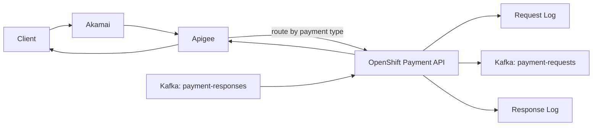
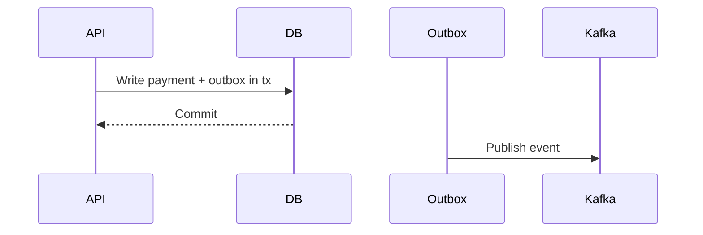
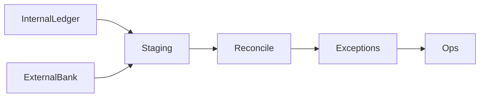
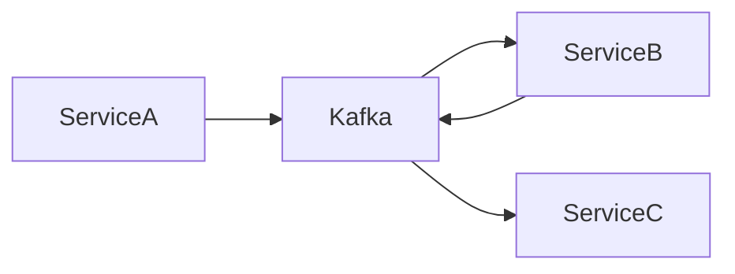
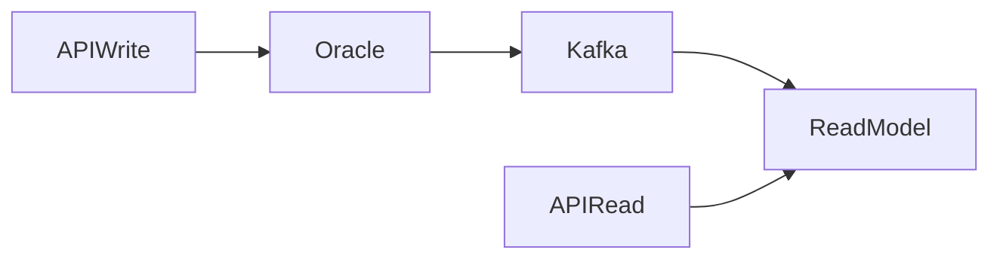

# System Design Interview Q&A (50)

Context: 8 years Java backend (banking), Java 21, Spring Boot 3.2, Oracle, MongoDB, Kafka, Docker, Kubernetes/Helm, Dynatrace, LogScale, Day2Ops, Akamai, Apigee, OpenShift.

## Core payment flow (your domain)



1. Q: How do I describe the payment request data flow?  
   A: I explain that Akamai protects the edge, Apigee handles auth, routing, throttling, and observability, then our OpenShift APIs validate and persist a request log, produce to Kafka for downstream processing, consume the response topic, log the response, and respond back to the client.

2. Q: How do I ensure idempotency for payments?  
   A: I require an idempotency key, store it with the request hash and response, and return the same response for duplicates within a TTL. I enforce a unique constraint in Oracle or a unique index in MongoDB.

3. Q: How do I handle retries without double-charging?  
   A: I use idempotency plus a state machine for payment status. I accept retries that map to the same idempotency key and reject state regressions.

4. Q: How do I design API gateways for payments?  
   A: I keep auth, rate limits, and request validation in Apigee; I avoid business logic there. I propagate correlation IDs and enforce schema validation early.

5. Q: How do I secure sensitive data?  
   A: I tokenize PANs, encrypt at rest, use TLS in transit, and implement strict RBAC. I log only masked data and use KMS-backed secrets.

6. Q: How do I do routing by payment type?  
   A: I implement a routing layer in Apigee or in the API that checks payment type and forwards to the correct service, using a routing table stored in config.

7. Q: How do I design for high availability?  
   A: I use active-active services in multiple AZs, stateless APIs, and Kafka with replication. I maintain health checks and rolling deployments.

8. Q: How do I handle partial failures across services?  
   A: I use timeouts, circuit breakers, retries with backoff, and compensation workflows. I do not rely on distributed transactions.

9. Q: How do I ensure consistent auditing?  
   A: I log requests and responses with immutable audit IDs, and I use append-only storage for audit trails.

10. Q: How do I define SLAs/SLOs for payments?  
    A: I track latency percentiles for API and end-to-end payment completion, error rates by type, and Kafka lag.

11. Q: How do I design schema evolution for Kafka events?  
    A: I use schema registry with backward-compatible changes and event versioning. I avoid breaking changes in the payload.

12. Q: How do I manage high throughput?  
    A: I partition Kafka by paymentId or merchantId, scale consumer groups, and design stateless APIs with horizontal scaling.

13. Q: How do I handle out-of-order events?  
    A: I use event timestamps, sequence numbers, and a state machine that can accept late events if they don’t violate final states.

14. Q: How do I design for data consistency?  
    A: I apply eventual consistency across services and keep strong consistency within a bounded context.

15. Q: How do I implement the outbox pattern?  
    A: I write to the DB and outbox in a single transaction, then relay to Kafka asynchronously.



16. Q: How do I avoid dual writes?  
    A: I use outbox/inbox patterns so DB and Kafka remain consistent without two-phase commit.

17. Q: How do I design a reconciliation job?  
    A: I compare internal ledger state with downstream confirmations and generate exceptions with audit trails.

18. Q: How do I handle large payloads?  
    A: I store large data in object storage and pass references in Kafka events.

19. Q: How do I design a payment state machine?  
    A: I define states like `RECEIVED`, `VALIDATED`, `SENT`, `CONFIRMED`, `FAILED`, and ensure transitions are monotonic.

20. Q: How do I implement rate limiting?  
    A: I use Apigee quotas for global limits and service-side limits in Redis for tenant-specific control.

21. Q: How do I design for multi-tenancy?  
    A: I include tenant ID in all keys, isolate configs, and enforce row-level security or separate schemas.

22. Q: How do I design a notification subsystem?  
    A: I use Kafka to emit notification events and a separate consumer to send email/SMS, decoupling from payment latency.

23. Q: How do I design data retention?  
    A: I keep transaction records per compliance rules, archive old data, and apply TTL on non-regulatory logs.

24. Q: How do I do schema design for Oracle vs Mongo?  
    A: I keep relational data in Oracle (ledger, payments) and use Mongo for flexible metadata or audit payloads.

25. Q: How do I handle backpressure?  
    A: I enforce Kafka consumer lag monitoring, apply rate limits, and scale consumers based on lag thresholds.

26. Q: How do I implement DLQs?  
    A: I publish to a dead-letter topic after N retries with error metadata for triage and replay.

27. Q: How do I structure a service for resilience?  
    A: I use bulkheads, circuit breakers, timeouts, and hedged requests where appropriate.

28. Q: How do I do zero-downtime deploys on OpenShift?  
    A: I use rolling updates, readiness probes, and canary or blue-green with traffic splitting.

29. Q: How do I implement observability?  
    A: I instrument with OpenTelemetry, ship logs to LogScale, metrics to Dynatrace, and enforce correlation IDs.

30. Q: How do I design for compliance (PCI)?  
    A: I minimize PCI scope, tokenize PAN, implement access controls, and use strict audit logging.

31. Q: How do I design an API versioning strategy?  
    A: I use URL or header versioning and keep backward compatibility with deprecation timelines.

32. Q: How do I validate request payloads?  
    A: I use JSON schema validation at the gateway and Bean Validation in services with detailed error codes.

33. Q: How do I prevent replay attacks?  
    A: I use nonce + timestamp validation and enforce idempotency key TTLs.

34. Q: How do I design a cache layer?  
    A: I cache read-heavy reference data with TTL and cache invalidation on updates.

35. Q: How do I handle timeouts with downstreams?  
    A: I set strict client timeouts, use retries with backoff, and fail fast to avoid thread exhaustion.

36. Q: How do I do capacity planning?  
    A: I forecast TPS, size Kafka partitions, and estimate CPU/memory based on profiling and P95 latencies.

37. Q: How do I do data flow for a reconciliation pipeline?  
    A: I ingest internal and external files, normalize into a staging store, compare, then produce exception events.



38. Q: How do I choose sync vs async?  
    A: I keep the user-facing payment submission synchronous but move long-running downstream processing async via Kafka.

39. Q: How do I design an event-driven system?  
    A: I use events to decouple services, standardize event contracts, and ensure idempotent consumers.



40. Q: How do I design for data lineage?  
    A: I tag every event and DB row with correlation IDs and timestamps for traceability.

41. Q: How do I handle PII in logs?  
    A: I mask or hash PII before logging, and control access to logs with strict RBAC.

42. Q: How do I handle SLA breaches?  
    A: I alert on error budgets, degrade gracefully (e.g., async processing), and scale hot paths.

43. Q: How do I implement blue/green with Helm?  
    A: I deploy separate release names and route traffic via service selectors, then switch after validation.

44. Q: How do I handle schema migrations safely?  
    A: I use backward-compatible migrations, feature flags, and dual-read/write if needed.

45. Q: How do I design a ledger?  
    A: I use append-only entries, never update balances directly, and compute balances from transactions.

46. Q: How do I handle multi-region?  
    A: I keep data locality per region, use async replication, and use regional Kafka clusters.

47. Q: How do I implement CQRS?  
    A: I separate write models (Oracle) from read models (Mongo/Elastic) and sync via Kafka.



48. Q: How do I design a fraud detection pipeline?  
    A: I publish payment events to a rules engine or ML service and block/flag suspicious transactions.

49. Q: How do I handle peak traffic (sales events)?  
    A: I pre-scale consumers, enforce rate limits, and apply graceful degradation for non-critical services.

50. Q: How do I explain trade-offs in system design?  
    A: I explicitly trade latency vs consistency, operational cost vs complexity, and state clearly why I chose event-driven processing for payments.

## Code snippets used in design discussions

```java
// Idempotency check (simplified)
public Optional<PaymentResponse> findExistingResponse(String key) {
    return repo.findByIdempotencyKey(key).map(Payment::getResponse);
}
```

```java
// Outbox row model (simplified)
@Entity
class OutboxEvent {
    @Id @GeneratedValue
    private Long id;
    private String aggregateId;
    private String type;
    @Lob
    private String payload;
    private Instant createdAt;
}
```

```java
// Circuit breaker (Resilience4j style)
Supplier<String> guarded = CircuitBreaker
    .decorateSupplier(cb, () -> downstream.call());
```

**Tier Tailoring**

**Big Tech Focus (FAANG-level)**
1. I quantify scale early: TPS, peak-to-average, data size, and read/write ratios.
2. I state explicit SLIs/SLOs and design around P95/P99 latency and error budgets.
3. I make trade-offs explicit: consistency vs availability, cost vs latency, complexity vs operability.
4. I design for multi-region, disaster recovery, and automated failover.
5. I discuss storage internals, indexing strategy, and hot partition avoidance.
6. I add deep dives on caching, sharding, and congestion control.
7. I show how I would capacity plan and run load tests.
8. I include operational playbooks and alerting strategy.

**High-Scale Fintech/Payments Focus**
1. I emphasize correctness: idempotency, ledger integrity, and auditability.
2. I outline compliance boundaries and PCI scope reduction.
3. I show a clear payment state machine and monotonic transitions.
4. I explain exactly-once effects with outbox/inbox patterns.
5. I include reconciliation and dispute handling in the design.
6. I define fraud checks and risk scoring as a separate pipeline.
7. I discuss secure key management, tokenization, and PII handling.
8. I address settlement timing, cutoffs, and batching.

**Mid-Size Product Focus**
1. I keep the architecture simple and evolvable.
2. I reduce moving parts and introduce complexity only when scale demands it.
3. I highlight time-to-market and maintainability trade-offs.
4. I design clear service boundaries and clean APIs.
5. I include a minimal but solid observability stack.
6. I plan for growth with modular services and an event backbone.
7. I show how I would prioritize features and defer non-critical components.
8. I focus on cost efficiency and practical operational overhead.

**Design Prompts to Rehearse**
1. Real-time payment authorization service with 99.99% availability.
2. Merchant settlement and reconciliation pipeline at 10k TPS.
3. Fraud detection with near-real-time rules and ML scoring.
4. Multi-region API gateway with geo routing and failover.
5. Event-driven notification system with SLA guarantees.
6. Ledger service with strong audit and backfill support.
7. Dispute management workflow with external integrations.
8. Card tokenization service with strict PCI isolation.
