# 🏗️ System Design Walkthrough: URL Shortener (TinyURL)

> **Difficulty**: Medium | **Interview Frequency**: Very High | **Time**: 45 mins

This is one of the most commonly asked system design problems. Master this, and you'll have a solid foundation for other designs.

---

## 📌 Step 1: Requirements Clarification (2-3 mins)

Always start by asking questions to clarify scope. Here's what to ask:

### Functional Requirements
| Requirement | Answer |
|-------------|--------|
| Shorten a URL? | ✅ Yes |
| Redirect to original URL? | ✅ Yes |
| Custom short URLs? | ✅ Optional |
| URL expiration? | ✅ Yes, configurable |
| Analytics (click count)? | ✅ Nice to have |

### Non-Functional Requirements
| Requirement | Answer |
|-------------|--------|
| Highly available? | ✅ Yes (100% uptime goal) |
| Low latency? | ✅ Yes (< 100ms redirect) |
| Shortened URLs should be unpredictable? | ✅ Yes (security) |

### Clarifying Questions to Ask
1. "What's the expected scale? How many URLs per day?"
2. "What should be the length of the short URL?"
3. "Do we need user accounts or anonymous access?"

---

## 📊 Step 2: Capacity Estimation (3-5 mins)

### Traffic Estimates
```
Assumptions:
├── 100M new URLs per month
├── Read:Write ratio = 100:1 (more reads than writes)
└── URLs stored for 5 years

Calculations:
├── Writes: 100M / (30 × 24 × 3600) ≈ 40 URLs/second
├── Reads: 40 × 100 = 4000 URLs/second (redirects)
└── Total URLs: 100M × 12 × 5 = 6 Billion URLs over 5 years
```

### Storage Estimates
```
Per URL record:
├── Short URL (7 chars): 7 bytes
├── Original URL (avg): 500 bytes
├── Created timestamp: 8 bytes
├── Expiration timestamp: 8 bytes
├── User ID: 8 bytes
└── Total: ~530 bytes per URL

Total Storage = 6B × 530 bytes ≈ 3.2 TB
```

### Bandwidth Estimates
```
Write: 40 × 530 bytes = 21 KB/s
Read: 4000 × 530 bytes = 2.1 MB/s
```

> [!NOTE]
> Present these numbers during interviews. It shows you think about scale!

---

## 🏛️ Step 3: High-Level Design (10 mins)

### System Architecture


### Core Components

| Component | Technology | Purpose |
|-----------|------------|---------|
| Load Balancer | Nginx / AWS ALB | Distribute traffic |
| Application Servers | Java Spring Boot | Business logic |
| Cache | Redis | Hot URLs, reduce DB load |
| Database | PostgreSQL / Cassandra | Store URL mappings |
| Key Generation | Standalone Service | Generate unique short keys |

---

## 💾 Step 4: Database Design (5 mins)

### Option 1: SQL (PostgreSQL)

```sql
CREATE TABLE urls (
    id BIGSERIAL PRIMARY KEY,
    short_key VARCHAR(10) UNIQUE NOT NULL,
    original_url TEXT NOT NULL,
    user_id BIGINT,
    created_at TIMESTAMP DEFAULT CURRENT_TIMESTAMP,
    expires_at TIMESTAMP,
    click_count BIGINT DEFAULT 0,
    INDEX idx_short_key (short_key),
    INDEX idx_expires_at (expires_at)
);

CREATE TABLE users (
    id BIGSERIAL PRIMARY KEY,
    email VARCHAR(255) UNIQUE NOT NULL,
    api_key VARCHAR(64) NOT NULL,
    tier VARCHAR(20) DEFAULT 'free'
);
```

### Option 2: NoSQL (Cassandra)
```
Table: url_mappings
├── Partition Key: short_key
├── original_url: text
├── created_at: timestamp
├── expires_at: timestamp
└── click_count: counter

Pros: Better for write-heavy, horizontal scaling
Cons: No transactions, eventual consistency
```

### Which to Choose?
| Factor | SQL | NoSQL |
|--------|-----|-------|
| Read-heavy | ✅ Better | Good |
| Write-heavy | Good | ✅ Better |
| ACID transactions | ✅ Yes | Limited |
| Horizontal scaling | Complex | ✅ Easy |

**Recommendation**: Start with SQL, migrate to NoSQL if scale demands

---

## 🔑 Step 5: Short URL Generation (Deep Dive)

This is the **CORE** of the system. Three main approaches:

### Approach 1: Base62 Encoding (Recommended)

```
Characters: [a-z, A-Z, 0-9] = 62 characters
7-character key = 62^7 = 3.5 trillion combinations

Example:
└── ID: 125 → Base62 → "cb"
└── ID: 1234567 → Base62 → "W7E"
```

**Java Implementation:**
```java
public class Base62Encoder {
    private static final String ALPHABET = 
        "abcdefghijklmnopqrstuvwxyzABCDEFGHIJKLMNOPQRSTUVWXYZ0123456789";
    private static final int BASE = ALPHABET.length();
    
    public static String encode(long num) {
        StringBuilder sb = new StringBuilder();
        while (num > 0) {
            sb.append(ALPHABET.charAt((int) (num % BASE)));
            num /= BASE;
        }
        return sb.reverse().toString();
    }
    
    public static long decode(String str) {
        long num = 0;
        for (char c : str.toCharArray()) {
            num = num * BASE + ALPHABET.indexOf(c);
        }
        return num;
    }
}
```

### Approach 2: Pre-generated Keys (Key Generation Service)


**Advantages:**
- No collision handling needed
- Fast key assignment
- Predictable performance

**Disadvantages:**
- Need to manage key database
- Synchronization overhead

### Approach 3: MD5/SHA256 Hash (First 7 chars)

```
hash("https://example.com") = "a9b4c3d2e1f0..."
short_key = "a9b4c3d"  # First 7 characters
```

**Problem**: High collision probability. Not recommended for production.

---

## 🔄 Step 6: API Design (5 mins)

### REST API Endpoints

```yaml
# Create Short URL
POST /api/v1/urls
Request:
  {
    "url": "https://www.example.com/very/long/path",
    "custom_alias": "my-link",  # optional
    "expires_at": "2026-12-31"  # optional
  }
Response:
  {
    "short_url": "https://tiny.url/abc1234",
    "original_url": "https://www.example.com/very/long/path",
    "expires_at": "2026-12-31T00:00:00Z",
    "created_at": "2026-02-07T03:30:00Z"
  }

# Redirect
GET /{short_key}
Response: 301/302 Redirect to original URL

# Get URL Info
GET /api/v1/urls/{short_key}
Response:
  {
    "short_url": "https://tiny.url/abc1234",
    "original_url": "https://www.example.com/...",
    "click_count": 12345,
    "created_at": "2026-02-07T03:30:00Z"
  }

# Delete URL
DELETE /api/v1/urls/{short_key}
Response: 204 No Content
```

### HTTP Status Codes
| Code | Meaning |
|------|---------|
| 201 | URL created |
| 301 | Permanent redirect |
| 302 | Temporary redirect |
| 404 | Short URL not found |
| 429 | Rate limit exceeded |

---

## ⚡ Step 7: Read/Write Flow (5 mins)

### Write Flow (Create Short URL)


### Read Flow (Redirect)

```mermaid
sequenceDiagram
    participant Client
    participant LB as Load Balancer
    participant App as App Server
    participant Cache as Redis
    participant DB as Database
    
    Client->>LB: GET /abc1234
    LB->>App: Forward request
    App->>Cache: GET abc1234
    
    alt Cache Hit
        Cache->>App: Return long_url
    else Cache Miss
        App->>DB: SELECT * FROM urls WHERE short_key='abc1234'
        DB->>App: Return long_url
        App->>Cache: SET abc1234 → long_url
    end
    
    App->>App: Increment click_count (async)
    App->>Client: 302 Redirect to long_url
```



---

## 🚀 Step 8: Scaling & Optimization (5 mins)

### Caching Strategy

```
Cache Policy: LRU (Least Recently Used)
├── Cache Size: 20% of daily traffic in memory
├── TTL: 24 hours (or until expiration)
└── Eviction: LRU

Hot URLs (80% of traffic hits 20% of URLs):
├── Cache hit ratio target: 80%+
└── Reduces DB load by 5x
```

**Redis Configuration:**
```java
@Configuration
public class RedisConfig {
    @Bean
    public RedisCacheManager cacheManager(RedisConnectionFactory factory) {
        return RedisCacheManager.builder(factory)
            .cacheDefaults(RedisCacheConfiguration.defaultCacheConfig()
                .entryTtl(Duration.ofHours(24))
                .serializeKeysWith(RedisSerializationContext.SerializationPair
                    .fromSerializer(new StringRedisSerializer())))
            .build();
    }
}
```

### Database Sharding


**Sharding Strategy:**
```
Shard Key: First character of short_key
├── Shard 1: a-i (handles 35% traffic)
├── Shard 2: j-r (handles 35% traffic)
└── Shard 3: s-z, 0-9 (handles 30% traffic)
```

### Rate Limiting

```java
@Component
public class RateLimiter {
    private final RedisTemplate<String, String> redis;
    
    // 100 requests per minute per IP
    public boolean isAllowed(String clientIP) {
        String key = "rate:" + clientIP;
        Long count = redis.opsForValue().increment(key);
        
        if (count == 1) {
            redis.expire(key, 60, TimeUnit.SECONDS);
        }
        
        return count <= 100;
    }
}
```

---

## 📈 Step 9: Analytics (Optional Feature)

### Click Tracking

```java
@Async
public void trackClick(String shortKey, HttpServletRequest request) {
    ClickEvent event = ClickEvent.builder()
        .shortKey(shortKey)
        .timestamp(Instant.now())
        .ip(request.getRemoteAddr())
        .userAgent(request.getHeader("User-Agent"))
        .referer(request.getHeader("Referer"))
        .build();
    
    kafkaTemplate.send("click-events", event);
}
```

### Analytics Pipeline


---

## ❓ Step 10: Common Interview Follow-ups

### Q1: "How do you handle collisions?"
**Answer:**
```
With Base62 + auto-increment ID, collisions are impossible.
With hash-based, we check DB and regenerate if collision occurs:
1. Generate hash
2. Check if exists in DB
3. If exists, append counter and rehash
4. Retry until unique
```

### Q2: "How do you handle expired URLs?"
**Answer:**
```
Two approaches:
1. Lazy deletion: Check expiry on read, return 404 if expired
2. Active cleanup: Background job deletes expired URLs nightly

Recommendation: Use both!
```

### Q3: "How would you make this globally distributed?"
**Answer:**


### Q4: "301 vs 302 redirect?"
| Redirect | Meaning | When to Use |
|----------|---------|-------------|
| 301 | Permanent | Browser caches, won't hit server again |
| 302 | Temporary | Every click hits server (good for analytics) |

**Recommendation:** 302 for analytics, 301 for pure redirection

### Q5: "How do you prevent abuse?"
**Answer:**
```
1. Rate limiting (100 req/min per IP)
2. CAPTCHA for anonymous users
3. URL validation (block malicious sites)
4. Account-based tiers (free: 100/day, paid: unlimited)
5. Blacklist known spam domains
```

---

## ✅ Summary Checklist

Use this during your actual interview:

```
□ Clarify requirements (2 mins)
□ Capacity estimation (3 mins)
□ High-level design diagram (5 mins)
□ Database schema (3 mins)
□ Short key generation algorithm (5 mins)
□ API design (3 mins)
□ Read/Write flows (5 mins)
□ Scaling strategies (5 mins)
□ Handle follow-up questions (10 mins)
```

---

## 🔗 Related System Design Problems

After mastering URL Shortener, try these similar problems:
1. **Pastebin** - Very similar, but with text content
2. **Rate Limiter** - Deep dive into one component
3. **Web Crawler** - URL processing at scale
4. **CDN** - Caching and geographic distribution

---

> [!TIP]
> **Interview Tips:**
> - Always draw diagrams (even rough ones)
> - Think out loud - explain your reasoning
> - Ask clarifying questions before diving in
> - Mention trade-offs for every decision
> - It's okay to say "I would research this more" for edge cases
